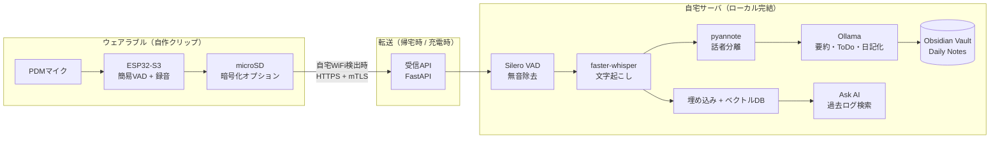

# ローカル完結型・音声ライフログデバイス 設計書

SwitchBot「AIマインドクリップ」（2026年8月20日発売、19,980円）に着想を得た、
**外部クラウドに一切データを出さない**自作ウェアラブル音声ロガー + ローカルLLM分析基盤の設計。

## 1. 背景：AIマインドクリップがやっていること

新製品説明会（YouTubeライブ配信）および公開情報から整理すると、本家の構成は以下の通り。

| 項目 | AIマインドクリップの実装 |
|---|---|
| デバイス | 16.8g のクリップ型、スライドスイッチで録音 ON/OFF |
| 録音 | 連続最大20時間、本体ストレージ 64GB（約5,000時間分） |
| 転送 | **充電中に自動転送**（リアルタイムではなくバッチ同期） |
| 処理 | クラウド（AWS）で文字起こし・話者識別・要約・ToDo抽出 |
| LLM | ChatGPT / Claude / Gemini から選択（= 外部APIに送信される） |
| 活用 | Ask AI（過去録音への自然言語質問）、カレンダー連携 |
| セキュリティ | デバイス〜クラウド間暗号化、ISO 27001/27701 等 |

**重要な観察**：本家も「常時ストリーミング」ではなく「デバイスにためて、充電時にまとめて転送」
という設計。これは消費電力とバッテリーの制約上合理的で、自作でも同じ戦略を取るのが正解。
違いは **転送先をクラウドではなく自宅のローカルサーバにする** ことだけ。つまり技術的に十分実現可能。

## 2. コンセプト

> 身につけたデバイスが日常会話を録音 → 自宅のローカルLLMが文字起こし・分析 →
> Obsidian の Daily Note に日々のログとして自動蓄積。**音声・テキストとも外部に一切出ない。**

既に構築中の「話しかけて日記を書く Obsidian 連携」と出口（Obsidian vault）を共有し、
入力チャネルが「意識的な音声日記」と「無意識の日常ログ」の2本になるイメージ。

### 2.1 運用イメージ（ゼロタッチ要件）

**「普段から身につけたまま、日中は一切取り出さない・触らない」を最優先の設計要件とする。**
デバイスに対するユーザー操作は 1 日 2 回だけ：

1. **朝**：クリップを襟元に留め、スライドスイッチを ON（装着＝録音開始）
2. **夜**：外して充電ドックに **置くだけ**。以降は全自動 ——
   ドック給電をトリガーに自宅WiFiへ接続 → サーバへ転送 → 夜間バッチで
   文字起こし・分析 → 翌朝には Obsidian の Daily Note に昨日のログが揃っている

日中の同期・確認・アプリ操作は一切不要。スマホを取り出す場面もない
（Phase 0 で古いスマホを使うのはサーバ側パイプラインの検証のためだけで、
最終形の運用にスマホ操作は登場しない）。この「置くだけ同期」は本家の
「充電中に自動転送」と同じ UX であり、追加の技術リスクなしに実現できる。

## 3. 全体アーキテクチャ



## 4. ハードウェア設計

### 4.1 メイン基板：Seeed Studio XIAO ESP32S3 Sense（推奨）

DIY AIウェアラブルの定番。オープンソースプロジェクト Omi（旧 Friend）系でも実績がある。

- サイズ 21×17.8mm、約3g（本家の16.8gに十分対抗できる）
- **PDMデジタルマイク搭載**、microSDスロット搭載、WiFi + BLE
- LiPoバッテリー充電回路内蔵（バッテリーを直結できる）
- 価格：約2,500円

### 4.2 バッテリーと稼働時間の試算

- 録音中（WiFi/BLE オフ、SD書き込みあり）：実測ベースでおおよそ 30〜40mA
- **LiPo 500mAh** → 約12〜15時間の連続録音（1日分として実用域）
- 同期時のみ WiFi ON（数分間、~100mA）なので影響は軽微
- 薄型 LiPo 502530（500mAh、約10g）で総重量 20g 前後を狙える
- **ゼロタッチ要件の含意：バッテリーは「起床〜就寝」を必ず走り切ること**。
  装着時間が15時間を超える生活パターンなら 703040（800mAh、約15g）に格上げするか、
  デバイス側VADで無音時のSD書き込みを止めて実効稼働を延ばす（会話時間は1日の
  一部なので、VADゲートだけで20時間級に届く見込み）。日中の充電継ぎ足しは設計として禁止

### 4.3 充電ドック（「置くだけ」の要）

- マグネット吸着 + ポゴピン給電の専用ドックを 3D プリントで自作
  （Qi ワイヤレスはコイル分の重量・厚みが装着性を損なうため不採用）
- ドックは玄関や寝室に常設。**給電開始の検出が「同期開始」のトリガー**を兼ねる
- 置き忘れ対策：サーバ側で「その日の転送が 24 時まで無ければ通知」をローカル通知
  （ntfy のセルフホスト等）で出す

### 4.4 筐体（クリップ型で確定）

形状は**クリップ型**とする（襟元・胸ポケットに常時装着、本家マインドクリップと同じ運用）。

- **固定方式はマグネットクランプ**（布を裏表から挟んでネオジム磁石で固定）を第一候補と
  する。バネ式クリップより、服の生地の厚みを選ばず・穴や跡が残らず・着脱が速い。
  本体側に磁石2個、裏板（服の内側に入れる薄いプレート）にも磁石2個を埋め込む
- **マイク開口は上向き（口方向）**に配置。襟元装着時に自声を最も安定して拾える。
  発話者との距離が近い分、遠方雑音より自分と対話相手の声が支配的になり STT 精度に有利
- **重心設計**：最重量物のバッテリーをクランプ（磁石）側に寄せ、装着時のお辞儀・垂れを防ぐ
- 3Dプリント（PETG推奨、肌・服接触があるため角はフィレット）。Omi の公開STLの
  クリップ機構が参考になる
- 物理スライドスイッチは筐体上面に露出させ、手探りで操作可能にする
  （後述のプライバシー/法務面で重要）
- 録音中LEDは正面に微灯で配置（相手から見えることが告知を兼ねる）
- 裏面にポゴピン接点（充電ドック用、4.3節）

### 4.5 代替案

| 案 | 長所 | 短所 |
|---|---|---|
| **XIAO ESP32S3 Sense（推奨）** | 小型軽量・安価・マイク/SD内蔵 | デバイス内での高度な処理は不可 |
| Omi DevKit を購入 | ハード開発を省略、FW/アプリがOSS | 入手性、BLE中継前提の設計 |
| Raspberry Pi Zero 2 W | デバイス内でVAD/圧縮など柔軟 | 消費電力大（連続録音数時間） |
| 古いスマートフォン | **Phase 0 の検証に最適**（下記） | 常時携帯ウェアラブルとしては重い |

## 5. ファームウェア設計（ESP32-S3）

1. **録音**：PDMマイク → I2S 16kHz/16bit/mono → リングバッファ → microSD に WAV 追記
   （1時間 ≒ 115MB。IMA-ADPCM にすれば約29MB。64GB SD で数百時間分）
2. **簡易VAD**：エネルギー閾値ベースで無音区間をスキップし、ファイル容量と後段処理を削減
   （精密なVADはサーバ側 Silero に任せる。デバイス側は「粗く録りこぼさない」方針）
3. **ファイル分割**：10分単位で新規ファイル化 + RTCタイムスタンプ命名（後段の日記化に必須）
4. **同期**：スライドスイッチOFF or 充電検出時に自宅WiFiへ接続 →
   `POST /ingest`（HTTPS + **mTLS クライアント証明書**）→ サーバのACK後にSDから削除
5. **状態表示**：LED（録音中=赤点滅なし/微灯、同期中=青、エラー=赤点滅）

フレームワークは ESP-IDF または Arduino。Omi のファームウェア（MIT/Apacheライセンス）が
BLE-Opusストリーミング実装を含むので、Phase 3 のリアルタイム化で参考にできる。

## 6. 転送経路の設計 — 「Cloudflare を使う」案の検討

ここが要件（外部に情報が漏洩しない）に直結する最重要の設計判断。

| 経路 | 仕組み | 漏洩リスク評価 |
|---|---|---|
| **A. 自宅WiFiバッチ同期（推奨・Phase 1）** | 帰宅/充電時にLAN内で直接転送 | ◎ パケットが宅外に出ない。本家と同じUX |
| **B. Tailscale / WireGuard 経由（Phase 3）** | スマホがBLEで受けてVPNトンネルで自宅へ | ○ E2E暗号化。Tailscaleの調停サーバは鍵交換のみで中身は見えない（自宅サーバに直接WireGuardでも可） |
| **C. Cloudflare Tunnel** | cloudflaredで自宅サーバを公開 | △ **注意：TLSがCloudflareエッジで終端されるため、音声データが復号された状態で第三者インフラを通過する**。「中だけで完結」という要件とは厳密には矛盾 |

**結論**：Cloudflare Tunnel は「自宅回線のポートを開けずに外から届ける」用途には便利だが、
本件の要件では **Tailscale（実体はWireGuard）を推奨**。どうしても Cloudflare を使う場合は、
デバイス/スマホ側で **自前の鍵によるアプリケーション層暗号化（例：age / libsodium）を重ねてから**
送り、復号鍵は自宅サーバにのみ置くこと（これならCloudflareには暗号文しか見えない）。

そもそも Phase 1 のバッチ同期なら外部経路自体が不要、というのが本設計の骨子。
リアルタイム性が本当に必要になってから B を足せばよい。

## 7. サーバ側パイプライン（ローカルLLM基盤）

### 7.1 処理フロー

1. **受信** — FastAPI `POST /ingest`（mTLS必須、LAN/VPNのみバインド）
2. **VAD** — Silero VAD で発話区間を切り出し（精度が高くCPUで軽量）
3. **文字起こし** — faster-whisper（`large-v3-turbo` または日本語なら `large-v3`）
   - RTX 3060 12GB で実時間の数倍〜10倍速。1日8時間分の録音でも夜間バッチで余裕
4. **話者分離** — pyannote.audio 3.x（完全ローカル実行可）
   - 自分の声を数分登録して声紋照合 →「自分の発言/他者の発言」をラベル付け
5. **LLM分析** — Ollama 上のローカルモデル（Qwen3 14B/32B、Gemma 3 27B など）
   - タスク：①日次サマリー ②ToDo/約束の抽出 ③トピック分類 ④感情・振り返りメモ
6. **Obsidian出力** — vault の `Daily Notes/YYYY-MM-DD.md` にセクション追記
   ```markdown
   ## 🎙️ 会話ログ（自動生成）
   ### サマリー
   ### ToDo / 約束
   - [ ] 〇〇さんに資料を送る（14:32 の会話より）
   ### タイムライン
   - 09:15 [自分] ...
   ```
7. **Ask AI（RAG）** — bge-m3 等のローカル埋め込み + Chroma/sqlite-vec に文字起こしを格納。
   「先週◯◯さんと何を話した？」をローカルLLMで回答。既存のObsidian連携UIから呼べる

### 7.2 サーバのハードウェア要件

| 構成 | 目安 | 備考 |
|---|---|---|
| 最小 | Mac mini (M系, 16GB+) | whisper + 8B級LLMまで快適 |
| 推奨 | Linux機 + RTX 3060 12GB〜 | whisper large + 14B級を夜間バッチで |
| 理想 | RTX 4090 / Mac Studio | 32B級LLM + リアルタイム処理 |

### 7.3 セキュリティ

- 全処理を自宅LAN内で完結。サーバのファイアウォールで **egress を明示的に制限**し
  「外部送信ゼロ」を構成として保証（信頼ではなく検証）
- 転送は mTLS（デバイスにクライアント証明書を焼く）
- 保存音声・文字起こしはディスク暗号化（LUKS）+ 定期的な生音声の自動削除ポリシー
  （テキスト化後 N 日で音声を消す等。ライフログは音声よりテキストの価値が支配的）
- microSD 紛失リスク対策として、デバイス側で公開鍵暗号（サーバの秘密鍵でのみ復号可）も検討

## 8. 法的・倫理面の注意（設計に組み込む）

- 日本では自分が参加する会話の録音（秘密録音）は直ちに違法ではないが、
  相手のプライバシー・信頼関係への配慮は別問題。**物理スイッチと録音中インジケータ**を
  必ず実装し、職場・他人の家など文脈に応じてOFFにする運用を前提とする
- 他者の発言の文字起こしを保存すること自体がセンシティブ。話者分離で
  「他者発言はサマリーのみ保存、逐語は自分の発言のみ」等のポリシーをパイプラインに実装可能

## 9. 段階的ロードマップ

| Phase | 内容 | ポイント |
|---|---|---|
| **0. パイプライン検証（最優先）** | 古いスマホやICレコーダーで録音した音声を、サーバ側パイプライン（VAD→whisper→pyannote→Ollama→Obsidian）に流す | **ハードより先にソフトを完成させる**。既存のObsidian音声日記システムと出口を統合。**→ 実装済み: [`../voice-logger/`](../voice-logger/README.md)** |
| **1. デバイス試作** | XIAO ESP32S3 Sense + LiPo + 3Dプリント筐体。SD録音 + 帰宅時WiFi同期 | 本家と同じ「バッチ同期」UXをローカルで再現 |
| **2. 分析の深化** | 話者分離・声紋登録、RAG（Ask AI）、週次/月次の振り返り自動生成 | ライフログとしての価値を作る段階 |
| **3. リアルタイム化（任意）** | BLE→スマホ→Tailscale/WireGuardで外出先からも同期 | 必要性を Phase 1-2 の運用で見極めてから |

## 10. 概算コスト（BOM）

| 品目 | 概算 |
|---|---|
| XIAO ESP32S3 Sense | ¥2,500 |
| LiPo 502530 500mAh | ¥800 |
| microSD 64GB | ¥1,000 |
| スライドスイッチ・LED・配線 | ¥500 |
| 3Dプリント筐体 | ¥500 |
| **デバイス合計** | **約 ¥5,300**（本家の1/4） |
| サーバ（既存PC流用 or 中古GPU機） | ¥0〜80,000 |

## 11. 参考プロジェクト・技術

- [Omi (BasedHardware)](https://github.com/BasedHardware/omi) — OSSのAIウェアラブル。FW/筐体STL/アプリが公開されており、バックエンドをセルフホストに差し替え可能
- [faster-whisper](https://github.com/SYSTRAN/faster-whisper) / [whisper.cpp](https://github.com/ggml-org/whisper.cpp) — ローカル文字起こし
- [Silero VAD](https://github.com/snakers4/silero-vad) — 軽量高精度VAD
- [pyannote.audio](https://github.com/pyannote/pyannote-audio) — 話者分離（ローカル実行可）
- [Ollama](https://ollama.com) — ローカルLLM実行基盤
