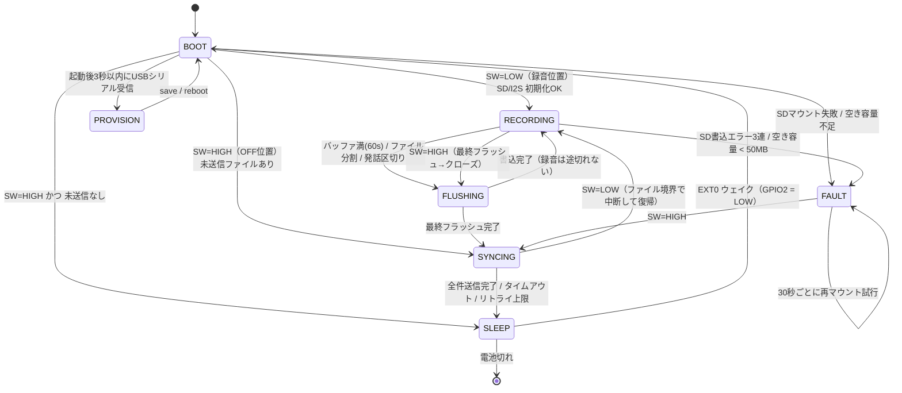

# MindClip DIY — Phase 1 ファームウェア仕様書 (v1.0)

対象ハード: Seeed XIAO ESP32S3 **Sense**（Sense拡張ボード装着、カメラ取り外し）
上位文書: [`../hardware/ELECTRICAL.md`](../hardware/ELECTRICAL.md) /
[`../hardware/COMMS.md`](../hardware/COMMS.md) /
[`../hardware/README.md §8`](../hardware/README.md) /
[`../docs/local-llm-voice-logger-design.md`](../docs/local-llm-voice-logger-design.md)
下流: Phase 0 サーバ [`../voice-logger/`](../voice-logger/)（**完成済み。壊さない**）

本書は「散在する要件を1つにまとめ、実装前に曖昧さを潰す」ためのもの。
**本書に書いていない挙動を実装で勝手に決めない。** 決める必要が出たら本書を先に更新する。

---

## 0. スコープと非スコープ

### 0.1 やること（v1 必達）
1. PDM 16kHz/16bit/mono 録音 → microSD に PCM WAV
2. 省電力（CPU 80MHz / バッファ書込 / VADゲート）で **実測平均 ≤28mA**
3. スイッチOFF → WiFi → HTTPS POST → ACK後にSD削除 → deep sleep
4. 同期時にサーバから時刻を受け取り RTC 補正（NTPを使わない）
5. EXT0(GPIO2, LOW) ウェイク、RTCプルアップ明示、SD CS(GPIO21) HIGHホールド
6. WiFi認証情報は NVS。日中は無線完全オフ
7. mTLS + 共有秘密HMAC の二重認証。無認証で受けない

### 0.2 やらないこと（回路が無い。**実装しようとしないこと**）
| 項目 | 理由 |
|---|---|
| VBUS(USB挿入)検出 | 分圧回路が無い（ELECTRICAL §2.1）。**同期トリガはスイッチOFFのみ** |
| 電池残量表示・低電圧保護 | 電池電圧監視回路が無い。過放電はセル側PCMのUVLOに委ねる |
| 内蔵ユーザーLEDでの状態表示 | GPIO21 が SD CS と共用（ELECTRICAL §1.1）。表示は外付けLED(D3)のみ |
| ADPCM圧縮 / SD上の暗号化 | v2候補（COMMS §1・§3-4）。v1は生PCM WAV |
| リアルタイム同期 | COMMS §5 |

---

## 1. ピン・クロック・ビルド設定（確定値）

| 用途 | GPIO | 設定 |
|---|---|---|
| スライドスイッチ | **GPIO2 (D1)** | `INPUT_PULLUP`、**ON=LOW=録音** / OFF=HIGH=同期→sleep |
| 外付けLED | **GPIO4 (D3)** | LEDC ch0 / 5kHz / 8bit、既定デューティ **15%**（10〜20%可変, NVS `cfg.led_duty`） |
| PDM CLK / DATA | GPIO42 / GPIO41 | `I2S_MODE_PDM_RX` 16000Hz / 16bit / MONO |
| microSD SPI | SCK7 / MISO8 / MOSI9 / **CS21** | `SD.begin(21, SPI, 20000000)`（20MHz。不安定なら 10MHz へ落とす） |

- **CPUクロック 80MHz**: `setCpuFrequencyMhz(80)` を `setup()` の最初に。
  以降クロックを上げない（SD/WiFi処理中も 80MHz のまま。WiFi は 80MHz 以上で動作可）。
- **PSRAM 必須**（Arduino IDE: PSRAM = OPI PSRAM）。録音リングバッファは PSRAM に置く。
- Flash 8MB / USB CDC On Boot = **Enabled**（プロビジョニングに必須）。
- `btStop()` を起動時に呼び、BLE を明示的に落とす。録音中は `WiFi.mode(WIFI_OFF)`。
- **ボード FQBN（必ずこの形で使う）**: `esp32:esp32:XIAO_ESP32S3:PSRAM=opi`
  - `esp32:esp32:XIAO_ESP32S3` だけでは **PSRAM が無効**になる。`boards.txt` の PSRAM メニューは
    先頭の `disabled` が既定で、`arduino-cli board details --show-properties` でも既定解決は
    `build.defines=`（`-DBOARD_HAS_PSRAM` 無し）／`build.memory_type=qio_qspi` になることを実行確認済み。
  - この既定でビルドすると `ps_malloc()` が NULL を返し、要件2の「30〜60秒バッファ」が
    黙って縮退する（§7 E12）。**BUILD_ENV.md・CI・手順書はすべて `:PSRAM=opi` 付きで書くこと。**

---

## 2. 状態機械



### 2.1 各状態の定義・LED・電流

LEDは常に LEDC PWM デューティ 15%（「微灯」= 平均 0.9mA）で駆動する。
**明るさは変えず、点滅パターンだけで状態を区別する。**

| 状態 | 内容 | LED表示 | 電流見積 (assumption) |
|---|---|---|---|
| **BOOT** | クロック80MHz化 → NVS読出 → SD/I2S初期化 → `.rec` 復旧 → 分岐。所要 <2s | 起動時に0.2s×1回 | 45 mA / 2 s |
| **RECORDING(LISTEN)** | VAD=無音。I2S DMA受信＋VAD計算のみ。SDはアイドル(CS=HIGH) | 4秒ごとに 60ms パルス（生存表示） | **19.9 mA** |
| **RECORDING(CAPTURE)** | VAD=発話。PSRAMリングバッファへ蓄積 | 点灯（微灯・連続） | **20.9 mA** |
| **FLUSHING** | リングバッファ→SDへ書込＋WAVヘッダ更新。**1回の書込は32KBに刻み、I2S読み出しの合間に流す**（単一スレッドなので「並行」ではなくインターリーブ。90msしかないDMAを溢れさせないための必須条件） | 直前の表示を維持（短すぎて区別不要） | 書込中の瞬時値は高いが、1回あたり約33ms。60秒ぶん(1.92MB)を流し切るのに約2秒 |
| **SYNCING** | WiFi接続→時刻取得→ファイル送信→削除 | 1Hz点滅。持越し発生時は sleep前に「2回点滅」を10秒 | **100 mA**（瞬時 >300mA） |
| **SLEEP** | deep sleep。EXT0待ち | 消灯 | **3 mA**（公式 typ, Sense装着時） |
| **FAULT** | SD無し/満杯。録音しない | 「3回点滅＋1.5秒休み」を繰返し | 20 mA |
| **PROVISION** | シリアルCLI。無線オフ | 5Hz 高速点滅 | 40 mA |

> RECORDING(LISTEN/CAPTURE) と FLUSHING の電流内訳は §8 の分解モデルによる。
> **すべて assumption であり、README §8.7 の実測ゲートで確定させること。**

### 2.2 遷移条件の詳細

- **スイッチの読み取りは 20ms×3回一致のデバウンス**を必ず通す（配線が長く、装着中の振動でチャタリングする）。
- `RECORDING → SYNCING` は「**現在のWAVを正しくクローズしてから**」行う。クローズ前に電源が落ちても §5.3 によりファイルは壊れない。
- `SYNCING → RECORDING`（同期中にスイッチON）は**送信中のファイルを完了させてから**中断する。
  中断時点で未送信のファイルはSDに残し、次回の同期に持ち越す。**送信途中で切ってもサーバ側に半端なファイルは残らない**（§6.4）。
- `SYNCING → SLEEP` は成功・失敗を問わず必ず通る。sleep しない経路を作らない（電池を無駄にしない）。
- **SYNCING に入る経路は例外なく I2S を停止してから入る**（`BOOT → SYNCING` と `FAULT → SYNCING` も同じ）。
  停止せずに入ると WiFi 送信中も PDM クロックと DMA が回り続けて §2.1 の電流見積が崩れ、
  さらに戻ってきたときの `begin()` が「既存チャンネルを解放しないまま `i2s_new_channel()`」で失敗して FAULT に落ちる。
  **`begin()` は必ず「停止済み」の状態からしか呼ばない**（二重 `begin()` を禁止する）。

---

## 3. 録音仕様

### 3.1 オーディオパス

```
PDM mic → I2S(PDM_RX, 16kHz/16bit/mono) → DMA(6面 × 240フレーム = 90ms 固定)
   → readBytes 960サンプル(=60ms=VAD 3フレーム)単位
   → [VAD 20ms フレーム判定] → PSRAMリングバッファ(60s = 1.92MB)
   → [DRAIN 32KB/回] → SD: /rec/YYYYMMDD_HHMMSS.wav
```

- DMAバッファは Arduino core 3.3.11 の `ESP_I2S` が `dma_desc_num=6, dma_frame_num=240` で
  **固定**しており、ファームから変更できない（`I2S_DEFAULT_CFG`）。16kHz/16bit/mono では
  6×240×2 = 2880 バイト = **90 ms 分しかない**。CPUは `i2s_read()` でブロックし、
  待っている間は FreeRTOS idle → WFI に入る（これが §8 の `cpu_busy≈12%` の根拠）。
  **ポーリングやビジーウェイトを書かないこと**（省電力予算が壊れる）。
- 1回の読み出しは **960 サンプル（60ms）**。`FRAME_SAMPLES=320` の整数倍でなければならない
  （倍数でないと `frames = got/(FRAME_SAMPLES*2)` が端数を毎回捨て、音声が恒常的に欠落して
  ファイル内の時刻が縮む）。`config.h` に `static_assert` を置いて機械的に保証する。
  端数が出た場合も `s_carryBytes` で次回へ繰り越し、1サンプルも捨てない。
- **SD書込は1回32KBに刻み、`recorderPump()` 1周につき1回だけ実行する**。DMAが90msしか
  無いので、数百KB〜1.9MB を一度に同期書込みすると、その間 `i2s_read()` が呼ばれず
  DMAが黙って溢れて音が消える（エラーも戻り値も出ない）。32KB＝実効1MB/sで約33msなら
  1周で取り込む60msより短く、DMAの滞留は必ず減る。
- ファイル境界は**リングバッファ上の位置**（`s_segBytes`）で持つ。分割を決めた瞬間に
  次のファイル名（＝時刻）を確定させ、旧ファイル分を書き切ってから閉じて次を開くため、
  書込に時間がかかってもその間の音声は捨てられず、ファイル名の時刻もずれない。
- リングバッファ長は NVS `cfg.buf_sec`（既定 60、範囲 30〜60）。60s = 1.92MB を PSRAM に確保。
- **プリロール 500ms**: 発話検出前の 500ms も必ず保存する（whisperの語頭欠けを防ぐ）。

### 3.2 ファイル分割（**重要な設計判断**）

| 条件 | 動作 |
|---|---|
| ハード上限 | **経過 600 秒（10分）で必ず分割**（要件1／転送単位を約19.2MBに抑える） |
| 発話の切れ目 | **無音が 3.0 秒以上続いたらファイルをクローズ**する。次の発話開始時に新しいファイルを開く |
| 最小長 | 確定音声長が **2.0 秒未満のファイルは作らない／作った場合は削除**（物音の誤検出を捨てる） |

**なぜ「無音3秒で分割」を追加するのか（曖昧さの解消）**:
VADで無音を捨てると *ファイル内の音声時刻* と *壁時計時刻* がずれる。
Phase 0 の `pipeline.build_markdown_block()` は
`clock = start + timedelta(seconds=seg.start)` で発話時刻を出しているため、
1ファイル内に長い無音カットが挟まると Daily Note の時刻が実際より早く表示され、
「日記の質」（COMMS §4 が時刻精度を重視する理由）が落ちる。
無音3秒で切れば **ファイル内の時刻ずれは最大3秒**に収まり、
ファイル名の開始時刻が常に実測値になる。

- 副作用1: ファイル数が増える（15h・発話35%なら平均60s/件で約300件/日）。
  → 同期は **TLSコネクションを張りっぱなしで keep-alive** し、ハンドシェイクを1回で済ませる（§6.5）。
  → **1セッションの送信件数に固定上限を設けない**。ディレクトリ列挙のバッファ（例 128件）は
    あくまで1バッチであり、**空になるまで列挙し直して回す**こと（§6.5）。
    生成300件/日 > 送信上限128件/日 になると未送信が毎日単調に積み上がり、
    最終的に空き50MBを割って E2 FAULT＝録音停止に至る。
- 副作用2: **フラッシュは「60秒ぶん」ではなく「1発話ぶん」になる**（切れ目ごとにクローズするため
  実際の1回の書込は数秒〜十数秒ぶん）。総書込バイト数は変わらないので電力・SD寿命への影響は無いが、
  ELECTRICAL §2.2 要件2「30〜60秒ためてまとめ書き」は
  **「チャンク（数十ms〜数百ms）ごとにSDを叩かない」という意図として満たす**、という解釈で運用する。
  `cfg.buf_sec=60` と PSRAM 1.92MB は「無音を挟まない長い連続発話の上限」を決める値として意味を持つ。
- 却下した案: 「10分固定＋無音もそのまま記録」＝ 省電力予算とSD容量を無駄にする。
  「10分固定＋無音カット」＝ 上記の時刻ずれが最大10分に達する。

### 3.3 ファイル名

```
/rec/YYYYMMDD_HHMMSS.wav        録音完了（同期対象）
/rec/YYYYMMDD_HHMMSS.wav.rec    録音中（同期対象にしない）
/rec/UNSYNC-<boot>-<seq>.wav    RTC未同期で作成（<boot>は4桁, <seq>は3桁）
```

- **`YYYYMMDD_HHMMSS` は Phase 0 の `timeparse.py` が最優先で解釈する形式**であることを実コードで確認済み:
  `parse_start_time(Path("20260827_091500.wav"))` → `(2026-08-27 09:15:00, "filename")`。
- `.wav.rec` は拡張子が `.rec` なので `pipeline.AUDIO_EXTENSIONS` に入らず、
  万一SDを直接PCに挿しても誤って処理されない（`iter_audio_files()` で検証済み）。
- `UNSYNC-0007-003.wav` は timeparse のどのパターンにも合致しない（数字の連なりが8桁未満）ことを実行確認済み
  → `mtime` フォールバックに落ちる。**ただしSDのmtimeも未同期なので信用できない。
  よって UNSYNC ファイルは §6.3 の手順で必ずサーバ側が正規名にリネームしてから inbox に置く。
  inbox に UNSYNC 名のまま残すことは禁止。**

### 3.4 RTC / 時刻の扱い

- 時刻は `RTC_DATA_ATTR` の構造体（epoch秒 + `valid` フラグ + magic）で保持する。
  ESP32-S3 の RTC タイマは deep sleep 中も動くので、**sleep→ウェイクでは時刻を失わない**。
- NVS `clk.last_epoch` にも同期時と毎ファイルクローズ時に書き込む（電池切れ後の粗い復元用。
  ただし復元しても `valid=false` のまま扱い、UNSYNC 名を使う）。
- **BOOT では `clk.last_epoch` を必ず `settimeofday()` に流し込む**（`valid=false` のまま）。
  これをやらないと `time(nullptr)` が「起動からの秒数」になり、FATの `mtime`
  （FatFs の `get_fattime()` は1980年未満をクランプするので必ず ≥315532800）との差が
  常に大きな負値になって、§6.3 の `X-MindClip-Age-Ms` が**一度も送られない**（§7 E9）。
  結果、未同期録音の時刻がすべて「同期した瞬間」に潰れて `_1`, `_2`, … になる。
- `clk.last_epoch` の書込は **同期セッションで1回**（`/time` 応答時）に限る。
  `ingest` の 200 応答ごとに NVS へ書くと、1晩300回のフラッシュ書換が TLS 通信の合間に入る。
- `valid=false` になるのは「初回書込後」「電池が完全に切れた後」のみ。
- 同期（§6.2）で時刻を得たら即座に `settimeofday()` し `valid=true`。
  タイムゾーンはサーバから受け取る `tz_offset_min` を適用し、**ファイル名はローカル時刻**で付ける
  （Phase 0 の Daily Note がローカル日付で切られるため）。

---

## 4. VAD（エネルギー閾値）仕様

| パラメータ | 既定値 | NVSキー | 備考 |
|---|---|---|---|
| フレーム長 | 20 ms（320 サンプル） | — | I2S 60ms 読み出しを 20ms 単位で走査 |
| 特徴量 | フレーム平均絶対値 → dBFS 換算 | — | RMSより安価。`20*log10(mean_abs/32768)` |
| ノイズフロア追従 | 非対称IIR: 下降 α=0.05 / 上昇 α=0.0005 | — | 環境騒音に自動追従（自動調整**要**） |
| 判定閾値 | `floor_dB + margin`、margin 既定 **9 dB** | `cfg.vad_margin` | 絶対クランプ **-50 〜 -25 dBFS** |
| 立ち上がり | 3フレーム連続(60ms)で超過 → CAPTURE | — | 単発の物音を弾く |
| ハングオーバー | **800 ms** 閾値未満が続いたら LISTEN へ | `cfg.vad_hang` | 語尾・文節間の欠落防止 |
| プリロール | **500 ms** | — | §3.1 |

### 4.1 書込デューティ ≤35% の担保

**用語を分離する（ここが要件の曖昧点）**:
- `D_capture` = VADが採用した音声秒数 ÷ 経過秒数。**ELECTRICAL §2.2 の「SD書込デューティ ≤35%」はこれを指す**。
- `D_spi` = SPIが実際に書込んでいる時間の割合 = `D_capture × 32000 B/s ÷ 書込スループット`。
  スループット 1.0 MB/s（**assumption。未実測**）なら `D_capture=35%` で **`D_spi`=1.12%**。

> **`1.0 MB/s` を実測前に確定値として扱わないこと（DMA欠落に直結する）**。
> §1 のとおり本ビルドは `PSRAM=opi` であり、リングバッファは `ps_malloc()` で **PSRAM上**に載る。
> さらに WAVヘッダ44バイトのぶん**ファイル内オフセットが常にセクタ境界から44ずれる**ため、
> FATFS が `disk_write()` に渡すポインタは PSRAM 上の 32/64バイト**非整列**アドレスになる。
> IDF 5.5.5 の `sdmmc_write_sectors()` は `esp_dma_is_buffer_alignment_satisfied()` が偽のとき
> **512バイト1セクタずつ memcpy + 単ブロック書込のバウンス経路**へ落ち、
> 実効スループットは 100〜300 KB/s オーダーまで下がりうる。
> 電力への影響は小さい（`D_spi` 1.12% → 5〜16%、+0.5〜1 mA 程度）が、
> **32KB の書込が 160ms を超えて I2S DMA の 90ms を溢れさせ、音が欠ける**のが本当の害である。
>
> したがって実装は次のどちらかを満たすこと:
> 1. **（推奨）32KB のドレインを内部DRAMの整列バウンスバッファ経由にする** —
>    `heap_caps_aligned_alloc(32, 32768, MALLOC_CAP_DMA | MALLOC_CAP_INTERNAL)` を**1個だけ**確保し、
>    PSRAM → 内部DRAM → `file.write()` の順に渡す（確保失敗時は直接書込へ縮退し WARN）。
> 2. 最低限、§4.2 の `flush_ms_max` と書込失敗カウンタを実機で確認し、
>    `flush_ms_max < 90ms` を見てから `1.0 MB/s` を確定値へ昇格させる（付録A）。

担保方法（**デューティ・ガバナ**）:
1. 直近 600 秒のスライディング窓で `D_capture` を積算する。
2. `D_capture > 0.35` が続く間、30秒ごとに `margin` を +1 dB（上限 +12 dB）。
3. `D_capture < 0.15` が続く間、30秒ごとに `margin` を −1 dB（下限 6 dB）。
4. **ハードクランプ**: `D_capture > 0.50` になったら、その窓が 0.50 を割るまで強制的に LISTEN 固定。
   既定は **無効**（`cfg.vad_clamp=0`）。理由は §8 の通り、電力ゲートは `D_capture=100%` でも
   通る見込みであり、発話を機械的に切り捨てる副作用のほうが害が大きいため。
   SD容量・転送時間が問題になった個体でのみ有効化する。

> **ガバナが上限に張り付いた（+12dB）状態が10分続いたらログに WARN を出す。**
> それは「常時騒音下にいる」か「マイク開口が塞がっている」かのどちらかで、実測ゲートの前に切り分けが要る。

**既知の限界（騒音下ではガバナが効かない）**: 判定閾値には絶対クランプ **-50 〜 -25 dBFS** が掛かっており、
実効閾値は `thr = min(floor + margin, -25 dBFS)` である。したがって

- `floor ≥ -37 dBFS` … `margin` の可動域（9→12 dB）が上端で削られ、ガバナの効き幅が縮む
- `floor ≥ -34 dBFS` … 既定 `margin = 9 dB` の時点で頭打ちになり、**ガバナは完全に無効**
  （`margin` を上げても `thr` が1dBも動かず、上記の WARN が出るだけになる）

騒がしいカフェ・電車内はこの領域に入りうる。**`D_capture ≤ 35%` は電力要件ではなく
SD容量(0.60 GB/日)・転送時間・SD寿命の予算**（§8.4 の結論）なので、この限界は
「騒音下では1日の書込量と送信本数が増える」ことを意味するだけで 28mA ゲートには影響しない。
それでも予算を守りたい個体では、次のどちらかを採る（既定はどちらも無効）:

1. `cfg.vad_clamp=1` でハードクランプ（`D_capture > 0.50` で強制 LISTEN）を有効化する
2. `THR_MAX_DB` を絶対値 -25 dBFS から **相対クランプ**（`max(-25 dBFS, floor + 15 dB)`）に変える

### 4.2 実測ゲートを切り分けるための計器（必須）

README §8.7 で 28mA を落としたとき、原因が `I_idle` なのか `D_capture` なのかを
**現場で切り分けられなければ対策が選べない**（§8.4 の結論が「成否は `I_idle` で決まる」である以上、
これを確認する手段が無いのは致命的）。そこで **60秒ごとにシリアルへ1行**、次を出す:

```
[stat] up=3600s D_cap=0.31 D_spi=0.010 cpu_busy=0.18 buf=60s floor=-58.2dB margin=9 wrote=118.2MB files=57 flush_ms_max=41 drops=0
```

**各フィールドの定義（実装が一意に決まるように書く。タグは必ず `[stat]`）**:

| フィールド | 定義 | 何の証拠か |
|---|---|---|
| `up` | 起動からの経過秒 | 他の累積値の分母。リセット検出 |
| `D_cap` | 直近600秒窓の「CAPTURE秒数 ÷ 経過秒数」 | VADが効いているか（§4.1） |
| `D_spi` | **累積SPI書込時間 ÷ 経過時間**。`drainStep()` の前後を `micros()` で挟んで積算する | 書込が電力/時間に占める割合（§8.2） |
| `cpu_busy` | 起床している時間の割合（loopTask が I2S 待ちでブロックしていない時間 ÷ 経過時間） | **`I_idle` の代理指標**。§8.4 の切り分けが1行で終わる |
| `buf` | リングバッファ容量（秒）。PSRAM縮退時は 5 になる | `PSRAM=opi` でビルドできているか（E12） |
| `floor` / `margin` | 現在のノイズフロアとガバナのマージン | 騒音でクランプに張り付いていないか（§4.1） |
| `wrote` / `files` | 累積書込バイト数 / 生成ファイル数 | SD容量・転送本数の予算（§3.2） |
| `flush_ms_max` | **1バースト（open〜close の間の全書込）の最大所要ms**。区間ごとにリセットしない累積最大 | **`< 90ms` が DMA 欠落しないことの唯一の証拠**（§4.1・§3.1） |
| `drops` | リングバッファのオーバーフロー破棄回数 | 上と対で見る。0 でなければ書込が追いついていない |

- この行だけが「VADが効いているか」「書込がDMA(90ms)を溢れさせていないか」の唯一の証拠になる。
- 同期時にサーバへ送る必要はない（USBシリアルで見えれば足りる）。
- **README §8.7 の実測は、この `[stat]` 行を記録しながら行う**（電流値だけでは原因を切り分けられない）。

---

## 5. WAVファイル形式

### 5.1 ヘッダ（44バイト・正準RIFF）

| offset | size | 値 |
|---|---|---|
| 0 | 4 | `"RIFF"` |
| 4 | 4 | `riff_size` = 36 + data_bytes （**動的更新**） |
| 8 | 4 | `"WAVE"` |
| 12 | 4 | `"fmt "` |
| 16 | 4 | 16 |
| 20 | 2 | 1 (PCM) |
| 22 | 2 | 1 (mono) |
| 24 | 4 | 16000 |
| 28 | 4 | 32000 (byteRate) |
| 32 | 2 | 2 (blockAlign) |
| 34 | 2 | 16 (bitsPerSample) |
| 36 | 4 | `"data"` |
| 40 | 4 | `data_bytes` （**動的更新**） |

拡張チャンク（LIST/INFO 等）は**付けない**。ffmpeg / faster-whisper / `soundfile` のいずれでも
追加処理なしに読めることを優先する。

### 5.2 サイズ未確定ヘッダの扱い

**「常に、実際に書き込み済みのバイト数以下の値を書く」を不変条件にする。**

フラッシュ1回の手順（この順序を守ること）:
1. リングバッファ内容を **ファイル末尾へ追記**
2. `file.flush()`（FATのFAT/ディレクトリエントリまで確定させる）
3. `seek(4)` → `riff_size` 更新 / `seek(40)` → `data_bytes` 更新
4. `file.flush()`
5. `seek(end)` に戻して次のフラッシュに備える

- ヘッダ更新のコストはセクタ1〜2個の read-modify-write のみ（60秒に1回なので無視できる）。
- **手順3の途中で電源が落ちてもヘッダは「前回の（＝より小さい）値」のままなので、必ず有効なWAVになる。**
  逆順（先にヘッダを大きくしてからデータを書く）にすると、電池切れ時に
  「宣言サイズ > 実データ」の壊れたファイルになるので**絶対に採らない**。
- 電池切れによる最大損失は **直近フラッシュ以降の音声（≤60秒）** に限定される。

**ヘッダ更新の頻度（この規定を外すと上の保証が嘘になる）**:
手順3のヘッダ更新を「バーストを全部吐き切った時点で1回だけ」にすると、
高水位(45秒)から始まるドレインの数秒間、**SD上には最大47秒のPCMが実在するのに
`data_bytes` は 0 のまま**という窓ができる。この窓で電池が切れたファイルは
「宣言0バイト」に見えるため、§5.3 の復旧が宣言値を信じる実装だと**削除されてしまう**。
したがって:

1. **ドレイン中も 32KB ごと（またはドレイン開始から1秒ごと）にヘッダを前進させる**。
   コストはセクタ1〜2個の read-modify-write なので、1秒に1回でも `D_spi` には効かない。
2. §5.3 の復旧は**宣言値を一切信用しない**（下記）。1 と 2 は片方でも成り立てば音声は残るが、
   **両方を実装すること**（1 は損失時間、2 は取りこぼしゼロを担保する。担保する対象が違う）。

### 5.3 クローズと復旧

- 正常クローズ: 最終フラッシュ → ヘッダ更新 → `close()` → **`.wav.rec` → `.wav` にリネーム**。
- BOOT時の復旧: `/rec/*.wav.rec` が残っていたら（＝前回は電池切れ or 異常リセット）
  1. ファイルサイズを読み、**`data_bytes = filesize - 44` に補正して書き直す**。
     `min(header_data_bytes, filesize - 44)` にしてはならない。§5.2 の不変条件
     「宣言 ≤ 実体」が成り立っている以上 `filesize - 44` は常に安全側であり、
     `min()` を採ると §5.2 のドレイン窓（宣言0・実体47秒）で電池が切れたファイルが
     `data_bytes = 0` に補正され、次の 2 で**丸ごと削除**される
     （§7 共通ルール「SDのファイルを消す方向には倒さない」に真っ向から反する）。
  2. `data_bytes` が `MIN_FILE_MS`（既定 **2秒** = 64000 バイト）未満なら削除、
     そうでなければ `.wav` へリネームして同期対象にする。
     **このしきい値が「削除してよい唯一の長さ」**であり、これを超えるファイルは何があっても消さない
     （`config.h` の `MIN_FILE_MS` と一致させること。以前の版は「1秒未満」と書いていた）
- 上記により「**中断したファイルが壊れない**」を構造で担保する。

**リネーム失敗時の扱い（復旧経路とクローズ経路で同じにすること）**:

- `.wav.rec → .wav` が失敗する現実的な原因は「宛先 `<stem>.wav` が既にある」こと。
  同期に失敗して持ち越された `20260827_104800.wav` が残っている状態で、サーバ時刻補正により
  RTCが巻き戻り、同じ秒のファイルを開いた直後に電池が切れる、といった経路で普通に起こりうる。
- したがって:
  1. **新規ファイルを開くときの衝突チェックは `.wav.rec` だけでなく `.wav` も見る**
     （同一 stem の `.wav` と `.wav.rec` を共存させない）。
  2. リネームが失敗したら `<stem>_1.wav` 〜 `<stem>_99.wav` の**連番フォールバック**を試す
     （`_N` 付きでも timeparse は先頭一致で解釈できる。§11）。
  3. 連番も尽きたら **`.wav.rec` のまま残す**（次回起動で再挑戦できる）。
- **リネーム失敗を理由にファイルを削除してはならない。**
  電源断から音声を救うために存在する経路が、救ったばかりの音声を消すことになる。
  削除が許されるのは §6.4 のACK確認後と、上記2.の「`MIN_FILE_MS` 未満」だけ（§7 共通ルール）。

---

## 6. 通信プロトコル

### 6.1 共通

- ベースURL: NVS `srv.url`（例 `https://192.168.1.10:8443`）。**http:// は受け付けない**（起動時に検証しFAULTログ）。
- 認証は**二重**（COMMS §3-1 と課題要件7）:
  1. **mTLS** — デバイスにクライアント証明書・秘密鍵を焼き、サーバ側CAで検証。
     デバイス側もサーバ証明書をプライベートCAで検証する（`WiFiClientSecure::setCACert` /
     `setCertificate` / `setPrivateKey`）。
  2. **共有秘密HMAC** — アプリ層で `Authorization` ヘッダ。
     mTLS の終端をリバースプロキシに任せた構成でも認証が消えないようにするため、
     **どちらか一方ではなく必ず両方**要求する。
- HMAC:
  ```
  msg  = "<method>\n<path>\n<device_id>\n<sha256_hex_of_body>\n<nonce_hex>"
  sig  = HMAC-SHA256(nvs:hmac.key, msg)
  Authorization: MindClip-HMAC dev=<device_id>,nonce=<32hex>,sig=<64hex>
  ```
  **`nonce` はリクエストごとに新規生成する**（同じファイルの再送・リトライでも必ず作り直す）。
  サーバは署名検証に成功した時点で nonce を消費するので、同じ nonce の再送は
  ボディの成否に関わらずリプレイとして 401 になる。
  なお `nonce` の乱数源は WiFi 接続後の `esp_random()`（RF有効なので真の乱数）でよい。
  タイムスタンプは**使わない**（RTC未同期時に成立しなくなるため）。
  リプレイ耐性は ①nonce の LRU キャッシュ（サーバ側 4096件 / 24h）
  ②**ボディの sha256 による冪等化**で確保する。
  ②は Phase 0 の `Manifest` がすでに sha256 基準で重複排除している設計と一致する（`pipeline.py`）。

### 6.2 `GET /api/v1/time`

同期セッションの**最初に必ず1回**呼ぶ。送るファイルが0件でも呼ぶ（RTC補正のため）。

レスポンス:
```json
{ "ok": true, "server_epoch": 1787900591, "tz_offset_min": 540,
  "iso": "2026-08-27T21:03:11+09:00" }
```
受信後ただちに `settimeofday()` → `rtc.valid = true` → NVS `clk.last_epoch` 更新。
**NTPクライアントは実装しない**（COMMS §4「NTPで外部に出る必要はない」）。

**リプレイ耐性の限界（サーバ実装の実態。明記しておく）**:
nonce の LRU（4096件 / 24h）は**サーバプロセス内メモリにしか無い**。したがって
サーバ再起動後、または4096件を超えて押し出された後は、古い nonce の再送が 401 にならない。
これを許容するのは、**ボディ sha256 による冪等化が二重の防御になっている**ためである
（同一ボディのリプレイは `duplicate:true` を返すだけで inbox のファイルは1本のまま増えない。
テスト `test_nonce_replay_is_rejected` / `test_resend_of_same_bytes_is_idempotent` で確認済み）。
nonce を永続化しないのは、1晩300件・1台運用で台帳をもう1つ fsync する代償に見合わないため。

### 6.3 `POST /api/v1/ingest`

- ボディ: **WAVの生バイト列**（`Content-Type: audio/wav`）。multipartは使わない（ESP32側のストリーミング送信を単純にするため）。
- メタデータはヘッダで渡す:

| ヘッダ | 例 | 意味 |
|---|---|---|
| `X-MindClip-Device` | `mindclip-01` | NVS `dev.id` |
| `X-MindClip-Filename` | `20260827_091500.wav` | SD上の名前 |
| `X-MindClip-Sha256` | `<64hex>` | ボディのSHA-256（デバイス側で算出） |
| `X-MindClip-Bytes` | `2118444` | ボディ長（`Content-Length` と一致必須） |
| `X-MindClip-Duration-Ms` | `66200` | 音声長 |
| `X-MindClip-Unsynced` | `0` / `1` | 1 なら RTC未同期で録音されたファイル |
| `X-MindClip-Age-Ms` | `18422100` | **このファイルの録音開始から「今」までの経過ms**（`X-MindClip-Unsynced: 1` のとき必須） |

- **未同期ファイルの命名解決**: サーバは `Unsynced:1` のとき
  `start = server_now − Age-Ms` を計算し、**`YYYYMMDD_HHMMSS.wav` にリネームして保存する**。
  `Age-Ms` が無い/異常（負・7日超）の場合は `server_now` を用いる。
  いずれにせよ **inbox には必ず timeparse が `filename` として解釈できる名前しか置かない**。
- 名前衝突時は `YYYYMMDD_HHMMSS_1.wav`, `_2.wav` …（timeparse は末尾の連番を無視して先頭一致するため安全）。

レスポンス 200:
```json
{ "ok": true, "sha256": "<64hex>", "stored_name": "20260827_091500.wav",
  "bytes": 2118444, "duplicate": false,
  "server_epoch": 1787900612, "tz_offset_min": 540 }
```

| ステータス | 意味 | デバイスの動作 |
|---|---|---|
| 200 `duplicate:false` | 保存完了 | sha256一致を確認して**SDから削除** |
| 200 `duplicate:true` | 同一sha256が既に処理済/inboxにある | **SDから削除**（再送ループを防ぐ） |
| 400 | ヘッダ不整合・sha256不一致（**そのファイル固有の問題**） | 3回リトライ（待ち 0 / 1s / 3s）→ 失敗なら**そのファイルだけ持ち越して次のファイルへ進む**。セッションは中止しない。3セッション連続なら E16 で隔離 |
| 401 / 403 | 認証失敗（鍵・証明書・デバイスIDの設定不正） | **セッション全体を即中止**してsleep（リトライ無意味・電池の無駄） |
| 413 | サイズ超過 | 持越し＋WARNログ。**次のファイルへ進む** |
| 507 | サーバのディスク不足 | **セッション全体を中止**、全ファイル持越し |
| 5xx / タイムアウト | 一時障害（サーバ側が落ちている） | リトライ（3回まで、試行間の待ちは **0 / 1s / 3s**）→ **セッション中止** |

**なぜ 400 でセッションを止めないか（head-of-line ブロッキングの回避）**:
送信は必ず古い順なので、SDの不良セクタ等で「sha256計算時とPOST時で中身が変わる」1本が
先頭に居座ると、セッションを中止する設計では翌日以降も毎回その1本で止まり、
**後続ファイルが永久に送れない**。最終的にSDが埋まって E2 FAULT＝録音停止、
つまり「1本の壊れたファイルのせいで将来の音声を全部失う」ことになる。
セッション中止が正しいのは 5xx / タイムアウト / 507 / 401 のような
**「次のファイルでも同じ結果になる」事象だけ**である。

**恒久的に失敗するファイルの隔離（E16。実装必須）**: 同一ファイルが **3セッション連続**で
400 になったら `<name>.wav.bad` にリネームして送信対象から外す（削除はしない。§7 共通ルール）。
`.bad` は `pipeline.AUDIO_EXTENSIONS` に入らないので、SDを直接PCへ挿しても誤処理されない。
実装しないと、恒久的に 400 になる1本（X-MindClip-Bytes 不整合・SD読み出しの恒久破損など）が
**毎晩 3回 × 最大19MB の POST を繰り返し、SDからも消えず、セッション結果が永久に `CARRY_OVER`** になる。

カウンタの持ち方（**セッションをまたいで数える**必要があるので、RAMではなくSD側に持つ）:

- 1セッションの中で 3回リトライして全部 400 だったファイルを「そのセッションでの1回」と数える。
- カウントは **SD上のファイル名で表現する**: 1回目 → `<stem>.wav.b1` にリネーム、
  2回目 → `<stem>.wav.b2`、3回目 → `<stem>.wav.bad`。
  `.b1` / `.b2` は**送信対象に含める**（次のセッションで再挑戦する）が、
  `.bad` は列挙から外す。`.wav` 以外の拡張子なので Phase 0 は一切拾わない。
- NVS にカウンタを置かない理由は、ファイルとカウンタが別の媒体にあると
  「削除済みファイルのカウンタが残る／リネームで対応が切れる」不整合が起きるため。
- 200 を得て削除された時点でカウントは自然に消える（ファイルごと無くなる）。
- 送信時の `X-MindClip-Filename` は `<stem>.wav.b1` のようにサフィックス付きになるが、
  **サーバは `.wav` より後ろの作業用サフィックス（`.b1` / `.b2` / `.rec`）を落としてから
  正準名を解釈する**ので、録音時刻は失われない（`ingest.resolve_start_time()`。
  テスト `test_retry_suffix_from_the_device_keeps_the_recording_time` で確認済み）。

**サーバ側の応答の届き方（実装上の注意）**:
- 401/403 は**ボディを1バイトも読まずに**確定する（署名の検証対象は `X-MindClip-Sha256` の宣言値）。
- 413 / 507 / ヘッダ不整合の 400 は、サーバがボディを読み捨ててから応答する（上限内のとき）。
  読み捨て上限を超える場合は接続が切られるので、**デバイス側では「送信失敗」として観測されうる**。
  その場合はステータスが得られないので **一時障害と同じ扱い（リトライ→持越し）**にすること。
- `duplicate:true` は sha256 完全一致でのみ返る。理屈の上では「1バイトも違わない2本の別録音」が
  1本に潰れるが、マイクノイズがある実機ではまず起こらない（起こるのはマイク故障で
  全ゼロPCMが出た場合など）。**その場合でも消えるのは無音ファイルだけ**なので許容する。

### 6.4 ACKと削除の順序（**サーバが受け取る前に消さない**）

サーバ側の受理手順（この順序を実装で守ること）:
1. ボディを `inbox/<name>.wav.part` に書く
2. `f.flush()` + `os.fsync(fd)`
3. 受信データの sha256 を計算し、`X-MindClip-Sha256` と照合。不一致なら `.part` を削除して 400
4. `os.rename()` で `inbox/<name>.wav` へ（同一FS内なのでアトミック）
5. ディレクトリを `fsync`
6. **ここで初めて 200 を返す**

- `.wav.part` は `pipeline.AUDIO_EXTENSIONS` に含まれないため、書込中のファイルを
  `watch` が拾わないことを実コードで確認済み（`iter_audio_files()` は `.part` を返さない）。
  Phase 0 の `_stable_files()`（2回スキャンでサイズ不変を確認）と合わせて二重に安全。
- デバイス側は **200 かつ `sha256` がローカル計算値と一致** した場合のみ `SD.remove()` する。
  レスポンスが読めなかった／接続が切れた場合は**削除しない**（次回に再送＝`duplicate:true` で回収される）。
- **署名の検証対象は `X-MindClip-Sha256`（デバイスが宣言した値）**であり、
  実際に受信したボディがその宣言と一致するかは受信後に別途照合して
  **不一致なら 400**（401 ではない）を返す。こうしないと、SDの読み出しがぶれて
  「sha256計算時とPOST時で中身が変わった」だけの1ファイルが *認証設定の不正* と誤診され、
  デバイスが E6 としてセッション全体を止めてしまう（§6.3・§7 E6）。
  ボディを読む前に 401 を確定できるので、認証されていない相手にディスクを一切使わない利点もある。
- **サーバは起動時に inbox の残留 `.ingest-*.wav.part` を削除する**。
  プロセスが SIGKILL された瞬間の `.part` を放置すると容量だけを食い続けるため
  （Phase 0 には拾われないので処理事故にはならない）。
- **サーバはエラー応答を返す前に、上限内ならボディを読み捨てる**。
  読まずに切ると送信中のデバイスからは EPIPE にしか見えず、413/507 の意味が伝わらない。

### 6.5 セッションの流れとタイムアウト

```
WiFi.begin(ssid, pass)              ; 接続タイムアウト 30 秒（COMMS §4）
  └ 失敗 → 即 deep sleep（データはSDに残す。外出先で他APを探さない）
GET /api/v1/time                    ; 接続10s / IO 60s
for each /rec/*.wav (古い順):
    POST /api/v1/ingest             ; 接続10s / IO(送信+応答) 60s
    3回リトライ (待ち 0 / 1s / 3s)、成功でSD削除
    ※ 1本のTLSコネクションを keep-alive で使い回す（§3.2でファイル数が増えるため必須）
WiFi.disconnect(true); WiFi.mode(WIFI_OFF)
deep sleep
```
- **タイムアウトは「接続」と「IO」の2つだけ**（`HTTPClient` が持つノブがこの2つしかない。
  `setConnectTimeout()` と `setTimeout()`＝送信と応答で共用される読み書きタイムアウト）。
  当初は「送信60s / 応答30s」と分けて書いていたが、実装できないので
  **`HTTP_CONNECT_MS = 10000` / `HTTP_IO_MS = 60000` の2値に一本化する**。
  19MB を 60秒で送れない回線（実効 2.5Mbps 未満）ではファイル単位で持ち越しになる。
- セッション全体の上限 **15分**。超えたら未送信を持ち越して sleep（電池保護）。
- 送信順は**古いファイルから**。途中で切れても古いものから確実に減る。
- **`HTTPClient` はセッション中に1個だけ作り、全ファイルで使い回す**。
  関数ローカルに作ると `~HTTPClient()` が `_reuse` に関係なく `_client->stop()` を呼ぶため、
  スコープを抜けるたびに TCP+TLS+クライアント証明書署名をやり直すことになる
  （`setReuse(true)` は `end()` にしか効かない）。§3.2 のとおり1晩300件になるので、
  ハンドシェイクを毎回やると15分のセッション予算をそれだけで食い潰す。
- **ファイル列挙はバッチで回す**。1バッチ（例 128件）を送り終えたら
  **ディレクトリを列挙し直し、対象が無くなるまで繰り返す**。
  「1セッション＝128件」で打ち切ると生成300件/日に追いつかず、未送信が永久に積み上がる（§3.2 副作用1）。
  中断条件は「セッション15分」「スイッチON（E8）」「セッション中止に当たるエラー（§6.3）」だけ。
- 列挙バッファ（`String names[128]` 相当 = 約2KB）は **`static` に置く**こと。
  `loopTask` のスタックは既定 8KB で、同じスタック上で mbedTLS のハンドシェイクと
  FATFS の LFN バッファが動く。あわせて `SET_LOOP_TASK_STACK_SIZE(16384)` を入れておく（安い保険）。

---

## 7. エラー時の挙動（全ケース確定）

| # | 事象 | 検出 | 挙動 | LED |
|---|---|---|---|---|
| E1 | **SDが無い / マウント失敗** | `SD.begin()` 失敗×3（間に200ms） | 録音しない。**FAULT** へ。30秒ごとに再マウントを試み、成功したら RECORDING へ復帰 | 3回点滅＋1.5s休み |
| E2 | **SDが満杯** | 空き `< 50MB`。**`SD.totalBytes()`/`usedBytes()`(=`f_getfree`) を録音ループから繰り返し呼ばない**（初回のFAT走査は秒オーダーでブロックし、DMA 90msを溢れさせる）。起動時に1回測り、以後は書込んだバイト数を引いて推定する | 現在のファイルをクローズして FAULT。**録音は止めるが同期経路は生かす**（スイッチOFFで送信→削除すれば空く） | 3回点滅＋1.5s休み |
| E3 | **SD書込エラー** | `write()` の戻り値不一致 | **失敗した地点（フラッシュ関数の呼び出し元）で必ず戻り値を見る**こと。同一ファイルへ1回再試行 → 失敗ならその場でクローズしてファイル番号を進めて継続。3ファイル連続で失敗したら E1 扱い。**「連続失敗」は「そのファイルで一度でもデータ書込が失敗したか」で数えること**（クローズ時のヘッダ4バイト書込が成功しただけで「成功」に数えると、不良セクタでデータ書込が全滅しているカードでもカウンタが毎ファイル 0 に戻り、E3 が永久に発火しない。ヘッダ更新は4バイトなので、データが書けないカードでも成功しうる）。戻り値を捨ててバッファだけ空にすると、次のクローズまで最大60秒の音声が黙って消える | E1と同じ |
| E4 | **WiFiに繋がらない** | 30秒タイムアウト | **リトライしない**。ファイルを残して即 deep sleep（COMMS §4） | 2回点滅を10秒→消灯 |
| E5 | **サーバが応答しない / 5xx / 507** | HTTPタイムアウト・ステータス | ファイル単位で3回（試行間の待ちは **0 / 1s / 3s**、合計待ち4秒）→ 持越し。次のファイルへは進まず**セッション中止**（サーバ側の障害なので次のファイルでも同じ結果になる）。**400（そのファイル固有）はここに含めない**。§6.3 参照 | 2回点滅を10秒→消灯 |
| E6 | **認証失敗 (401/403)** | ステータス | セッション即中止。**証明書/鍵の入れ忘れが原因なので次回も失敗する**→ 高速点滅5回で明示。サーバは「ボディが宣言sha256と違う」を 400 に分けているので、401 は本当に鍵・証明書・デバイスIDの問題だけを意味する（§6.4） | 5回点滅を10秒→消灯 |
| E7 | **録音中にスイッチOFF** | デバウンス後 HIGH | 現ファイルを最終フラッシュ→ヘッダ更新→クローズ→`.wav`へリネーム→SYNCING | — |
| E8 | **同期中にスイッチON** | デバウンス後 LOW | **送信中のファイルは完了させてから**中断し RECORDING へ。未送信は持越し | — |
| E9 | **RTC未同期のままファイル作成** | `rtc.valid == false` | `UNSYNC-<boot>-<seq>.wav` で作成。同期時に `X-MindClip-Unsynced:1` + `Age-Ms` を付けて送り、**サーバが正規名にリネーム**（§6.3）。SD上でのリネームはしない。**`Age-Ms` を算出できるように、BOOT で NVS `clk.last_epoch` を `settimeofday()` しておく**（`valid=false` のままでよい。§3.4）。未実施だと `time(nullptr)` が起動からの秒数になり、FATの `mtime`（FatFsの `get_fattime()` は1980年未満をクランプするので必ず ≥315532800）との差が常に大きな負値になって、`Age-Ms` が**一度も送られない**。加えて `mtime < 1000000000`（2001年以前）は不採用にする | 通常表示に加え、10秒ごとに2回点滅 |
| E10 | **同期成功後にRTCが有効化された** | `/time` 応答 | 以後に作るファイルは正規名。既にある UNSYNC ファイルは E9 の経路で解決 | — |
| E11 | **NVS未設定（初回）** | `wifi.ssid` 空 | 録音は**行う**（UNSYNC名で貯まる）。同期は試みず即sleep。プロビジョニングを促す | 起動時に5回点滅 |
| E12 | **PSRAMが無い/確保失敗** | `ps_malloc()` == NULL | 内部SRAMへ縮退して継続＋WARNログ。**ただし非PSRAMビルドの空きDRAMは実測で約275KBしかなく、10秒(320KB)は確保できない**ので、縮退段は 5秒(160KB) を実用値とみなす（§1 のとおり本来は `:PSRAM=opi` でビルドすること）。**全段失敗して `s_buf == nullptr` になった場合は FAULT にする**（無反応のまま「録音しているように見えて何も残らない機械」になるのを防ぐ） | 起動時に4回点滅 |
| E13 | **I2S初期化失敗** | `I2S.begin()` false | 録音不能。FAULT（再初期化を30秒ごと） | 3回点滅 |
| E14 | **スイッチ状態が読めない/チャタリング** | デバウンス不成立が5秒継続 | 安全側に倒して **RECORDING を継続**（記録の取りこぼしより電池消費を許容） | — |
| E15 | **I2Sが初期化後に停止した**（マイク断線・DMA停止） | `readBytes()` が **5秒間** 0 を返し続ける（DMA 90ms・1回の読み出し60msに対し十分長く、かつ「電池だけ減って何も録れない」時間を短くできる値） | `begin()` が成功していても壊れることはある。FAULT へ（30秒ごとに `end()`→`begin()` で再初期化）。検出しないと「電池だけ減って何も録れない」状態が一日続く | 3回点滅（E13と同じ） |
| E16 | **特定ファイルが恒久的に 400 になる** | 同一ファイルで 3セッション連続 400（カウントは `.wav.b1` → `.wav.b2` → `.wav.bad` のリネームで保持。§6.3） | `<name>.wav.bad` にリネームして送信対象から外す（**削除はしない**）。§6.3 の head-of-line ブロッキング対策 | 変更なし |
| E17 | **POSTがローカル要因で失敗**（`http.begin()` 失敗・送信用に `SD.open()` できない等の負値エラー） | 戻り値 < 0 | **400 と同じ扱い**＝そのファイルだけ持ち越して次のファイルへ進む。セッションは中止しない（次のファイルでも同じ結果になるとは限らないため。§6.3 の head-of-line ブロッキング回避は負値コードにも同じく必要） | 変更なし |
| E18 | **同期に入ったが SD が使えない**（`SD.open("/rec")` 失敗） | ディレクトリを開けない | 「送信対象0件」と**区別して失敗として扱う**。空のディレクトリと同じ `SYNC_OK` にすると、FAULT_SD のまま無言で deep sleep し、利用者に異常が伝わらない | E1 と同じ 3回点滅を10秒 |

**共通ルール**: どのエラーでも「**SDのファイルを消す方向には倒さない**」。
削除が許されるのは §6.4 のACK確認後と、§5.3 の `MIN_FILE_MS`（既定2秒）未満のファイルだけ。

---

## 8. 電力予算

### 8.1 分解モデル（すべて assumption。実測で確定）

| 記号 | 内容 | 値 |
|---|---|---|
| `I_idle` | RF off・CPU idle(WFI)@80MHz ＋ Sense拡張ボード/SDアイドル ＋ PDMマイク | **18.0 mA** (13 + 3 + 2) |
| `I_psram` | **オクタルPSRAM（`PSRAM=opi`）の常時消費** | **+2〜5 mA（assumption・未計上だった項）** |
| `I_cpu` | CPU実行中の増分 @80MHz | **+8.0 mA** |
| `I_sdw` | SPI書込中の増分 | **撤回。8〜16 mA と推定**（下記） |
| `I_led` | LED 5.9mA × PWM 15% | **+0.9 mA（過大。実効は約 0.33 mA。下記）** |
| `cpu_busy` | LISTEN 12% / CAPTURE 25% / FLUSH 100% | — |
| 書込スループット | SPI 20MHz の実効値 | **1.0 MB/s** |

`I_idle` の 3 mA は、ELECTRICAL §2.2 の「素のXIAO deep sleep 14µA に対し Sense装着時 3mA(公式typ)」
＝ 拡張ボード＋SDカードの静止電流が約3mA、という公式値から取った。
**この 3mA は「拡張ボード＋SDカード」の合計であり、SDカード単体のアイドル電流は検証していない。**
ファームはカードをマウントしたまま（SPIホストも初期化したまま）保持しており、
ELECTRICAL §2.2 が言う「書込中以外はSDをアイドルに落とす」を能動的にはやっていない
（§8.4 の対策4「長い無音で `SD.end()`」は未実装。再マウントに約80msかかるため既定では入れない）。
内訳は README §8.7 に**「SDスロットを空にして `I_idle` を測る」1手順**を足せばタダで分かる。

> **`I_psram` は当初の見積から抜け落ちていた項である**。§1 のとおり要件2（30〜60秒バッファ）を
> 満たすには `PSRAM=opi` が必須で（既定ビルドでは `ps_malloc()` が NULL を返し、内部DRAMも
> 320KB を contiguous に取れず **5秒**へ縮退する＝要件未達）、ESP32-S3 のオクタルPSRAMは
> SPI0 から 80MHz で常時クロックされる。§8.4 のとおり `I_idle` が数mA動くだけでゲートの合否が
> 変わるため、**`PSRAM=opi` と `disabled` の A/B 測定**を `CDCOnBoot` の A/B と同じ要領で行うこと。

> **`I_led = 0.9 mA` は保守側にずれている**（実装より過大）。連続微灯は CAPTURE のときだけで、
> LISTEN 中は 100ms/4000ms のハートビートである。`D_capture = 35%` での実効は
> `0.35 × 0.885 + 0.65 × 0.885 × 0.025 ≒ 0.33 mA` なので、予算には **約 0.57 mA の隠れマージン**がある
> （§8.5 のレンジ上端が「+9 mAh しか余裕なし」である以上、明示しておく価値がある）。
> 見積表はこのまま 0.9 mA を使う（保守側に倒しておく）。

> **訂正（重要）**: 当初 `I_sdw = +45.0 mA` を置いていたが、これは唯一の実測アンカーと矛盾する。
> `I_sdw=45` だと FLUSHING は 18+8+45+0.9 = 71.9 mA になるが、ELECTRICAL §2.2 の公式実測
> 「Microphone recording & SD card writing = **54.4 mA**」は同じ作業を**より高い240MHz**で
> 測った値であり、より低いクロックの見積が実測を17.5mA上回るのは物理的にありえない。
> アンカーから素直に分解すると `54.4 = chip@240(RF off, 33〜41.5) + Sense/SD 3 + mic 2 + I_sdw`
> より **`I_sdw ≈ 8〜16 mA`**。したがって以下の表の「余裕」は過大評価であり、
> **録音時平均は 22〜29 mA のレンジ**（28mAゲートはレンジ上端で不合格になりうる）と読むこと。

### 8.2 状態別電流と平均

| 状態 | 計算 | 電流 |
|---|---|---|
| RECORDING(LISTEN) | 18 + 8×0.12 + 0.9 | **19.9 mA** |
| RECORDING(CAPTURE) | 18 + 8×0.25 + 0.9 | **20.9 mA** |
| FLUSHING | 18 + 8×1.00 + `I_sdw`(8〜16) + 0.9 | **35〜43 mA**（旧記載の 71.9 mA は撤回。§8.1） |
| SYNCING | ELECTRICAL §2.2 | 100 mA |
| SLEEP | 公式 typ | 3 mA |

`D_capture` を振ったときの録音時平均（`D_spi = D_capture × 32000 ÷ 1.0e6`）:

| `D_capture` | `D_spi` | 録音時平均（旧 `I_sdw=45` 前提。過大評価） |
|---|---|---|
| 20% | 0.64% | 20.39 mA |
| **35%（目標）** | 1.12% | **20.80 mA** |
| 50% | 1.60% | 21.20 mA |
| 100%（VAD無効） | 3.20% | 22.53 mA |

> **「30〜60秒ためてまとめ書き」は名目上しか成立していない（`[stat]` の読み方に直結する）**。
> 高水位は容量の3/4（60秒バッファなら45秒）だが、§3.2 のとおり**無音3秒で分割→クローズ**するため、
> 実際の書込バーストは「**発話の1区切りごと**」であり、SDが起きる周期を決めているのは
> バッファ容量ではなく**ファイル数（1日300件前後の open / ヘッダ更新 / close / rename）**である。
> 総書込バイト数は変わらないので `D_spi`（＝データ量 ÷ スループット）と電力の結論は変わらないが、
> 実測時に `[stat]` の `files` と `flush_ms_max` を「45秒バッファの1回」と読み違えないこと。
> ELECTRICAL §2.2 の要件2の文言は「RAMに30〜60秒ためられる容量を持ち、その上限で必ず吐く」
> と読む（バッファは**上限**であって周期ではない）。

この表が示すのは「`D_capture` を振っても平均は 2.1 mA しか動かない」ことだけであり、
**絶対値の余裕を主張する根拠にはならない**（`I_sdw` が上記のとおり撤回されたため）。
実測前に置ける結論は「録音時平均 **22〜29 mA**、成否は `I_idle` で決まる」まで。

### 8.3 トップダウン検算（公式実測値 54.4mA からの引き算）

```
54.4 mA (公式: 録音+SD連続書込 @240MHz)
 − 18.0 (CPU 240→80MHz, assumption)
 − 19.8 (SPI書込デューティ 45%→1.12%, 45mA × 0.44)
 + 0.9  (LED)
 ＝ 17.5 mA
```
この式は「公式測定が既に書込デューティ45%だった」と暗黙に仮定しているが、その出典は無い。
連続書込(100%)として引くと `54.4 − 18 − 45×0.99 = −8.1 mA` と負になりモデルが破綻するため、
**§8.3 は §8.2 と独立な検算ではなく、同じ（誤った）`I_sdw` を使った循環論**である。
アンカーから素直に引き直すと:

```
録音時平均 = 54.4                      (アンカー: 録音+SD連続書込 @240MHz, RF off)
           − ΔCPU(240→80MHz)  17〜18   (assumption)
           − I_sdw × (1 − D_spi)       (I_sdw = 8〜16, D_spi ≈ 1% なのでほぼ全額引く)
           + I_led 0.9
           = 21.5 〜 30.4 mA
```

**28mA ゲートはこのレンジの内側**にあり（中央値でおよそ26mA）、**実測するまで合否は決められない**。
「25〜37%の余裕がある」「7.2mA の余裕がある」という当初の記述は撤回する。
レンジの広さの主因は `I_sdw` ではなく **`ΔCPU` と `I_idle`**（§8.4）である点に注意。

### 8.4 感度分析と「本当のリスク」

`D_capture=35%` 固定で `I_idle` だけを振る:

| `I_idle` | 録音時平均 | 判定 | 備考 |
|---|---|---|---|
| 18 mA | 20.80 | ◎ | **PSRAM を含まない値**。`PSRAM=disabled`（＝要件2未達の縮退構成）でしか出ない |
| **20 mA** | **22.80** | ○ | `PSRAM=opi` の想定下端（18 + `I_psram` 2mA） |
| 22 mA | 24.80 | ○ | |
| **23 mA** | **25.80** | △ | `PSRAM=opi` の想定上端（18 + `I_psram` 5mA）。**ゲートまで 2.2 mA** |
| 24 mA | 26.80 | △（余裕1.2mA） | |
| **26 mA** | **28.80** | **✗ ゲート不通過** | |

**要件2を満たすビルド（`PSRAM=opi`）の現実的な中心はこの表の 20〜23 mA 行**であり、
28mA ゲートまでの余裕は **2.2〜5.2 mA しかない**（LED の隠れマージン 0.57mA を足しても同じ結論）。

> **結論（重要）: この設計では VAD は電力の主役ではない。**
> バッファ書込を入れた時点で SPI が動くのは全体の約1%であり、
> `D_capture` を 100%→20% に下げても平均は 2.1 mA しか減らない。
> 28mAゲートの成否は **`I_idle`（常時オンの床）＝ CPU 80MHz 化とWFIで寝られているか** でほぼ決まる。
> VADの `≤35%` 要件は主として **SD容量（0.60 GB/日）・転送時間・SD寿命** の予算として扱う。

`I_idle` が想定より高かった場合の対策（この順で試す）:
1. ビジーウェイトの排除（`delay()` ではなく `i2s_read()` のブロッキング待ちで寝る）
2. **最優先**: 起床回数を減らす。ただし `ESP_I2S` は DMA 深さを外から指定できない
   （`I2S_DEFAULT_CFG` が 6×240 固定）ので、伸ばすには IDF の `i2s_channel` を直接叩く必要がある
3. `CDCOnBoot=Disabled` でビルドし直して `I_idle` の差分を測る（USB Serial/JTAG の PHY が
   電池運用中も給電されたままなので、数mA乗っている可能性がある。最も安い切り分け）
3b. **`PSRAM=opi` と `PSRAM=disabled` の A/B を測る**（`I_psram` の実額を確定させる）。
   `disabled` 側はバッファが5秒へ縮退して要件2を満たさないので**測定専用**であり、
   差が大きい場合の逃げ道は「バッファをPSRAMではなく内部DRAM 160KB(5秒)で回し、
   代わりに分割条件を短くする」になる（要件2の再交渉が必要なので、実測してから判断する）
4. `SD.end()` を長い無音時に呼び、SPIバスを落とす（再マウントに約80msかかる点に注意）
5. それでも駄目なら ELECTRICAL §2.2 の規定どおり **slim → allday** へバリアント変更

> `esp_pm_configure()` による自動ライトスリープは**この Arduino コアでは効かない**。
> `esp32s3-libs/3.3.11/sdkconfig` が `# CONFIG_PM_ENABLE is not set` であり、
> DFS / tickless idle がそもそもビルドに入っていない（対策候補から削除した）。

### 8.5 1日の収支

録音時平均を §8.3 のレンジ（21.5 / 26 / 30.4 mA）で振ると:

| 録音時平均 | 装着15h | 同期5分 | sleep 9h | 1日合計 | 充電500mAhに対する余裕 |
|---|---|---|---|---|---|
| 21.5 mA（レンジ下端） | 322 | 8.3 | 27 | **358 mAh** | +142 mAh |
| 26 mA（中央値） | 390 | 8.3 | 27 | **425 mAh** | +75 mAh |
| 30.4 mA（レンジ上端） | 456 | 8.3 | 27 | **491 mAh** | **+9 mAh（ほぼ無い）** |

一晩10時間で戻せるのは **50mA × 10h = 500 mAh**（ELECTRICAL §2.1）。
**下端なら余裕十分、上端なら実質ゼロ**であり、1日収支もまた `I_idle` 次第で決まる。

連続録音時間は allday 680mAh で **22〜32 h**、slim 425mAh で **14〜20 h**。
**slim はレンジ上端だと 15h 要件を満たさない**（14.0h）ので、
実測が上端寄りだった場合は §8.4 の対策か allday バリアントを採る。

**この節の数値はすべて見積である。README §8.7 の実測ゲート（電池側平均 ≤28mA ＝ USB電流計読み ≒25mA以下）
を通すまで「達成」と書かないこと。**

**実測は必ず Phase 1 のファームで行い（テスト4のような「VADもバッファも無い連続書込スケッチ」で
測ると要件2/3の効果を一切評価できない）、同時にシリアルの `[stat]` 行（§4.2）を記録する。**
最低限この4条件を測って表にする（各10分平均）:

| # | 構成 | 見るもの |
|---|---|---|
| 1 | `PSRAM=opi` + `CDCOnBoot=Enabled`（既定） | ゲート判定の本命 |
| 2 | `PSRAM=opi` + `CDCOnBoot=Disabled` | USB Serial/JTAG PHY の実額 |
| 3 | `PSRAM=disabled` + `CDCOnBoot=Disabled` | `I_psram` の実額（測定専用構成） |
| 4 | 1 の構成で **SDスロットを空**にして起動（FAULT表示のまま放置） | 「拡張ボード/SD 3mA」の内訳 |

1 が 28mA を落ちたときは、`[stat]` の `cpu_busy` と `D_cap` を見て
「`I_idle` が高いのか `D_capture` が高いのか」を先に確定させる（§8.4 の結論）。

---

## 9. deep sleep 仕様

sleep 移行の手順（**この順序を守ること**）:

```c
// 1) SD を安全に切り離す
SD.end();
pinMode(21, OUTPUT);
digitalWrite(21, HIGH);                 // CS を HIGH 固定してSPIバスを解放
gpio_hold_en(GPIO_NUM_21);              // ★通常GPIOの出力状態はsleep中に失われる
gpio_deep_sleep_hold_en();              //   → ホールドしないとCSがフロートしSD待機電流が増える

// 2) 無線を確実に落とす
WiFi.disconnect(true);
WiFi.mode(WIFI_OFF);
esp_wifi_stop();
btStop();

// 3) LED を消す
ledcWrite(LED_CH, 0);
digitalWrite(4, LOW);

// 3b) SPIの残り3本(SCK/MOSI/MISO)とLEDを sleep 中フロートさせない
//     ★pinMode(INPUT_PULLDOWN) は deep sleep 中に失われる（digital GPIO の状態は保持されない）
rtc_gpio_isolate(GPIO_NUM_7);           // SCK   ※どれもRTC対応ピン(GPIO0-21)なので isolate できる
rtc_gpio_isolate(GPIO_NUM_8);           // MISO
rtc_gpio_isolate(GPIO_NUM_9);           // MOSI
gpio_hold_en(GPIO_NUM_4);               // LED は LOW のままホールド（CSと同じ扱いに揃える）

// 4) ウェイク要因: EXT0 = GPIO2 が LOW
rtc_gpio_pullup_en(GPIO_NUM_2);         // ★RTCドメインのプルアップを明示的に有効化
rtc_gpio_pulldown_dis(GPIO_NUM_2);      //   (通常のINPUT_PULLUPはsleep中に効かない)
esp_sleep_enable_ext0_wakeup(GPIO_NUM_2, 0);   // 0 = LOW でウェイク

// 5) RTCメモリの時刻を確定させてから寝る
esp_deep_sleep_start();
```

- **ウェイク後**: `gpio_hold_dis(GPIO_NUM_21)` / `gpio_hold_dis(GPIO_NUM_4)` と
  `gpio_deep_sleep_hold_dis()` を BOOT の最初に呼ぶこと
  （呼ばないと SD の CS が制御できずマウントに失敗し、LED も光らない）。
  `rtc_gpio_isolate()` したピンは `SPI.begin()` / `SD.begin()` が再設定するので個別の解除は不要。
- **CS(21) だけをホールドしても足りない**。`pinMode(7/8/9, INPUT_PULLDOWN)` は
  **deep sleep 中に失われる**（`driver/gpio.h` の `gpio_hold_en` 注記3: ESP32/S2/C3/S3/C2 では
  digital GPIO の状態を deep sleep 中に保持できず、保持したいなら `gpio_deep_sleep_hold_en()` を呼ぶ）。
  結果 SCK/MOSI/MISO がフロートし、SDカード側の入力バッファが中間電位でシュートスルーする —
  ELECTRICAL §2.2 が CS について「ホールドなしではフロートしSDの待機電流がかえって増え得る」と
  書いた事象は、そのまま3本にも当てはまる。sleep 9時間の予算は 27mAh しかない（§8.5）ので
  数百µA〜mA の増分は無視できない。**`esp_deep_sleep_start()` の直前に
  `rtc_gpio_isolate(GPIO_NUM_7/8/9)`（または各ピンに `gpio_hold_en()`）を呼ぶこと。**
- LED(GPIO4) も `ledOffHard()` で LOW にした後フロートする。実害は小さいが CS と同じく
  `gpio_hold_en(GPIO_NUM_4)` を掛けて扱いを揃える（ウェイク後の `gpio_hold_dis` も忘れないこと）。
- **deep sleep の実測が公称 3mA を超えたら、まずここ（SPI3本とLEDのホールド漏れ）を疑う。**
- **EXT0 ウェイク直後はプロビジョニング待ち時間を 0 にする**。
  `esp_sleep_get_wakeup_cause() == ESP_SLEEP_WAKEUP_EXT0` なら USB は繋がっていないので、
  3秒待つと「スイッチONから録音開始まで毎回3秒遅れる」だけになる（待つのは電源投入/リセット時のみ）。
- ウェイク直後にスイッチを再デバウンスし、HIGH に戻っていたら（誤ウェイク）
  何もせず即 sleep に戻る。
- タイマウェイクは設定しない（起きる理由がないため）。

---

## 10. NVS 設定項目とプロビジョニング

### 10.1 NVS（namespace = `mindclip`）

| キー | 型 | 既定 | 内容 | 秘密 |
|---|---|---|---|---|
| `wifi.ssid` | str(32) | — | 自宅SSID | |
| `wifi.pass` | str(63) | — | パスフレーズ | ● |
| `srv.url` | str(96) | — | `https://192.168.x.x:8443` | |
| `srv.ca` | blob(4K) | — | プライベートCA証明書 PEM | |
| `dev.id` | str(32) | `mindclip-01` | デバイス識別子 | |
| `dev.crt` | blob(4K) | — | クライアント証明書 PEM (mTLS) | |
| `dev.key` | blob(4K) | — | クライアント秘密鍵 PEM (mTLS) | ● |
| `hmac.key` | blob(32) | — | 共有秘密 (HMAC-SHA256) | ● |
| `cfg.led_duty` | u8 | 15 | LED PWM % (10〜20) | |
| `cfg.split_sec` | u16 | 600 | ファイル分割上限秒 | |
| `cfg.gap_sec` | u8 | 3 | 無音で分割する秒数 | |
| `cfg.buf_sec` | u8 | 60 | バッファ秒数 (30〜60) | |
| `cfg.vad_margin` | u8 | 9 | VAD閾値マージン dB | |
| `cfg.vad_hang` | u16 | 800 | ハングオーバー ms | |
| `cfg.vad_clamp` | u8 | 0 | 50%ハードクランプ有効/無効。**NVSキー名は15文字以内**（`NVS_KEY_NAME_MAX_SIZE=16`, NUL込み）。旧称 `cfg.vad_hardclamp` は17文字で保存/読出が必ず失敗するため改名した | |
| `cfg.wifi_to_s` | u8 | 30 | WiFiタイムアウト秒 | |
| `clk.last_epoch` | u64 | 0 | 最後に既知だった時刻 | |
| `st.boot_count` | u32 | 0 | UNSYNC名の `<boot>` に使う | |

- **ソースにSSID・パスワード・鍵を書かない。** ビルド定数にも入れない（要件6）。
- 秘密（●）は `show` コマンドで `****`（末尾4文字のみ）表示にする。

### 10.2 プロビジョニング手順（初心者向け）

**入り方**: USBケーブルでPCに接続 → Arduino IDE の**シリアルモニタ（115200, 改行=LF）**を開く
→ XIAO の **R（RESET）ボタンを押す** → **3秒以内に Enter キーを押す**
→ LEDが高速点滅すればプロビジョニングモード（`mindclip>` プロンプトが出る）。

> 3秒待っても何も送らなければ通常動作に入る。**押しっぱなしのボタン操作は不要**なので、
> 筐体に組み込んだ後でも USB を挿すだけで設定を変えられる。

**コマンド**:

```
mindclip> help
mindclip> set wifi.ssid MyHomeAP
mindclip> set wifi.pass ********
mindclip> set srv.url https://192.168.1.10:8443
mindclip> set dev.id mindclip-01
mindclip> paste srv.ca            ← PEMを貼り付け、最後に "." だけの行で終了
mindclip> paste dev.crt
mindclip> paste dev.key
mindclip> set hmac.key <64桁hex>  ← **共有秘密はサーバ側で作ってこちらへ入れる**（推奨・既定の手順）
                                     サーバ: `voice-logger serve --gen-key` の出力をそのまま貼る
mindclip> gen hmac                ← 非推奨。デバイス側で32バイト乱数を生成して hex を1回だけ表示する
mindclip> show                    ← 設定確認（秘密は伏字）
mindclip> test wifi               ← 接続だけ試す（成功/失敗とRSSIを表示）
mindclip> test server             ← GET /api/v1/time を実行し、時刻とTLS検証結果を表示
mindclip> save
mindclip> reboot
```

- **`set hmac.key <hex>` を必ず実装すること**（`paste hmac.key` でも可）。
  これが無いと鍵の入手経路が `gen hmac` の一択になる。
- **`gen hmac` を使う場合は乱数源に注意**: `esp_random()` が真の乱数になるのは
  Wi-Fi か Bluetooth が有効なときだけ（ESP-IDF `esp_random.h` に明記）。
  PROVISION は `btStop()` + `WiFi.mode(WIFI_OFF)` の後に入るので、**その条件を満たさない**。
  `gen hmac` の中で `bootloader_random_enable()` を呼ぶ（または一時的にRFを有効化する）こと。
  長期共有鍵は **OSのCSPRNG を使うサーバ側生成（`--gen-key`）を正**とする。
- **`set srv.url` は末尾スラッシュを落として保存する**。`https://host:8443/` を入れると
  リクエストパスが `//api/v1/ingest` になり、署名対象のパス（`/api/v1/ingest`）と食い違って
  **401 に化ける**（サーバ側はこれを検出して「srv.url の末尾スラッシュを外せ」と404で案内するが、
  デバイス側で正規化しておくのが本筋）。
- `erase` で全消去（工場出荷状態）。
- **`test wifi` と `test server` が両方 OK になるまでは組み立てを進めない**こと。
  これは hardware README §8 の「テスト5」（§8.6 ファームウェアの書き込みと通し確認）に含まれる。
- サーバ側にも同じ `hmac.key` と、CAが署名した `dev.crt` の登録が必要
  （サーバ側の生成手順は Phase 1 の実装担当がサーバ実装と一緒に用意する）。

---

## 11. Phase 0 との整合（コードレベルで確認済み）

| 確認項目 | 確認方法 | 結果 |
|---|---|---|
| `YYYYMMDD_HHMMSS.wav` を timeparse が解釈する | `parse_start_time(Path("20260827_091500.wav"))` を実行 | `(2026-08-27 09:15:00, "filename")` ✅ |
| `UNSYNC-0007-003.wav` が誤って日時解釈されない | 同上 | `mtime` フォールバック（＝**サーバでのリネームが必須**）✅ |
| `_1` 連番付きでも解釈できる | `20260827_091500_1.wav` は先頭パターンに一致 | ✅ |
| 受信中の `.wav.part` を watch が拾わない | `iter_audio_files()` に `.wav.part` を含むディレクトリを渡す | `['20260827_091500.wav']` のみ ✅ |
| 隔離ファイル `.wav.b1` / `.wav.b2` / `.wav.bad`（§6.3 E16）を watch が拾わない | 同上（SDを直接PCへ挿した場合の事故防止） | `['20260827_091500.wav']` のみ ✅（`AUDIO_EXTENSIONS` は `.wav` 等の拡張子完全一致） |
| 二重連番 `20260827_091500_99_1.wav` を timeparse が解釈する | `parse_start_time()` を実行 | `(2026-08-27 09:15:00, "filename")` ✅（サーバの `STORED_STEM_RE` も連番の繰り返しを許すよう修正済み） |
| 重複送信が二重処理されない | `pipeline.Manifest` が sha256 キー | ✅（HMACのリプレイ耐性②の根拠） |
| Daily Note の発話時刻 | `build_markdown_block()` は `start + seg.start` | §3.2 の「無音3秒で分割」の根拠 ✅ |

**サーバ受信APIを追加する担当者への申し送り**:
`/api/v1/ingest` は `cfg.paths.inbox` にファイルを置くだけにし、
既存の `cli.py watch` / `pipeline.process_file()` には手を入れないこと。
分析パイプラインとの結合点は「inbox にちゃんとした名前の .wav が置かれる」という一点だけにする。

**実装済みのサーバ側の挙動（`voice_logger/ingest.py`。デバイス実装はこれを前提にしてよい）**:

| 挙動 | 目的 |
|---|---|
| 署名は `X-MindClip-Sha256`（宣言値）に対して検証し、ボディとの不一致は **400** | ファイル1本の破損を 401＝設定不正と誤診させない（§6.4） |
| 401/403 は**ボディを読まずに**返す | 認証されていない相手にディスクを使わない |
| 413 / 507 / ヘッダ不整合の400 は、上限内ならボディを読み捨ててから返す | 「読まずに切る」と送信中のデバイスに EPIPE しか届かず、意味が伝わらないため |
| 起動時に inbox の `.ingest-*.wav.part` を掃除する | SIGKILL 時の残骸が容量を食い続けるのを防ぐ |
| `//api/v1/...`（srv.url の末尾スラッシュ）は 404 + 原因文言 | Python の `http.server` がパスを正規化するため、放置すると**署名不一致の401**に化けて原因が分からない |
| 保存名はサーバが生成（`reserve_name()`）し、クライアント文字列は使わない | パストラバーサルの遮断・inbox に非正準名を置かない（§6.3） |
| `X-MindClip-Filename` は `.wav` より後ろの作業用サフィックス（`.b1` / `.b2` / `.rec`）を落として解釈する | E16 で隔離カウントを進めたファイルでも録音時刻を失わない |
| 二重連番 `_99_1` も正準名として受理する（`STORED_STEM_RE`） | SD側の連番とサーバ側の連番が重なっても `server_now` に落ちない |
| 想定外の例外（`os.rename` 失敗等）は **500** を返してログに残す | 応答を返さずに切ると、デバイスからは一時障害に見えて**セッション全体が中止**され、原因が恒久的だと毎晩全件が送れずSDが埋まる（§7 E5→E2） |
| 受信台帳（`ingest_receipts.jsonl`）は**追記型**。1件あたり約0.2ms・件数に依存しない | 台帳の fsync は「200 を返す前」＝デバイスがWiFiを上げたまま約100mAで待つ区間に乗る。全体書き直し方式では20000件で1件138ms（1晩300件で+42秒）だった |
| 台帳の書込に失敗しても **200 を返す**（ログには残す） | ファイルは既に inbox にある。500 にするとデバイスが再送し、台帳が空なので重複判定も効かず inbox に2本目が並ぶ |

---

## 12. 実装チェックリスト（受け入れ条件）

- [ ] `arduino-cli compile --fqbn esp32:esp32:XIAO_ESP32S3:PSRAM=opi firmware/mindclip/` が通る（**PSRAM有効のFQBN**。§1）
- [ ] スケッチのディレクトリ名と `.ino` 名が一致している
- [ ] ソース中に SSID / パスワード / 鍵 / 証明書のリテラルが無い（`grep` で確認）
- [ ] `setCpuFrequencyMhz(80)` が `setup()` 冒頭にある
- [ ] `rtc_gpio_pullup_en(GPIO_NUM_2)` と `gpio_hold_en(GPIO_NUM_21)` + `gpio_deep_sleep_hold_en()` がある
- [ ] WAVヘッダ更新が「データ書込 → flush → ヘッダ更新 → flush」の順である
- [ ] `SD.remove()` の呼び出し箇所が「ACK 200 かつ sha256 一致」の内側にしかない
- [ ] 録音中に `WiFi` / `BT` の API を一切呼んでいない
- [ ] 1回の I2S 読み出しサンプル数が VAD フレーム長の整数倍で、端数を捨てていない（§3.1）
- [ ] SD書込が32KB刻みで、1回の書込の間に I2S 読み出しが挟まる（§3.1・DMAは90msしかない）
- [ ] SYNCING に入る全経路で I2S を停止している（§2.2）
- [ ] `HTTPClient` がセッションで1個だけ生成され、ファイル数の上限でセッションを打ち切っていない（§6.5）
- [ ] 400 でセッションを中止していない（中止は 401/403・5xx・507・タイムアウトだけ。§6.3）
- [ ] `.wav.rec` のリネーム失敗で音声を削除していない（連番フォールバック。§5.3）
- [ ] NVSキーがすべて15文字以内（§10.1）
- [ ] 60秒ごとの `[stat]` ログが出て、`up` / `D_cap` / `D_spi` / `cpu_busy` / `buf` / `files` /
      `flush_ms_max` / `drops` が**全部**入っている（§4.2。これが無いと実測ゲートの原因切り分けができない）
- [ ] `flush_ms_max` が実機で **90ms 未満**（§4.1。PSRAM非整列バウンス経路に落ちていないことの証拠）
- [ ] 32KB のドレインが内部DRAMの整列バッファ経由になっている（§4.1 対策1）
- [ ] E3 の連続失敗カウントが「ファイル単位の書込エラー有無」で数えられている（§7 E3）
- [ ] `.wav.rec` の復旧が `filesize - 44` を採り、`min(宣言値, ...)` になっていない（§5.3）
- [ ] ドレイン中もヘッダが前進する（§5.2。宣言0のまま数秒走らない）
- [ ] E16（`.b1`/`.b2`/`.bad` による3セッション連続400の隔離）が実装されている（§6.3）
- [ ] POSTの負値エラー（E17）で セッションを中止していない（§7 E17）
- [ ] 同期時に `/rec` を開けなかった場合を「0件」と区別している（§7 E18）
- [ ] `rtc_gpio_isolate(GPIO_NUM_7/8/9)` と `gpio_hold_en(GPIO_NUM_4)` が sleep 直前にある（§9）
- [ ] README §8.7 の実測ゲート（電池側平均 ≤28mA）を通過した数値を記録した

---

## 付録A: 未確定事項（assumption 一覧）

| 項目 | 採用値 | 状況 |
|---|---|---|
| `I_idle`（RF off / CPU idle @80MHz + Sense + マイク） | 18 mA | **assumption**。§8.4 の通りゲートの成否を左右する最重要値。最初に実測すべき |
| CPU実行中の増分 @80MHz | +8 mA | assumption |
| SPI書込中の増分 `I_sdw` | **8〜16 mA（レンジ）** | 当初の +45 mA は公式実測 54.4mA と矛盾するため**撤回**（§8.1）。アンカーからの逆算値であり、依然 assumption |
| SDカード書込スループット (SPI 20MHz) | 1.0 MB/s | **assumption（要検証）**。0.5MB/s でも `D_spi` は 2.2% で電力の結論は変わらないが、PSRAM上の非整列バッファで `sdmmc_write_sectors()` のバウンス経路に落ちると 100〜300KB/s まで落ち、**32KB書込が160ms超＝DMA 90ms を溢れて音が欠ける**。§4.1 の整列バウンスバッファで回避し、`flush_ms_max < 90ms` を実測してから確定値に昇格させる |
| `I_psram`（オクタルPSRAM `PSRAM=opi` の常時消費） | 2〜5 mA | **assumption。当初の `I_idle` から抜けていた項**。要件2に必須のビルドオプションなので `PSRAM=opi`/`disabled` の A/B で実測する（§8.1・§8.5） |
| SDカード単体のアイドル電流 | 「拡張ボード＋SD = 3mA」に内包 | assumption。SDスロットを空にして測れば内訳が分かる（§8.5 の測定4） |
| WiFi同期中の平均電流 | 100 mA | ELECTRICAL §2.2（そこでも assumption） |
| deep sleep 3 mA | 公式 typ | 検証済（Seeed公式スペック表 Sense列） |
| 録音+SD連続書込 54.4 mA | 公式実測 | 検証済（§8.3 のトップダウン検算のアンカー） |
| 1日の発話割合 35% | 目標値 | 未実測。ガバナ（§4.1）で上振れを抑える |
| `ESP_I2S` ライブラリのAPI名 | `I2SClass::setPinsPdmRx()` / `begin(I2S_MODE_PDM_RX, ...)` | **検証済**（core 3.3.11 の `ESP_I2S.h` と両FQBNでのコンパイルで確認） |
| I2S DMA 深さ | 6面 × 240フレーム = 90 ms | **検証済（変更不可）**。`ESP_I2S.cpp` の `I2S_DEFAULT_CFG` が固定値。§3.1 の32KB刻み書込はこの値が前提 |
| `esp_pm_configure()` による自動ライトスリープ | 使えない | **検証済**。`esp32s3-libs/3.3.11/sdkconfig` が `# CONFIG_PM_ENABLE is not set`（§8.4 の対策から削除済み） |
| USB Serial/JTAG (`CDCOnBoot=Enabled`) の消費 | 未測定 | **assumption**。電池運用中も USJ の PHY は給電されたまま。`I_idle` に数mA乗っている可能性があり、28mAを落としたら最初に切り分ける（§8.4） |
| NVS パーティション (default_8MB, `nvs`=20KB) の容量 | 足りる見込み | **assumption（算術のみ）**。CA/証明書/鍵のPEM 約5KB に対し、ページ/コンパクション分を引いた実効は約16KB。数KBのblobを5ページで回すのは既知の詰まりどころなので、初回プロビジョニング時に実機で確認する |
| `.wav.bad` 隔離（§6.3 / §7 E16）の発生率 | 0 と仮定 | assumption。3セッション連続400が出た時点でSDカードを疑う |
