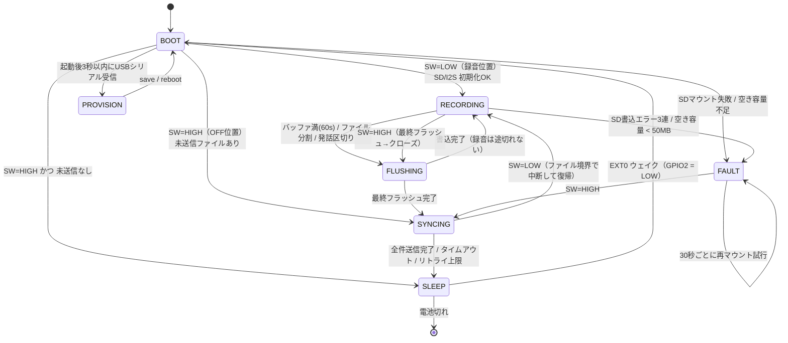

# MindClip DIY — Phase 1 ファームウェア仕様書 (v1.0)

対象ハード: Seeed XIAO ESP32S3 **Sense**（Sense拡張ボード装着、カメラ取り外し）
上位文書: [`../hardware/ELECTRICAL.md`](../hardware/ELECTRICAL.md) /
[`../hardware/COMMS.md`](../hardware/COMMS.md) /
[`../hardware/README.md §8`](../hardware/README.md) /
[`../docs/local-llm-voice-logger-design.md`](../docs/local-llm-voice-logger-design.md)
下流: Phase 0 サーバ [`../voice-logger/`](../voice-logger/)（**完成済み。壊さない**）

本書は「散在する要件を1つにまとめ、実装前に曖昧さを潰す」ためのもの。
**本書に書いていない挙動を実装で勝手に決めない。** 決める必要が出たら本書を先に更新する。

---

## 0. スコープと非スコープ

### 0.1 やること（v1 必達）
1. PDM 16kHz/16bit/mono 録音 → microSD に PCM WAV
2. 省電力（CPU 80MHz / バッファ書込 / VADゲート）で **実測平均 ≤28mA**
3. スイッチOFF → WiFi → HTTPS POST → ACK後にSD削除 → deep sleep
4. 同期時にサーバから時刻を受け取り RTC 補正（NTPを使わない）
5. EXT0(GPIO2, LOW) ウェイク、RTCプルアップ明示、SD CS(GPIO21) HIGHホールド
6. WiFi認証情報は NVS。日中は無線完全オフ
7. mTLS + 共有秘密HMAC の二重認証。無認証で受けない

### 0.2 やらないこと（回路が無い。**実装しようとしないこと**）
| 項目 | 理由 |
|---|---|
| VBUS(USB挿入)検出 | 分圧回路が無い（ELECTRICAL §2.1）。**同期トリガはスイッチOFFのみ** |
| 電池残量表示・低電圧保護 | 電池電圧監視回路が無い。過放電はセル側PCMのUVLOに委ねる |
| 内蔵ユーザーLEDでの状態表示 | GPIO21 が SD CS と共用（ELECTRICAL §1.1）。表示は外付けLED(D3)のみ |
| ADPCM圧縮 / SD上の暗号化 | v2候補（COMMS §1・§3-4）。v1は生PCM WAV |
| リアルタイム同期 | COMMS §5 |

---

## 1. ピン・クロック・ビルド設定（確定値）

| 用途 | GPIO | 設定 |
|---|---|---|
| スライドスイッチ | **GPIO2 (D1)** | `INPUT_PULLUP`、**ON=LOW=録音** / OFF=HIGH=同期→sleep |
| 外付けLED | **GPIO4 (D3)** | LEDC ch0 / 5kHz / 8bit、既定デューティ **15%**（10〜20%可変, NVS `cfg.led_duty`） |
| PDM CLK / DATA | GPIO42 / GPIO41 | `I2S_MODE_PDM_RX` 16000Hz / 16bit / MONO |
| microSD SPI | SCK7 / MISO8 / MOSI9 / **CS21** | `SD.begin(21, SPI, 20000000)`（20MHz。不安定なら 10MHz へ落とす） |

- **CPUクロック 80MHz**: `setCpuFrequencyMhz(80)` を `setup()` の最初に。
  以降クロックを上げない（SD/WiFi処理中も 80MHz のまま。WiFi は 80MHz 以上で動作可）。
- **PSRAM 必須**（Arduino IDE: PSRAM = OPI PSRAM）。録音リングバッファは PSRAM に置く。
- Flash 8MB / USB CDC On Boot = **Enabled**（プロビジョニングに必須）。
- `btStop()` を起動時に呼び、BLE を明示的に落とす。録音中は `WiFi.mode(WIFI_OFF)`。
- ボード FQBN: `esp32:esp32:XIAO_ESP32S3`（`arduino-cli board listall esp32` で確認すること）。

---

## 2. 状態機械



### 2.1 各状態の定義・LED・電流

LEDは常に LEDC PWM デューティ 15%（「微灯」= 平均 0.9mA）で駆動する。
**明るさは変えず、点滅パターンだけで状態を区別する。**

| 状態 | 内容 | LED表示 | 電流見積 (assumption) |
|---|---|---|---|
| **BOOT** | クロック80MHz化 → NVS読出 → SD/I2S初期化 → `.rec` 復旧 → 分岐。所要 <2s | 起動時に0.2s×1回 | 45 mA / 2 s |
| **RECORDING(LISTEN)** | VAD=無音。I2S DMA受信＋VAD計算のみ。SDはアイドル(CS=HIGH) | 4秒ごとに 60ms パルス（生存表示） | **19.9 mA** |
| **RECORDING(CAPTURE)** | VAD=発話。PSRAMリングバッファへ蓄積 | 点灯（微灯・連続） | **20.9 mA** |
| **FLUSHING** | リングバッファ→SDへ一括書込＋WAVヘッダ更新。**録音は並行して継続** | 直前の表示を維持（短すぎて区別不要） | **71.9 mA / 約1.9 s** |
| **SYNCING** | WiFi接続→時刻取得→ファイル送信→削除 | 1Hz点滅。持越し発生時は sleep前に「2回点滅」を10秒 | **100 mA**（瞬時 >300mA） |
| **SLEEP** | deep sleep。EXT0待ち | 消灯 | **3 mA**（公式 typ, Sense装着時） |
| **FAULT** | SD無し/満杯。録音しない | 「3回点滅＋1.5秒休み」を繰返し | 20 mA |
| **PROVISION** | シリアルCLI。無線オフ | 5Hz 高速点滅 | 40 mA |

> RECORDING(LISTEN/CAPTURE) と FLUSHING の電流内訳は §8 の分解モデルによる。
> **すべて assumption であり、README §8.6 の実測ゲートで確定させること。**

### 2.2 遷移条件の詳細

- **スイッチの読み取りは 20ms×3回一致のデバウンス**を必ず通す（配線が長く、装着中の振動でチャタリングする）。
- `RECORDING → SYNCING` は「**現在のWAVを正しくクローズしてから**」行う。クローズ前に電源が落ちても §5.3 によりファイルは壊れない。
- `SYNCING → RECORDING`（同期中にスイッチON）は**送信中のファイルを完了させてから**中断する。
  中断時点で未送信のファイルはSDに残し、次回の同期に持ち越す。**送信途中で切ってもサーバ側に半端なファイルは残らない**（§6.4）。
- `SYNCING → SLEEP` は成功・失敗を問わず必ず通る。sleep しない経路を作らない（電池を無駄にしない）。

---

## 3. 録音仕様

### 3.1 オーディオパス

```
PDM mic → I2S(PDM_RX, 16kHz/16bit/mono) → DMA(8 × 1024 sample) 
   → [VAD 20ms フレーム判定] → PSRAMリングバッファ(60s = 1.92MB)
   → [FLUSH] → SD: /rec/YYYYMMDD_HHMMSS.wav
```

- DMAバッファは **1024 サンプル×8面**（1面=64ms）。CPUは `i2s_read()` でブロックし、
  待っている間は FreeRTOS idle → WFI に入る（これが §8 の `cpu_busy≈12%` の根拠）。
  **ポーリングやビジーウェイトを書かないこと**（省電力予算が壊れる）。
- リングバッファ長は NVS `cfg.buf_sec`（既定 60、範囲 30〜60）。60s = 1.92MB を PSRAM に確保。
- **プリロール 500ms**: 発話検出前の 500ms も必ず保存する（whisperの語頭欠けを防ぐ）。

### 3.2 ファイル分割（**重要な設計判断**）

| 条件 | 動作 |
|---|---|
| ハード上限 | **経過 600 秒（10分）で必ず分割**（要件1／転送単位を約19.2MBに抑える） |
| 発話の切れ目 | **無音が 3.0 秒以上続いたらファイルをクローズ**する。次の発話開始時に新しいファイルを開く |
| 最小長 | 確定音声長が **2.0 秒未満のファイルは作らない／作った場合は削除**（物音の誤検出を捨てる） |

**なぜ「無音3秒で分割」を追加するのか（曖昧さの解消）**:
VADで無音を捨てると *ファイル内の音声時刻* と *壁時計時刻* がずれる。
Phase 0 の `pipeline.build_markdown_block()` は
`clock = start + timedelta(seconds=seg.start)` で発話時刻を出しているため、
1ファイル内に長い無音カットが挟まると Daily Note の時刻が実際より早く表示され、
「日記の質」（COMMS §4 が時刻精度を重視する理由）が落ちる。
無音3秒で切れば **ファイル内の時刻ずれは最大3秒**に収まり、
ファイル名の開始時刻が常に実測値になる。

- 副作用: ファイル数が増える（15h・発話35%なら平均60s/件で約300件/日）。
  → 同期は **TLSコネクションを張りっぱなしで keep-alive** し、ハンドシェイクを1回で済ませる（§6.5）。
- 却下した案: 「10分固定＋無音もそのまま記録」＝ 省電力予算とSD容量を無駄にする。
  「10分固定＋無音カット」＝ 上記の時刻ずれが最大10分に達する。

### 3.3 ファイル名

```
/rec/YYYYMMDD_HHMMSS.wav        録音完了（同期対象）
/rec/YYYYMMDD_HHMMSS.wav.rec    録音中（同期対象にしない）
/rec/UNSYNC-<boot>-<seq>.wav    RTC未同期で作成（<boot>は4桁, <seq>は3桁）
```

- **`YYYYMMDD_HHMMSS` は Phase 0 の `timeparse.py` が最優先で解釈する形式**であることを実コードで確認済み:
  `parse_start_time(Path("20260827_091500.wav"))` → `(2026-08-27 09:15:00, "filename")`。
- `.wav.rec` は拡張子が `.rec` なので `pipeline.AUDIO_EXTENSIONS` に入らず、
  万一SDを直接PCに挿しても誤って処理されない（`iter_audio_files()` で検証済み）。
- `UNSYNC-0007-003.wav` は timeparse のどのパターンにも合致しない（数字の連なりが8桁未満）ことを実行確認済み
  → `mtime` フォールバックに落ちる。**ただしSDのmtimeも未同期なので信用できない。
  よって UNSYNC ファイルは §6.3 の手順で必ずサーバ側が正規名にリネームしてから inbox に置く。
  inbox に UNSYNC 名のまま残すことは禁止。**

### 3.4 RTC / 時刻の扱い

- 時刻は `RTC_DATA_ATTR` の構造体（epoch秒 + `valid` フラグ + magic）で保持する。
  ESP32-S3 の RTC タイマは deep sleep 中も動くので、**sleep→ウェイクでは時刻を失わない**。
- NVS `clk.last_epoch` にも同期時と毎ファイルクローズ時に書き込む（電池切れ後の粗い復元用。
  ただし復元しても `valid=false` のまま扱い、UNSYNC 名を使う）。
- `valid=false` になるのは「初回書込後」「電池が完全に切れた後」のみ。
- 同期（§6.2）で時刻を得たら即座に `settimeofday()` し `valid=true`。
  タイムゾーンはサーバから受け取る `tz_offset_min` を適用し、**ファイル名はローカル時刻**で付ける
  （Phase 0 の Daily Note がローカル日付で切られるため）。

---

## 4. VAD（エネルギー閾値）仕様

| パラメータ | 既定値 | NVSキー | 備考 |
|---|---|---|---|
| フレーム長 | 20 ms（320 サンプル） | — | I2S 64ms バッファを 20ms 単位で走査 |
| 特徴量 | フレーム平均絶対値 → dBFS 換算 | — | RMSより安価。`20*log10(mean_abs/32768)` |
| ノイズフロア追従 | 非対称IIR: 下降 α=0.05 / 上昇 α=0.0005 | — | 環境騒音に自動追従（自動調整**要**） |
| 判定閾値 | `floor_dB + margin`、margin 既定 **9 dB** | `cfg.vad_margin` | 絶対クランプ **-50 〜 -25 dBFS** |
| 立ち上がり | 3フレーム連続(60ms)で超過 → CAPTURE | — | 単発の物音を弾く |
| ハングオーバー | **800 ms** 閾値未満が続いたら LISTEN へ | `cfg.vad_hang` | 語尾・文節間の欠落防止 |
| プリロール | **500 ms** | — | §3.1 |

### 4.1 書込デューティ ≤35% の担保

**用語を分離する（ここが要件の曖昧点）**:
- `D_capture` = VADが採用した音声秒数 ÷ 経過秒数。**ELECTRICAL §2.2 の「SD書込デューティ ≤35%」はこれを指す**。
- `D_spi` = SPIが実際に書込んでいる時間の割合 = `D_capture × 32000 B/s ÷ 書込スループット`。
  スループット 1.0 MB/s（assumption）なら `D_capture=35%` で **`D_spi`=1.12%**。

担保方法（**デューティ・ガバナ**）:
1. 直近 600 秒のスライディング窓で `D_capture` を積算する。
2. `D_capture > 0.35` が続く間、30秒ごとに `margin` を +1 dB（上限 +12 dB）。
3. `D_capture < 0.15` が続く間、30秒ごとに `margin` を −1 dB（下限 6 dB）。
4. **ハードクランプ**: `D_capture > 0.50` になったら、その窓が 0.50 を割るまで強制的に LISTEN 固定。
   既定は **無効**（`cfg.vad_hardclamp=0`）。理由は §8 の通り、電力ゲートは `D_capture=100%` でも
   通る見込みであり、発話を機械的に切り捨てる副作用のほうが害が大きいため。
   SD容量・転送時間が問題になった個体でのみ有効化する。

> **ガバナが上限に張り付いた（+12dB）状態が10分続いたらログに WARN を出す。**
> それは「常時騒音下にいる」か「マイク開口が塞がっている」かのどちらかで、実測ゲートの前に切り分けが要る。

---

## 5. WAVファイル形式

### 5.1 ヘッダ（44バイト・正準RIFF）

| offset | size | 値 |
|---|---|---|
| 0 | 4 | `"RIFF"` |
| 4 | 4 | `riff_size` = 36 + data_bytes （**動的更新**） |
| 8 | 4 | `"WAVE"` |
| 12 | 4 | `"fmt "` |
| 16 | 4 | 16 |
| 20 | 2 | 1 (PCM) |
| 22 | 2 | 1 (mono) |
| 24 | 4 | 16000 |
| 28 | 4 | 32000 (byteRate) |
| 32 | 2 | 2 (blockAlign) |
| 34 | 2 | 16 (bitsPerSample) |
| 36 | 4 | `"data"` |
| 40 | 4 | `data_bytes` （**動的更新**） |

拡張チャンク（LIST/INFO 等）は**付けない**。ffmpeg / faster-whisper / `soundfile` のいずれでも
追加処理なしに読めることを優先する。

### 5.2 サイズ未確定ヘッダの扱い

**「常に、実際に書き込み済みのバイト数以下の値を書く」を不変条件にする。**

フラッシュ1回の手順（この順序を守ること）:
1. リングバッファ内容を **ファイル末尾へ追記**
2. `file.flush()`（FATのFAT/ディレクトリエントリまで確定させる）
3. `seek(4)` → `riff_size` 更新 / `seek(40)` → `data_bytes` 更新
4. `file.flush()`
5. `seek(end)` に戻して次のフラッシュに備える

- ヘッダ更新のコストはセクタ1〜2個の read-modify-write のみ（60秒に1回なので無視できる）。
- **手順3の途中で電源が落ちてもヘッダは「前回の（＝より小さい）値」のままなので、必ず有効なWAVになる。**
  逆順（先にヘッダを大きくしてからデータを書く）にすると、電池切れ時に
  「宣言サイズ > 実データ」の壊れたファイルになるので**絶対に採らない**。
- 電池切れによる最大損失は **直近フラッシュ以降の音声（≤60秒）** に限定される。

### 5.3 クローズと復旧

- 正常クローズ: 最終フラッシュ → ヘッダ更新 → `close()` → **`.wav.rec` → `.wav` にリネーム**。
- BOOT時の復旧: `/rec/*.wav.rec` が残っていたら（＝前回は電池切れ or 異常リセット）
  1. ファイルサイズを読み、`data_bytes = min(header_data_bytes, filesize - 44)` に補正して書き直す
  2. `data_bytes < 32000`（1秒未満）なら削除、そうでなければ `.wav` へリネームして同期対象にする
- 上記により「**中断したファイルが壊れない**」を構造で担保する。

---

## 6. 通信プロトコル

### 6.1 共通

- ベースURL: NVS `srv.url`（例 `https://192.168.1.10:8443`）。**http:// は受け付けない**（起動時に検証しFAULTログ）。
- 認証は**二重**（COMMS §3-1 と課題要件7）:
  1. **mTLS** — デバイスにクライアント証明書・秘密鍵を焼き、サーバ側CAで検証。
     デバイス側もサーバ証明書をプライベートCAで検証する（`WiFiClientSecure::setCACert` /
     `setCertificate` / `setPrivateKey`）。
  2. **共有秘密HMAC** — アプリ層で `Authorization` ヘッダ。
     mTLS の終端をリバースプロキシに任せた構成でも認証が消えないようにするため、
     **どちらか一方ではなく必ず両方**要求する。
- HMAC:
  ```
  msg  = "<method>\n<path>\n<device_id>\n<sha256_hex_of_body>\n<nonce_hex>"
  sig  = HMAC-SHA256(nvs:hmac.key, msg)
  Authorization: MindClip-HMAC dev=<device_id>,nonce=<32hex>,sig=<64hex>
  ```
  タイムスタンプは**使わない**（RTC未同期時に成立しなくなるため）。
  リプレイ耐性は ①nonce の LRU キャッシュ（サーバ側 4096件 / 24h）
  ②**ボディの sha256 による冪等化**で確保する。
  ②は Phase 0 の `Manifest` がすでに sha256 基準で重複排除している設計と一致する（`pipeline.py`）。

### 6.2 `GET /api/v1/time`

同期セッションの**最初に必ず1回**呼ぶ。送るファイルが0件でも呼ぶ（RTC補正のため）。

レスポンス:
```json
{ "ok": true, "server_epoch": 1787900591, "tz_offset_min": 540,
  "iso": "2026-08-27T21:03:11+09:00" }
```
受信後ただちに `settimeofday()` → `rtc.valid = true` → NVS `clk.last_epoch` 更新。
**NTPクライアントは実装しない**（COMMS §4「NTPで外部に出る必要はない」）。

### 6.3 `POST /api/v1/ingest`

- ボディ: **WAVの生バイト列**（`Content-Type: audio/wav`）。multipartは使わない（ESP32側のストリーミング送信を単純にするため）。
- メタデータはヘッダで渡す:

| ヘッダ | 例 | 意味 |
|---|---|---|
| `X-MindClip-Device` | `mindclip-01` | NVS `dev.id` |
| `X-MindClip-Filename` | `20260827_091500.wav` | SD上の名前 |
| `X-MindClip-Sha256` | `<64hex>` | ボディのSHA-256（デバイス側で算出） |
| `X-MindClip-Bytes` | `2118444` | ボディ長（`Content-Length` と一致必須） |
| `X-MindClip-Duration-Ms` | `66200` | 音声長 |
| `X-MindClip-Unsynced` | `0` / `1` | 1 なら RTC未同期で録音されたファイル |
| `X-MindClip-Age-Ms` | `18422100` | **このファイルの録音開始から「今」までの経過ms**（`X-MindClip-Unsynced: 1` のとき必須） |

- **未同期ファイルの命名解決**: サーバは `Unsynced:1` のとき
  `start = server_now − Age-Ms` を計算し、**`YYYYMMDD_HHMMSS.wav` にリネームして保存する**。
  `Age-Ms` が無い/異常（負・7日超）の場合は `server_now` を用いる。
  いずれにせよ **inbox には必ず timeparse が `filename` として解釈できる名前しか置かない**。
- 名前衝突時は `YYYYMMDD_HHMMSS_1.wav`, `_2.wav` …（timeparse は末尾の連番を無視して先頭一致するため安全）。

レスポンス 200:
```json
{ "ok": true, "sha256": "<64hex>", "stored_name": "20260827_091500.wav",
  "bytes": 2118444, "duplicate": false,
  "server_epoch": 1787900612, "tz_offset_min": 540 }
```

| ステータス | 意味 | デバイスの動作 |
|---|---|---|
| 200 `duplicate:false` | 保存完了 | sha256一致を確認して**SDから削除** |
| 200 `duplicate:true` | 同一sha256が既に処理済/inboxにある | **SDから削除**（再送ループを防ぐ） |
| 400 | ヘッダ不整合・sha256不一致 | そのファイルをリトライ（3回まで）。3回失敗で持越し |
| 401 / 403 | 認証失敗 | **セッション全体を即中止**してsleep（リトライ無意味・電池の無駄） |
| 413 | サイズ超過 | 持越し＋WARNログ |
| 507 | サーバのディスク不足 | **セッション全体を中止**、全ファイル持越し |
| 5xx / タイムアウト | 一時障害 | リトライ（3回まで、バックオフ 1s/3s/9s） |

### 6.4 ACKと削除の順序（**サーバが受け取る前に消さない**）

サーバ側の受理手順（この順序を実装で守ること）:
1. ボディを `inbox/<name>.wav.part` に書く
2. `f.flush()` + `os.fsync(fd)`
3. 受信データの sha256 を計算し、`X-MindClip-Sha256` と照合。不一致なら `.part` を削除して 400
4. `os.rename()` で `inbox/<name>.wav` へ（同一FS内なのでアトミック）
5. ディレクトリを `fsync`
6. **ここで初めて 200 を返す**

- `.wav.part` は `pipeline.AUDIO_EXTENSIONS` に含まれないため、書込中のファイルを
  `watch` が拾わないことを実コードで確認済み（`iter_audio_files()` は `.part` を返さない）。
  Phase 0 の `_stable_files()`（2回スキャンでサイズ不変を確認）と合わせて二重に安全。
- デバイス側は **200 かつ `sha256` がローカル計算値と一致** した場合のみ `SD.remove()` する。
  レスポンスが読めなかった／接続が切れた場合は**削除しない**（次回に再送＝`duplicate:true` で回収される）。

### 6.5 セッションの流れとタイムアウト

```
WiFi.begin(ssid, pass)              ; 接続タイムアウト 30 秒（COMMS §4）
  └ 失敗 → 即 deep sleep（データはSDに残す。外出先で他APを探さない）
GET /api/v1/time                    ; タイムアウト 10 秒
for each /rec/*.wav (古い順):
    POST /api/v1/ingest             ; 接続10s / 送信60s / 応答30s
    3回リトライ、成功でSD削除
    ※ 1本のTLSコネクションを keep-alive で使い回す（§3.2でファイル数が増えるため必須）
WiFi.disconnect(true); WiFi.mode(WIFI_OFF)
deep sleep
```
- セッション全体の上限 **15分**。超えたら未送信を持ち越して sleep（電池保護）。
- 送信順は**古いファイルから**。途中で切れても古いものから確実に減る。

---

## 7. エラー時の挙動（全ケース確定）

| # | 事象 | 検出 | 挙動 | LED |
|---|---|---|---|---|
| E1 | **SDが無い / マウント失敗** | `SD.begin()` 失敗×3（間に200ms） | 録音しない。**FAULT** へ。30秒ごとに再マウントを試み、成功したら RECORDING へ復帰 | 3回点滅＋1.5s休み |
| E2 | **SDが満杯** | 空き `< 50MB` を毎フラッシュ前に確認 | 現在のファイルをクローズして FAULT。**録音は止めるが同期経路は生かす**（スイッチOFFで送信→削除すれば空く） | 3回点滅＋1.5s休み |
| E3 | **SD書込エラー** | `write()` の戻り値不一致 | 同一ファイルへ1回再試行 → 失敗ならクローズしてファイル番号を進めて継続。3ファイル連続で失敗したら E1 扱い | E1と同じ |
| E4 | **WiFiに繋がらない** | 30秒タイムアウト | **リトライしない**。ファイルを残して即 deep sleep（COMMS §4） | 2回点滅を10秒→消灯 |
| E5 | **サーバが応答しない / 5xx** | HTTPタイムアウト | ファイル単位で3回（1s/3s/9s）→ 持越し。次のファイルへは進まず**セッション中止**（サーバが落ちている） | 2回点滅を10秒→消灯 |
| E6 | **認証失敗 (401/403)** | ステータス | セッション即中止。**証明書/鍵の入れ忘れが原因なので次回も失敗する**→ 高速点滅5回で明示 | 5回点滅を10秒→消灯 |
| E7 | **録音中にスイッチOFF** | デバウンス後 HIGH | 現ファイルを最終フラッシュ→ヘッダ更新→クローズ→`.wav`へリネーム→SYNCING | — |
| E8 | **同期中にスイッチON** | デバウンス後 LOW | **送信中のファイルは完了させてから**中断し RECORDING へ。未送信は持越し | — |
| E9 | **RTC未同期のままファイル作成** | `rtc.valid == false` | `UNSYNC-<boot>-<seq>.wav` で作成。同期時に `X-MindClip-Unsynced:1` + `Age-Ms` を付けて送り、**サーバが正規名にリネーム**（§6.3）。SD上でのリネームはしない（同期に成功しなければ意味がないため） | 通常表示に加え、10秒ごとに2回点滅 |
| E10 | **同期成功後にRTCが有効化された** | `/time` 応答 | 以後に作るファイルは正規名。既にある UNSYNC ファイルは E9 の経路で解決 | — |
| E11 | **NVS未設定（初回）** | `wifi.ssid` 空 | 録音は**行う**（UNSYNC名で貯まる）。同期は試みず即sleep。プロビジョニングを促す | 起動時に5回点滅 |
| E12 | **PSRAMが無い/確保失敗** | `ps_malloc()` == NULL | バッファ長を 60s→10s（内部SRAM 320KB）に自動縮退して継続。WARNログ | 起動時に4回点滅 |
| E13 | **I2S初期化失敗** | `I2S.begin()` false | 録音不能。FAULT（再初期化を30秒ごと） | 3回点滅 |
| E14 | **スイッチ状態が読めない/チャタリング** | デバウンス不成立が5秒継続 | 安全側に倒して **RECORDING を継続**（記録の取りこぼしより電池消費を許容） | — |

**共通ルール**: どのエラーでも「**SDのファイルを消す方向には倒さない**」。
削除が許されるのは §6.4 のACK確認後と、§5.3 の 1秒未満ファイルだけ。

---

## 8. 電力予算

### 8.1 分解モデル（すべて assumption。実測で確定）

| 記号 | 内容 | 値 |
|---|---|---|
| `I_idle` | RF off・CPU idle(WFI)@80MHz ＋ Sense拡張ボード/SDアイドル ＋ PDMマイク | **18.0 mA** (13 + 3 + 2) |
| `I_cpu` | CPU実行中の増分 @80MHz | **+8.0 mA** |
| `I_sdw` | SPI書込中の増分 | **+45.0 mA** |
| `I_led` | LED 5.9mA × PWM 15% | **+0.9 mA** |
| `cpu_busy` | LISTEN 12% / CAPTURE 25% / FLUSH 100% | — |
| 書込スループット | SPI 20MHz の実効値 | **1.0 MB/s** |

`I_idle` の 3 mA は、ELECTRICAL §2.2 の「素のXIAO deep sleep 14µA に対し Sense装着時 3mA(公式typ)」
＝ 拡張ボード＋SDカードの静止電流が約3mA、という公式値から取った。

### 8.2 状態別電流と平均

| 状態 | 計算 | 電流 |
|---|---|---|
| RECORDING(LISTEN) | 18 + 8×0.12 + 0.9 | **19.9 mA** |
| RECORDING(CAPTURE) | 18 + 8×0.25 + 0.9 | **20.9 mA** |
| FLUSHING | 18 + 8×1.00 + 45 + 0.9 | **71.9 mA** |
| SYNCING | ELECTRICAL §2.2 | 100 mA |
| SLEEP | 公式 typ | 3 mA |

`D_capture` を振ったときの録音時平均（`D_spi = D_capture × 32000 ÷ 1.0e6`）:

| `D_capture` | `D_spi` | 録音時平均 | 28mAに対する余裕 |
|---|---|---|---|
| 20% | 0.64% | **20.39 mA** | 7.61 mA |
| **35%（目標）** | 1.12% | **20.80 mA** | **7.20 mA** |
| 50% | 1.60% | 21.20 mA | 6.80 mA |
| 100%（VAD無効） | 3.20% | 22.53 mA | 5.47 mA |

### 8.3 トップダウン検算（公式実測値 54.4mA からの引き算）

```
54.4 mA (公式: 録音+SD連続書込 @240MHz)
 − 18.0 (CPU 240→80MHz, assumption)
 − 19.8 (SPI書込デューティ 45%→1.12%, 45mA × 0.44)
 + 0.9  (LED)
 ＝ 17.5 mA
```
ボトムアップ 20.8 mA / トップダウン 17.5 mA。**独立な2経路が 17〜21mA に収束**し、
どちらも 28mA ゲートに 25〜37% の余裕がある。

### 8.4 感度分析と「本当のリスク」

`D_capture=35%` 固定で `I_idle` だけを振る:

| `I_idle` | 録音時平均 | 判定 |
|---|---|---|
| 18 mA（想定） | 20.80 | ◎ |
| 22 mA | 24.80 | ○ |
| 24 mA | 26.80 | △（余裕1.2mA） |
| **26 mA** | **28.80** | **✗ ゲート不通過** |

> **結論（重要）: この設計では VAD は電力の主役ではない。**
> バッファ書込を入れた時点で SPI が動くのは全体の約1%であり、
> `D_capture` を 100%→20% に下げても平均は 2.1 mA しか減らない。
> 28mAゲートの成否は **`I_idle`（常時オンの床）＝ CPU 80MHz 化とWFIで寝られているか** でほぼ決まる。
> VADの `≤35%` 要件は主として **SD容量（0.60 GB/日）・転送時間・SD寿命** の予算として扱う。

`I_idle` が想定より高かった場合の対策（この順で試す）:
1. ビジーウェイトの排除（`delay()` ではなく `i2s_read()` のブロッキング待ちで寝る）
2. DMAバッファを 64ms→128ms に伸ばして起床回数を半減
3. `SD.end()` を長い無音時に呼び、SPIバスを落とす（再マウントに約80msかかる点に注意）
4. `esp_pm_configure()` で自動ライトスリープ（I2S DMA と両立するか要検証）
5. それでも駄目なら ELECTRICAL §2.2 の規定どおり **slim → allday** へバリアント変更

### 8.5 1日の収支

| 項目 | 計算 | 消費 |
|---|---|---|
| 装着 15h | 20.80 mA × 15h | 312 mAh |
| 同期 5分 | 100 mA × (5/60)h | 8.3 mAh |
| deep sleep 9h | 3 mA × 9h | 27 mAh |
| **合計** | | **347 mAh** |

一晩10時間の充電で戻せるのは **50mA × 10h = 500 mAh**（ELECTRICAL §2.1）なので
**153 mAh（約44%）の余裕**がある。
連続録音時間は allday 680mAh ÷ 20.8mA ≈ **32.7 h**、slim 425mAh ÷ 20.8mA ≈ **20.4 h**
（どちらも 15h 要件を満たす）。

**この節の数値はすべて見積である。README §8.6 の実測ゲート（電池側平均 ≤28mA ＝ USB電流計読み ≒25mA以下）
を通すまで「達成」と書かないこと。**

---

## 9. deep sleep 仕様

sleep 移行の手順（**この順序を守ること**）:

```c
// 1) SD を安全に切り離す
SD.end();
pinMode(21, OUTPUT);
digitalWrite(21, HIGH);                 // CS を HIGH 固定してSPIバスを解放
gpio_hold_en(GPIO_NUM_21);              // ★通常GPIOの出力状態はsleep中に失われる
gpio_deep_sleep_hold_en();              //   → ホールドしないとCSがフロートしSD待機電流が増える

// 2) 無線を確実に落とす
WiFi.disconnect(true);
WiFi.mode(WIFI_OFF);
esp_wifi_stop();
btStop();

// 3) LED を消す
ledcWrite(LED_CH, 0);
digitalWrite(4, LOW);

// 4) ウェイク要因: EXT0 = GPIO2 が LOW
rtc_gpio_pullup_en(GPIO_NUM_2);         // ★RTCドメインのプルアップを明示的に有効化
rtc_gpio_pulldown_dis(GPIO_NUM_2);      //   (通常のINPUT_PULLUPはsleep中に効かない)
esp_sleep_enable_ext0_wakeup(GPIO_NUM_2, 0);   // 0 = LOW でウェイク

// 5) RTCメモリの時刻を確定させてから寝る
esp_deep_sleep_start();
```

- **ウェイク後**: `gpio_hold_dis(GPIO_NUM_21)` と `gpio_deep_sleep_hold_dis()` を
  BOOT の最初に呼ぶこと（呼ばないと SD の CS が制御できずマウントに失敗する）。
- ウェイク直後にスイッチを再デバウンスし、HIGH に戻っていたら（誤ウェイク）
  何もせず即 sleep に戻る。
- タイマウェイクは設定しない（起きる理由がないため）。

---

## 10. NVS 設定項目とプロビジョニング

### 10.1 NVS（namespace = `mindclip`）

| キー | 型 | 既定 | 内容 | 秘密 |
|---|---|---|---|---|
| `wifi.ssid` | str(32) | — | 自宅SSID | |
| `wifi.pass` | str(63) | — | パスフレーズ | ● |
| `srv.url` | str(96) | — | `https://192.168.x.x:8443` | |
| `srv.ca` | blob(4K) | — | プライベートCA証明書 PEM | |
| `dev.id` | str(32) | `mindclip-01` | デバイス識別子 | |
| `dev.crt` | blob(4K) | — | クライアント証明書 PEM (mTLS) | |
| `dev.key` | blob(4K) | — | クライアント秘密鍵 PEM (mTLS) | ● |
| `hmac.key` | blob(32) | — | 共有秘密 (HMAC-SHA256) | ● |
| `cfg.led_duty` | u8 | 15 | LED PWM % (10〜20) | |
| `cfg.split_sec` | u16 | 600 | ファイル分割上限秒 | |
| `cfg.gap_sec` | u8 | 3 | 無音で分割する秒数 | |
| `cfg.buf_sec` | u8 | 60 | バッファ秒数 (30〜60) | |
| `cfg.vad_margin` | u8 | 9 | VAD閾値マージン dB | |
| `cfg.vad_hang` | u16 | 800 | ハングオーバー ms | |
| `cfg.vad_hardclamp` | u8 | 0 | 50%ハードクランプ有効/無効 | |
| `cfg.wifi_to_s` | u8 | 30 | WiFiタイムアウト秒 | |
| `clk.last_epoch` | u64 | 0 | 最後に既知だった時刻 | |
| `st.boot_count` | u32 | 0 | UNSYNC名の `<boot>` に使う | |

- **ソースにSSID・パスワード・鍵を書かない。** ビルド定数にも入れない（要件6）。
- 秘密（●）は `show` コマンドで `****`（末尾4文字のみ）表示にする。

### 10.2 プロビジョニング手順（初心者向け）

**入り方**: USBケーブルでPCに接続 → Arduino IDE の**シリアルモニタ（115200, 改行=LF）**を開く
→ XIAO の **R（RESET）ボタンを押す** → **3秒以内に Enter キーを押す**
→ LEDが高速点滅すればプロビジョニングモード（`mindclip>` プロンプトが出る）。

> 3秒待っても何も送らなければ通常動作に入る。**押しっぱなしのボタン操作は不要**なので、
> 筐体に組み込んだ後でも USB を挿すだけで設定を変えられる。

**コマンド**:

```
mindclip> help
mindclip> set wifi.ssid MyHomeAP
mindclip> set wifi.pass ********
mindclip> set srv.url https://192.168.1.10:8443
mindclip> set dev.id mindclip-01
mindclip> paste srv.ca            ← PEMを貼り付け、最後に "." だけの行で終了
mindclip> paste dev.crt
mindclip> paste dev.key
mindclip> gen hmac                ← 32バイト乱数を生成し、hex をコンソールに1回だけ表示
                                     （この値をサーバの設定にコピーする）
mindclip> show                    ← 設定確認（秘密は伏字）
mindclip> test wifi               ← 接続だけ試す（成功/失敗とRSSIを表示）
mindclip> test server             ← GET /api/v1/time を実行し、時刻とTLS検証結果を表示
mindclip> save
mindclip> reboot
```

- `erase` で全消去（工場出荷状態）。
- **`test wifi` と `test server` が両方 OK になるまでは組み立てを進めない**こと。
  これは README §8 のテスト群に続く「テスト7」に相当する。
- サーバ側にも同じ `hmac.key` と、CAが署名した `dev.crt` の登録が必要
  （サーバ側の生成手順は Phase 1 の実装担当がサーバ実装と一緒に用意する）。

---

## 11. Phase 0 との整合（コードレベルで確認済み）

| 確認項目 | 確認方法 | 結果 |
|---|---|---|
| `YYYYMMDD_HHMMSS.wav` を timeparse が解釈する | `parse_start_time(Path("20260827_091500.wav"))` を実行 | `(2026-08-27 09:15:00, "filename")` ✅ |
| `UNSYNC-0007-003.wav` が誤って日時解釈されない | 同上 | `mtime` フォールバック（＝**サーバでのリネームが必須**）✅ |
| `_1` 連番付きでも解釈できる | `20260827_091500_1.wav` は先頭パターンに一致 | ✅ |
| 受信中の `.wav.part` を watch が拾わない | `iter_audio_files()` に `.wav.part` を含むディレクトリを渡す | `['20260827_091500.wav']` のみ ✅ |
| 重複送信が二重処理されない | `pipeline.Manifest` が sha256 キー | ✅（HMACのリプレイ耐性②の根拠） |
| Daily Note の発話時刻 | `build_markdown_block()` は `start + seg.start` | §3.2 の「無音3秒で分割」の根拠 ✅ |

**サーバ受信APIを追加する担当者への申し送り**:
`/api/v1/ingest` は `cfg.paths.inbox` にファイルを置くだけにし、
既存の `cli.py watch` / `pipeline.process_file()` には手を入れないこと。
分析パイプラインとの結合点は「inbox にちゃんとした名前の .wav が置かれる」という一点だけにする。

---

## 12. 実装チェックリスト（受け入れ条件）

- [ ] `arduino-cli compile --fqbn esp32:esp32:XIAO_ESP32S3 firmware/mindclip/` が通る
- [ ] スケッチのディレクトリ名と `.ino` 名が一致している
- [ ] ソース中に SSID / パスワード / 鍵 / 証明書のリテラルが無い（`grep` で確認）
- [ ] `setCpuFrequencyMhz(80)` が `setup()` 冒頭にある
- [ ] `rtc_gpio_pullup_en(GPIO_NUM_2)` と `gpio_hold_en(GPIO_NUM_21)` + `gpio_deep_sleep_hold_en()` がある
- [ ] WAVヘッダ更新が「データ書込 → flush → ヘッダ更新 → flush」の順である
- [ ] `SD.remove()` の呼び出し箇所が「ACK 200 かつ sha256 一致」の内側にしかない
- [ ] 録音中に `WiFi` / `BT` の API を一切呼んでいない
- [ ] README §8.6 の実測ゲート（電池側平均 ≤28mA）を通過した数値を記録した

---

## 付録A: 未確定事項（assumption 一覧）

| 項目 | 採用値 | 状況 |
|---|---|---|
| `I_idle`（RF off / CPU idle @80MHz + Sense + マイク） | 18 mA | **assumption**。§8.4 の通りゲートの成否を左右する最重要値。最初に実測すべき |
| CPU実行中の増分 @80MHz | +8 mA | assumption |
| SPI書込中の増分 | +45 mA | assumption |
| SDカード書込スループット (SPI 20MHz) | 1.0 MB/s | assumption。0.5MB/s でも `D_spi` は 2.2% で結論は変わらない |
| WiFi同期中の平均電流 | 100 mA | ELECTRICAL §2.2（そこでも assumption） |
| deep sleep 3 mA | 公式 typ | 検証済（Seeed公式スペック表 Sense列） |
| 録音+SD連続書込 54.4 mA | 公式実測 | 検証済（§8.3 のトップダウン検算のアンカー） |
| 1日の発話割合 35% | 目標値 | 未実測。ガバナ（§4.1）で上振れを抑える |
| `ESP_I2S` ライブラリのAPI名 | `I2SClass::setPinsPdmRx()` / `begin(I2S_MODE_PDM_RX, ...)` | README §8.5 のサンプル準拠。**esp32コアのバージョンで変わるので実装時にコンパイルで確認すること**（本仕様書執筆時点ではコアのインストールが未完了で未検証） |
