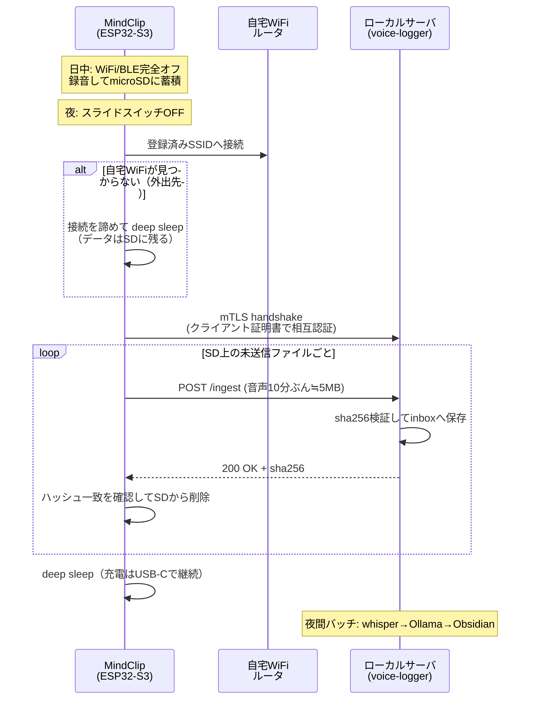

# MindClip DIY — 通信設計書（デバイス → ローカルLLM の経路）

「録音したデータをどうやってローカルサーバへ運ぶか」の設計。
結論を先に書くと、**スマホは要らない。Bluetooth も要らない。ESP32-S3 内蔵の WiFi で
自宅サーバへ直接アップロードする**のが最適解。

## 1. 結論と、そう判断した理由

### ESP32-S3 を選ぶ最大の理由が、まさにこの通信部分

「ESP32 のようなマイコンを使った方が効率がいい」という見立ては正しく、
**理由は処理能力ではなく WiFi が載っていること**にある。ここが構成全体を単純化する。

比較対象として、同種のOSSウェアラブル **Omi** は nRF52840 を使い
「デバイス → BLE → スマホアプリ → クラウド」という3段構成を取っている。
これは nRF52840 に WiFi が無く、BLE でスマホに中継してもらうしかないため。
結果としてスマホアプリの開発・常駐・電池消費・OSのバックグラウンド制限との戦いが
必ず付いてくる。

ESP32-S3 なら **デバイスが自分で自宅の WiFi に繋がる**ので、この3段が2段になり、
スマホアプリという構成要素が丸ごと消える。ゼロタッチ運用（朝つけて夜置くだけ）とも
噛み合う。中継役の機器が増えるほど、そこが情報漏洩の経路にもなり得るという点でも、
経路が短いほうが要件に合う。

### 各方式の比較

| 方式 | 必要な物 | 1日分(440MB)の転送時間 | 評価 |
|---|---|---|---|
| **WiFi直接（採用）** | 何も追加不要（内蔵） | **約3分**（実効20Mbps時） | ◎ スマホ不要、速い、経路が自宅LAN内で完結 |
| BLE → スマホ中継 | スマホアプリの開発が必要 | 約50分〜（実効150KB/s） | △ Omi方式。アプリ常駐が必要でゼロタッチと相性が悪い |
| USBケーブルでPC直結 | 毎日挿す運用 | 数分 | △ 充電と同時にできるが、PCの前に座る必要がある |
| LTE / LPWA | SIM・月額費用 | — | ✗ 外部網を経由するので「中だけで完結」に反する |

### 転送量の計算（この判断の根拠）

- 16kHz / 16bit / モノラルの生WAV = 32 KB/s = **115 MB/時**
- IMA-ADPCM で4:1圧縮 = **29 MB/時**
- 15時間装着 → **約440 MB/日**（ADPCM）。VADゲートが効けばこの3〜5割

440MB を BLE で運ぶと、ESP32 の実効スループット（2M PHY でも実測 100〜200KB/s 程度）では
1時間近くかかり、その間スマホを近くに置いて接続を維持し続ける必要がある。
WiFi なら同じデータが数分で終わる。**帰宅して置いた数分後には転送が終わっている**という
体験は、この差から来る。

## 2. 採用する同期フロー

**設計上のポイント**

- **同期トリガはスライドスイッチOFF**。v1 の配線には VBUS(USB挿入)検出の手段が無いため、
  「充電開始で同期」は v1 では実装できない（ELECTRICAL.md §2.1 の制約）。
  運用は「夜スイッチをOFFにして、ドックに置く」の1動作にまとまるので実用上の差は無い。
  v2 で 5Vピンからの分圧をRTC GPIOに入れれば充電検出も可能になる。
- **ファイル単位で完結**させる（10分=約5MB）。途中で切れても、そのファイルを
  最初から送り直すだけで済み、レジューム処理を実装しなくてよい。
- **サーバのACKでハッシュが一致してから初めてSDを消す**。消してから届いていなかった、
  という最悪ケースを構造的に防ぐ。
- **自宅WiFiが無い場所では何もしない**。外出先で勝手に繋ごうとしない設計にすることで、
  意図しないネットワークにデータが出る経路を作らない。

## 3. セキュリティ設計 — 「外に出ない」を構成で保証する

信頼ではなく**構成で**保証する。具体的には次の4点。

1. **相互TLS（mTLS）** — デバイスにクライアント証明書を焼き込み、サーバは正しい証明書を
   持つデバイス以外からの `POST /ingest` を拒否する。サーバ証明書もデバイス側で検証するので、
   偽サーバに送ってしまう事故も防げる。自己署名のプライベートCAで十分（外部CAは不要）。
2. **サーバをLANにのみバインド** — `/ingest` は自宅LANのアドレスでのみ待ち受け、
   ルータのポート開放は**しない**。外から到達する経路をそもそも作らない。
3. **サーバのegress制限** — 分析サーバからの外向き通信をファイアウォールで明示的に落とす。
   whisper も Ollama もローカル推論なので、正常動作に外向き通信は一切不要。
   「外に出ていないことを検証できる」状態にしておく。
4. **SD紛失対策** — デバイスを落とした場合に備え、SD上の音声をサーバ公開鍵で暗号化して
   保存する案（復号鍵は自宅サーバのみが持つ）。v1では未実装、v2の候補。

### Cloudflare について（前回の続き）

外出先からリアルタイムで同期したくなった時のために、改めて明記しておく。

**Cloudflare Tunnel は本件では推奨しない。** TLS が Cloudflare のエッジで終端されるため、
音声データが**復号された状態で第三者インフラを通過する**。「外部に漏洩しない」という
要件と厳密に矛盾する。外部からの同期が必要になったら **Tailscale / WireGuard**
（エンドツーエンド暗号化で、中継サーバは鍵交換にしか関与せず中身を見られない）を使う。

ただし本設計では**そもそも外部経路が要らない**。帰宅時に自宅LANで同期するだけなので、
パケットが宅外に出ることが一度もない。これが最も強いプライバシー保証になる。

## 4. ファームウェア側の通信要件（Phase 1 で実装）

| 項目 | 要件 |
|---|---|
| WiFi認証情報 | NVS（不揮発領域）に保存。ソースにハードコードしない |
| 接続タイムアウト | 30秒。見つからなければ即 deep sleep（電池を無駄にしない） |
| 送信中のクロック | WiFi送信時は瞬時300mA超のバーストがあるため、電池PCMの放電定格が連続500mA以上必要（bom.md #2 の必須条件） |
| リトライ | ファイル単位で3回まで。失敗したらSDに残したまま次回に持ち越す |
| 時刻同期 | 同期時にサーバから現在時刻を受け取りRTCを補正（ファイル名のタイムスタンプ精度が日記の質に直結するため）。NTPで外部に出る必要はない |
| 日中の無線 | **完全オフ**。録音中にWiFi/BLEを有効にしない（消費電流とプライバシーの両面） |

## 5. なぜリアルタイム同期をやらないか

技術的には BLE や WiFi 常時接続でリアルタイム転送もできるが、v1 では採用しない。

- **電池が持たない** — 日中WiFiを維持すると消費電流が数倍になり、終日稼働が破綻する
- **日記という用途に不要** — その日のログが翌朝までに揃っていれば目的を満たす
- **本家も同じ** — SwitchBot AIマインドクリップも「充電中に自動転送」というバッチ方式。
  ウェアラブルの電力制約から出てくる自然な帰結

リアルタイム性が本当に必要だと分かってから Phase 3 で足せばよい。その時も、
デバイス側は「録りためて送る」ままで、送る頻度を上げるだけで済む設計にしてある。
