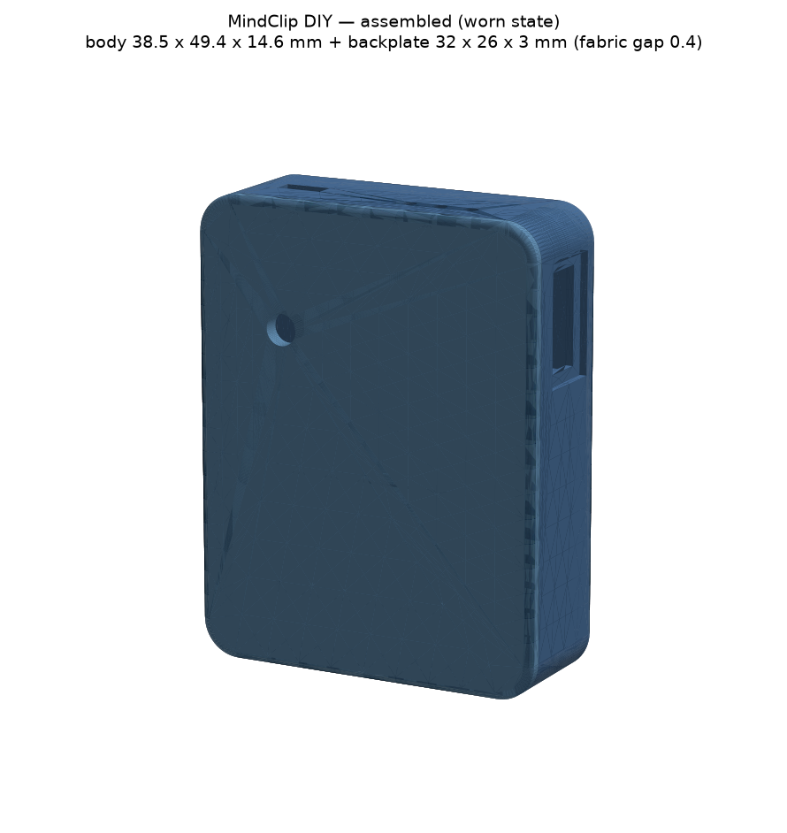
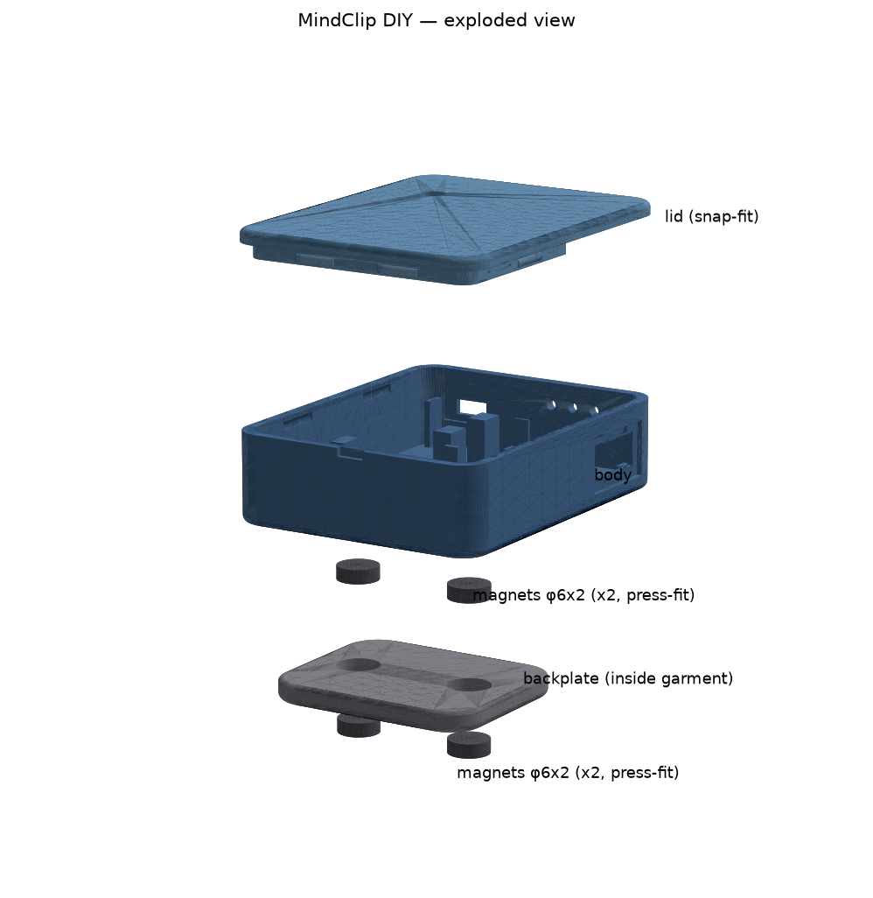
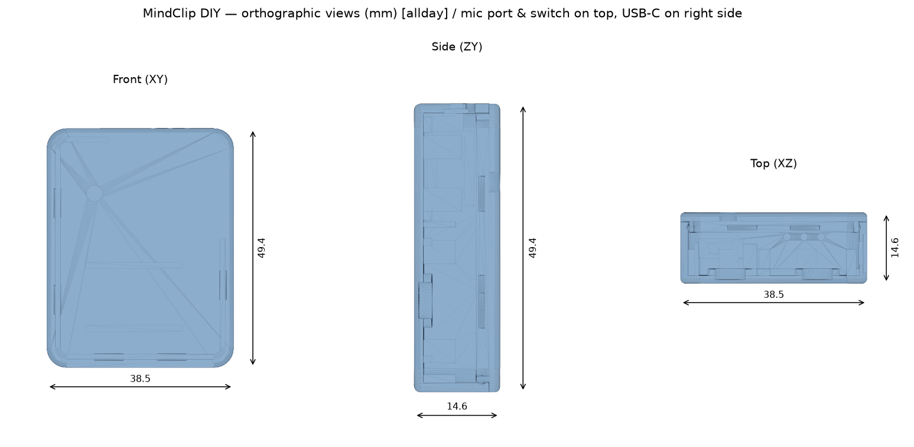
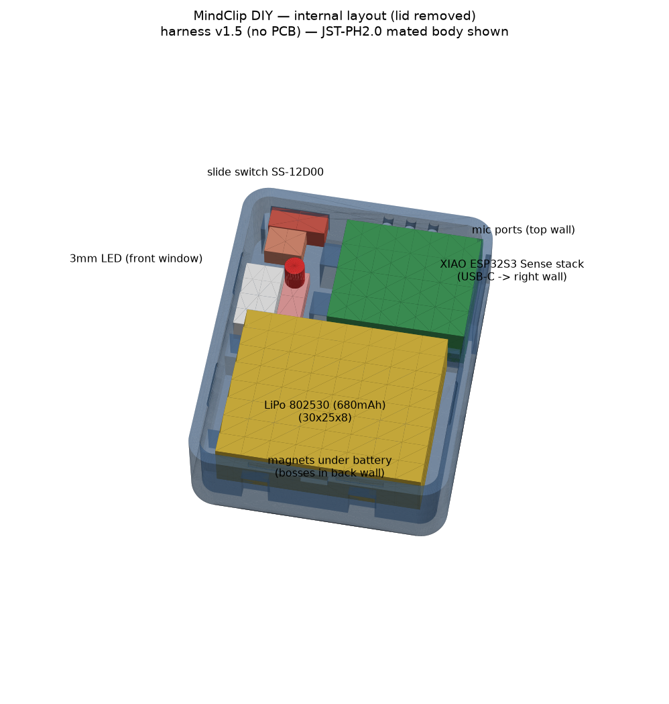

# MindClip DIY — 組み立てガイド（電子工作がはじめての人向け）

自作ウェアラブル音声ロガー **MindClip DIY** のハードウェアを、
**電子工作がまったく未経験の人でも、この手順どおりにやれば組める**ように書いたガイドです。

> **この文書が「正」です。** `ELECTRICAL.md` / `MECHANICAL.md` / `bom.md` と食い違いがある場合は
> このREADMEの記述を優先してください（矛盾していた箇所は各ファイル側も修正済みです）。

---

## 目次

1. [これは何か](#1-これは何か)
2. [完成品の外観](#2-完成品の外観)
3. [バリアントの選び方](#3-バリアントの選び方)
4. [必要な工具一覧](#4-必要な工具一覧)
5. [部品の購入](#5-部品の購入)
6. [3Dプリント手順](#6-3dプリント手順)
7. [組み立て手順](#7-組み立て手順)
8. [動作確認](#8-動作確認)
9. [既知の課題・未検証事項](#9-既知の課題未検証事項)

---

## 0. 最初に読む安全上の注意

作業を始める前に、これだけは頭に入れてください。

- **リチウムポリマー（LiPo）電池は、ショート・逆接続・穴あけで発火します。** 必ず保護回路（PCM）付きを買い、
  被覆を剥いた＋と−のリード線を絶対に触れ合わせないでください（[§7 手順8](#手順8-電池をつなぐjstコネクタ-最重要)）。
- **電池の極性を間違えると、XIAO（¥2,660）は一瞬で壊れます。** 復旧できません。
  v1.5 では電池を **JST-PH2.0 コネクタで嵌合**する方式に変えましたが、
  **コネクタは「上下逆挿し」しか防いでくれません**（中身の赤黒が逆の個体、
  ハウジング内のコンタクト位置が逆の個体が実在します）。
  **嵌合の前に、テスターで4項目を確認する手順（手順8-B）が唯一の防御です。省略しないでください。**
- はんだごてのこて先は **300℃以上**です。触れると重度のやけどをします。使わないときは必ずこて台に置く。
- はんだの煙は吸わない。**必ず換気**してください（窓を開ける、換気扇を回す）。
- 完成後、**microSDカードやクレジットカード・磁気定期券と密着させて持ち歩かない**でください
  （本機は背面にネオジム磁石を内蔵しています）。

---

## 1. これは何か

MindClip DIY は、襟元にクリップで留めて日常会話を録音し、
そのデータを**自宅のローカルサーバだけ**で文字起こし・要約して Obsidian の Daily Note に貯める、
「外部クラウドに一切データを出さない」音声ライフログデバイスの**自作ハードウェア（Phase 1）**です。
心臓部は Seeed Studio の小型マイコンボード **XIAO ESP32S3 Sense**（マイクとmicroSDスロットが載った拡張ボード付き）で、
外付け部品は **電池・スライドスイッチ・LED（+抵抗）の3つだけ**、はんだ付けは**合計10か所**まで削ってあります
（v1.5 で電池を JST-PH2.0 コネクタ化し、空中での3本より合わせを廃止しました）。
システム全体の考え方は [`../docs/local-llm-voice-logger-design.md`](../docs/local-llm-voice-logger-design.md)、
すでに動いている録音ファイル→Obsidian のパイプライン（Phase 0）は [`../voice-logger/`](../voice-logger/) にあります。
**このデバイスのファームウェアは実装済みです** → [`../firmware/`](../firmware/README.md)
（書き込み・WiFi設定・実測ゲートの手順はそちらのガイドにあります）。
本ガイドのゴールは「筐体と回路が正しく組み上がり、マイク・SD・スイッチ・LEDが動くことを確認したうえで、
[§8](#8-動作確認) でファームを焼いて録音〜サーバ同期まで通す」ところまでです。

---

## 2. 完成品の外観

以下は CAD（[`cad/mindclip_case.py`](cad/mindclip_case.py)）が自動生成したレンダリング画像です
（**allday バリアント**のもの。slim は [`renders/slim/`](renders/slim/) にあります）。

| 組み立て状態 | 分解図 |
|---|---|
|  |  |
| 服を挟んで、本体（手前）と裏板（服の内側）を磁石でクランプする | 上から リッド / 本体 / 磁石2個 / 裏板 / 磁石2個 |

| 三面図（寸法入り） | 内部レイアウト |
|---|---|
|  |  |
| 上面にマイク穴とスイッチ、右側面にUSB-C | 下段に電池、上段にXIAO、左にスイッチとLED |

- [`renders/allday/assembled.png`](renders/allday/assembled.png)
- [`renders/allday/exploded.png`](renders/allday/exploded.png)
- [`renders/allday/views.png`](renders/allday/views.png)
- [`renders/allday/internal.png`](renders/allday/internal.png)

配線の全体像は [`wiring.svg`](wiring.svg)（ブラウザで開いてください）が一番わかりやすいです。
**印刷して手元に置きながら作業する**ことを強く勧めます。

---

## 3. バリアントの選び方

筐体CADは **allday** と **slim** の2種類を出力できます。違いは**電池の厚みと、それに伴う筐体の奥行きだけ**です。
回路・配線・はんだ付け・部品点数は完全に同じです。

### allday（既定・**こちらを推奨**）

| 項目 | 値 |
|---|---|
| 電池 | **LiPo 802530（3.7V 800mAh、30×25×8.0mm、保護回路付き）** |
| 外形 | **38.5 × 49.4 × 14.6 mm** |
| 印刷部品の重量 | 15.3 g（body 7.9 / lid 4.6 / backplate 2.9） |
| デバイス総重量 | **約33 g**（電池を10gと見積もった場合。[§9](#9-既知の課題未検証事項)の注記も参照） |
| 素の状態（省電力実装なし）の連続録音 | **約12.5時間** |
| 生成コマンド | `python3 cad/mindclip_case.py` |

### slim

| 項目 | 値 |
|---|---|
| 電池 | LiPo 502530（3.7V 500mAh、30×25×5.0mm、保護回路付き） |
| 外形 | **38.5 × 49.4 × 12.9 mm** |
| 印刷部品の重量 | 14.9 g（body 7.3 / lid 4.7 / backplate 2.9） |
| デバイス総重量 | 約32 g |
| 素の状態（省電力実装なし）の連続録音 | 約7.8時間 |
| 生成コマンド | `MINDCLIP_VARIANT=slim python3 cad/mindclip_case.py` |

### なぜ allday を既定にしたか

Seeed公式スペック表に載っている**実測値**「Microphone recording & SD card writing = 3.8V / 平均54.4mA・ピーク108mA」を
電力予算の基準（＝最悪ケース）に置くと、こうなります。

| バリアント | 公称容量 | 実効容量（×0.85） | ÷ 54.4mA |
|---|---|---|---|
| slim | 500mAh | 425mAh | **約7.8時間** |
| allday | 800mAh | 680mAh | **約12.5時間** |

「起床から就寝まで（約15時間）」を目標にすると、**slim は省電力実装なしでは半分しか走れません**。
allday なら worst case でも12.5時間を確保でき、ファームウェア側の省電力
（CPUクロックを240MHz→80MHzに下げる／SDへの書き込みをRAMにためてまとめ書きする／
無音を検出して書き込みを止める VAD ゲート）が効けば **18時間以上**が見込めます。

そして厚みの増加は **1.7mm だけ**です。電池は 5.0mm → 8.0mm と3mm厚くなりますが、
筐体の奥行きを決めているのは主に XIAO のスタック（基板＋拡張ボード）側なので、外形にはそのまま反映されません。
**この1.7mmと引き換えに録音時間が1.6倍になるので、迷ったら allday** を選んでください。

> **slim を選ぶ理由があるとすれば**: 「とにかく薄くしたい」「会議の1〜2時間だけ使えればいい」場合です。

> **重要な注意（充電時間）**: XIAO の充電電流は **50mA固定**です。800mAh を空から満充電にするには
> **16〜18時間**かかります（500mAhでも11〜12時間）。つまり **一晩（10時間）の充電で戻せるのは約500mAh**。
> allday の 800mAh は「1日にたくさん使うための容量」ではなく、**省電力実装が間に合うまでのマージン・
> 充電し忘れた日の余力・経年劣化代**として効きます。詳しくは [§9](#9-既知の課題未検証事項)。

---

## 4. 必要な工具一覧

「何を買えばいいかわからない」を無くすため、**用途・価格・選び方**をすべて書きます。

### 4.1 これは必ず要る（合計 ¥8,000〜12,000程度）

| # | 工具 | 何に使うか | 目安価格 | 選び方・入手先 |
|---|---|---|---|---|
| T1 | **はんだごて**（30W前後） | 10か所のはんだ付け全部 | ¥1,500〜6,000 | 安く済ませるなら goot KS-30R 等の固定温度30W（¥1,500）。**温度調節付き（白光 FX-600 / ¥6,000前後）だと失敗が激減する**ので、今後も電子工作をするなら最初から温調付きを勧めます。こて先は**細めのB型（φ2mm前後）かC型**。極細（φ0.5）は熱が足りず初心者には難しい。秋月電子・Amazon |
| T2 | **こて台**（クリーニング用スポンジ or ワイヤ付き） | こてを安全に置く／こて先を掃除する | ¥800〜1,500 | 白光 FH-300 など。**「机に直置き」は火事とやけどの原因なので絶対にやらない**。ワイヤ（金だわし）タイプの方がこて先温度が下がらず良い |
| T3 | **はんだ**（φ0.6mm ヤニ入り） | 同上 | ¥800〜1,500 | **初心者は鉛入り（Sn60/Pb40）を強く推奨**。融点が約183℃と低く、格段に扱いやすい。鉛フリーは融点217℃で難易度が上がります。太さは**φ0.6mm**（φ1.0は今回の細かい作業には太すぎ）。作業後は手を洗う |
| T4 | **はんだ吸い取り線**（φ2mm） | **失敗のやり直し**。付けすぎたはんだ、ブリッジ（隣同士がくっつく）の除去 | ¥300〜600 | goot CP-2015 等。**これが無いと失敗がリカバリできません。必ず買ってください** |
| T5 | **ワイヤストリッパ** | AWG28〜30の細い電線の被覆を剥く | ¥1,200〜2,500 | **AWG30まで対応**の表記があるものを選ぶ（例: エンジニア PA-06、ベッセル No.3500E-1）。ニッパーやカッターで剥くと芯線を切ってしまい、後で断線します |
| T6 | **ニッパー**（精密用・小型） | 電線・部品リードの切断 | ¥1,000〜2,500 | HOZAN N-31、フジ矢 等。工作用の大きいニッパーだと細かい所に入りません |
| T7 | **ピンセット**（先の細いストレート） | 小さい部品・電線を押さえる。**熱い部品を触らない**ためにも必須 | ¥300〜1,500 | ステンレス製の先細（No.5型）。100円ショップのものでも可だが、先がぴったり合うものを |
| T8 | **テスター（デジタルマルチメータ）** | **電池の極性確認**（これを怠ると基板が壊れる）／ショートしていないかの導通確認／電圧測定 | ¥1,500〜3,000 | **「導通ブザー機能」と「DC電圧測定」があれば十分**。Amazon の安価品でOK。**この工具だけは省略不可** |
| T9 | **USB Type-C 電流・電圧チェッカー** | [§8.7 の消費電流の実測ゲート](#87-テスト6-消費電流の実測ゲート必須)。充電できているかの確認にも使う | ¥1,000〜2,500 | 「USBテスター Type-C 電流計」で検索。**積算容量（mAh）表示があるもの**が測定に便利 |
| T10 | **USB-Cケーブル**（データ通信対応） | ファーム書き込み・充電 | ¥0〜1,000 | **「充電専用」ケーブルはPCから認識されません。**必ずデータ通信対応品を。手持ち流用可 |
| T11 | **ライター or ヒートガン** | 熱収縮チューブを縮める | ¥100〜3,000 | ライターで可（**炎を直接当てず、横のあぶりで**。当てすぎると溶けて穴が開く）。ヒートガンがあれば確実 |
| T12 | **耐熱マット or 作業板**（不要な板・タイル等） | 机を溶かさない・焦がさない | ¥0〜1,000 | ダンボールは焦げるので避ける。100円ショップの陶器タイルでも可 |

### 4.2 あると成功率が上がる（推奨）

| # | 工具 | 何に使うか | 目安価格 |
|---|---|---|---|
| T13 | **「第三の手」（ヘルピングツール）** | 基板や電線をクリップで固定する。片手にこて・片手にはんだだと**部品を持つ手が足りない**ので、実質必須に近い | ¥800〜2,500 |
| T14 | **フラックス**（ペーストまたはペン） | はんだの乗りが悪いパッド（XIAO裏面のBATパッドなど）に塗ると劇的に楽になる | ¥500〜1,000 |
| T15 | **ノギス** | 印刷した筐体・買った電池の実寸確認（[§9](#9-既知の課題未検証事項)の未検証項目の検証に使う） | ¥1,000〜2,500 |
| T16 | **針ヤスリ（丸・平）／紙ヤスリ #400** | スナップフィットの嵌合調整、磁石ポケットの微調整 | ¥500〜1,000 |
| T17 | **カッターナイフ・デザインナイフ** | 3Dプリントのバリ取り、糸引きの除去 | ¥300〜800 |
| T18 | **静電気防止リストバンド** | 冬場の基板保護。無い場合は**作業前に金属（ドアノブ等）に触れて放電**する | ¥500〜1,000 |

### 4.3 3Dプリンタ

- **自分で持っている場合**: FDM機（Bambu Lab / Prusa / Ender 等）で十分です。[§6](#6-3dプリント手順)へ。
- **持っていない場合**: STLファイルを外部サービスに投げます。
  - 個人向け: **DMM.make 3Dプリント**、**JLCPCB 3D Printing**（安価だが海外発送）
  - 近所のファブラボ・メイカースペース・図書館のデジタル工房（1時間数百円で使えることが多い）
  - **PETGを指定できるサービスを選んでください**（理由は[§6](#6-3dプリント手順)）。

### 4.4 買い物メモ（最短ルート）

秋月電子で **T1（こて）・T2（こて台）・T3（はんだ）・T4（吸い取り線）・T5〜T7** と[§5](#5-部品の購入)の電子部品をまとめて注文し、
**T8（テスター）・T9（USB電流計）・T13（第三の手）** を Amazon で買うのが手数が少ないです。

---

## 5. 部品の購入

**部品表の正本は [`bom.md`](bom.md) です。** ここでは「買うときにハマりやすい点」だけを説明します。

### 5.1 買い物リスト（要点だけ）

| # | 部品 | 個数 | 目安 | 入手先 |
|---|---|---|---|---|
| 1 | Seeed Studio **XIAO ESP32S3 Sense** | 1 | ¥2,660 | 秋月 通販コード **118079** |
| 2 | **LiPo電池**（バリアントによる。下記5.2） | 1 | ¥900〜1,500 | Amazon 等 |
| 3 | **microSDカード 32GB**（下記5.3） | 1 | ¥800 | Amazon 等 |
| 4 | スライドスイッチ SS-12D00G3 | 1 | ¥20 | 秋月 通販コード **115707** |
| 5 | 3mm 赤色LED（OSR5JA3Z74A） | 1 | ¥10〜20 | 秋月 通販コード **111577** |
| 6 | カーボン抵抗 **220Ω 1/4W** | 1 | ¥200/100本 | 秋月 通販コード **125221** |
| 7 | 配線材 AWG28〜30（赤・黒・青・橙） | 各20cm | ¥300 | 秋月 / 手持ち |
| 8 | 熱収縮チューブ φ1.5〜3mm 詰め合わせ | 1式 | ¥200〜500 | 秋月 / Amazon |
| 9 | ポリイミド（カプトン）テープ 幅10mm | 1巻 | ¥500 | Amazon |
| 9a | 薄手両面テープ ＋ 1mm厚スポンジ | 1式 | ¥300〜500 | Amazon / 100円ショップ |
| 9b | **2液エポキシ接着剤** | 1 | ¥300 | ホームセンター / 100円ショップ |
| 9c | ホットボンド or 多用途接着剤 | 1式 | ¥100〜500 | 100円ショップ |
| **A1** | **JST-PH2.0 2P コネクタ付きコード（ピグテール／オス・メス組）** | 1組 | ¥300〜600 | Amazon / 秋月 |
| 10 | ネオジム磁石 **φ6 × 厚2mm** | **4個** | ¥300〜500 | Amazon / 100円ショップ |
| 11 | PETGフィラメント | — | ¥500相当 | — |

**デバイス本体の合計: 約 ¥6,800〜8,100**（工具を除く）。

> **#A1（JST-PH2.0 ピグテール）は v1.5 で追加した部品です。** これが無いと
> [手順8](#手順8-電池をつなぐjstコネクタ-最重要) が組めず、v1 の「電池を基板に直はんだ」に
> 逆戻りします。買うときの条件は3つ:
> 1. **圧着済み（プリクリンプ）品**であること。「コネクタ付きケーブル」「配線済み」の表記のもの。
>    ハウジングと端子だけのセットは圧着工具（¥3,000〜）が要るので買わないこと。
> 2. **電線の被覆込み外径が 1.3mm 以下**（AWG26以下。**AWG28＝約1.2mm が理想**）。
>    XIAO の裏面には 1.40mm の隙間しかなく、太い電線だと基板が浮いて
>    **USB-C が開口とずれて充電できなくなります**。
>    商品写真で判断できない場合は「AWG28」または「AWG26」と明記された品を選ぶ。
> 3. **オス・メス組（2本入り）** を買う。どちらが電池と嵌合するかは電池が届くまで
>    確定しません。余った1本は予備になります。

### 5.2 【最重要】LiPo電池の買い方

- **必ず「保護回路（PCM / PCB / 保護基板）内蔵」と明記されたものを買ってください。**
  XIAO に載っている充電IC（TI BQ25101）は**充電の制御しかしません**。過放電・過電流・短絡から
  電池を守る回路は入っていないので、**電池側の保護回路が唯一の安全装置**です。
  保護回路なしのセル（ラジコン用の「裸セル」など）を使うと、過放電で電池が死ぬ／最悪発火します。
- **サイズは型番がそのまま寸法です**（例: 802530 = 厚8.0 × 幅25 × 長30 mm）。
  - allday を作る → **802530（800mAh）**
  - slim を作る → **502530（500mAh）**
  - **厚みは公称+0.5mmまで**（allday は 8.5mm 超、slim は 5.5mm 超の個体は筐体に入りません）。
- **放電能力**: 連続500mA（1C）以上・瞬時1A程度を許容する保護回路であること。
  WiFi送信時に瞬間的に300mAを超えるためです。市販の一般的な保護回路（2A級）なら通常満たしますが、商品説明を確認してください。
- **【v1.5 必須】JST-PH2.0（ピッチ 2.0mm）のプラグが付いているもの**を買ってください。
  v1 では「コネクタは切り落として使う」と書いていましたが、**この記述は撤回します。**
  v1.5 は #A1 のピグテールと嵌合させる前提で、切り落とすと直はんだ（v1）に逆戻りし、
  **充電済みの電池を持ったまま基板にこてを当てる**という一番危ない作業が復活します。
  - 商品説明の「JST 1.25mm」「GH 1.25」「SH 1.0」「XH 2.5」は**別物**です。
    **2.0mm ピッチ = PH** を選んでください。写真で判断できない場合は
    「PH2.0」「PH 2.0mm コネクタ付き」と明記された品を。
  - **もしバラ線（コネクタ無し）や別ピッチの個体が届いてしまったら**:
    ①返品・交換が最優先。②どうしても使う場合は、**電池側のリードにピグテールを
    はんだ付けする**ことになります（＝充電済みセルへの通電はんだ 2点増。
    必ず1本ずつ・被覆を同時に剥かない・こては2秒以内。**初心者には勧めません**）。
    ③XH(2.5mm) のプラグが付いていた場合、変換ケーブルを買うのは**不可**です
    （嵌合体が高さ8mm あり、筐体の左ポケット（上限 allday 8.7 / slim 7.0mm）に入りません）。
- **買ってはいけない例**: 千石電商 DTP652533（6.5×25×33mm）は**長さ33mmが筐体に入りません**。
- **届いたら真っ先にやること**: テスターのDC電圧レンジで電圧を測り、**どちらのリードが＋か**を確認。
  **中国製セルには赤黒が逆に付いている個体、さらにコネクタのハウジング内で
  コンタクトの位置が逆になっている個体が実在します。**
  **色もコネクタの形も信用しないでください。**
  v1.5 では「セルを嵌合した状態でピグテールの自由端の電圧を測り、＋を示した線を BAT+ に
  はんだ付けする」順序にして、色にもハウジングにも依存しないようにしています
  （[手順5](#手順5-電池ピグテールjstの準備はんだ-0か所) と [手順8](#手順8-電池をつなぐjstコネクタ-最重要)）。

### 5.3 【重要】microSDカードの買い方

- **32GB以下**を買ってください。**Seeed公式wikiのサポート上限が32GB**です。
- **FAT32でフォーマット**して使います。32GBまでは出荷時からFAT32なのでそのまま使えます。
- 64GB以上は出荷時 **exFAT** なので FAT32 への再フォーマットが必要ですが、
  **Windows標準機能では32GB超をFAT32にフォーマットできません**（`guiformat` などの外部ツールが要る）。
  初心者は素直に32GBを選んでください。
- Class10 / UHS-I (U1) 以上。SanDisk・Samsung・KIOXIA など素性のわかるメーカー品を。
  極端に安いノーブランド品は容量偽装・書き込み中の脱落があります。

### 5.4 そのほかの注意

- **磁石は「φ6mm × 厚2mm」を4個**。厚3mmや径8mmを買うと筐体のポケットに入りません。
- **接着剤は瞬間接着剤を使わないでください**（磁石とLED窓の固定）。
  瞬間接着剤は硬化時に白い曇り（ブルーム）を出し、**LEDのレンズと窓の内側を曇らせます**。
  また磁石の固定では、剥がすときの引き剥がし方向の力に瞬間接着剤は弱く、磁石が抜けます。**2液エポキシ**を使ってください。
- 抵抗とLEDは袋売り（100本入りなど）になることが多いので、単価と実際の支払額は違います。

---

## 6. 3Dプリント手順

### 6.1 どのファイルを印刷するか

作るバリアントに合わせて、**3つのSTLをすべて1個ずつ**印刷します。

```
allday を作る → stl/allday/mindclip_body.stl
                stl/allday/mindclip_lid.stl
                stl/allday/mindclip_backplate.stl

slim を作る  → stl/slim/mindclip_body.stl
                stl/slim/mindclip_lid.stl
                stl/slim/mindclip_backplate.stl
```

> **v1.4 の筐体を印刷済みの人へ**: **lid（フタ）だけ刷り直してください。**
> v1.5 で LED窓を 2.9mm 右へ移し、径を φ3.2 → φ3.4 に広げました
> （旧位置だと窓の真下に JST コネクタが来て、90°に曲げた LED のリードとぶつかります）。
> **body と backplate は v1.4 と完全に同一のデータ**なので、刷り直し不要です。

STLが無い／パラメータを変えたい場合は、CadQuery 2.8 が入った環境で以下を実行すると再生成されます。

```bash
cd hardware
python3 cad/mindclip_case.py                        # allday（既定）
MINDCLIP_VARIANT=slim python3 cad/mindclip_case.py  # slim
```

### 6.2 材料は PETG

**PETG を使ってください。** 理由は3つあります。

- **PLA は不可**: 夏の車内・直射日光下（60℃前後）で軟化して変形します。体温に触れる装着品なので避けます。
- **ABS は反りやすく**、この大きさの薄肉部品では寸法が出にくい（スナップフィットが合わなくなる）。
- PETG は耐熱（ガラス転移温度 約80℃）・靭性ともに十分で、**スナップフィットのたわみに耐えます**。

### 6.3 推奨スライサ設定

| 項目 | 値 |
|---|---|
| ノズル径 | **0.4 mm** |
| 積層ピッチ（レイヤー高さ） | **0.2 mm** |
| 壁（外周）の周回数 | **4周（= 1.6mm）**（最低でも3周） |
| インフィル（中身の充填率） | **30%**（グリッド or ジャイロイド） |
| ノズル温度 | 235〜245℃（フィラメントの指定に従う） |
| ベッド温度 | 70〜80℃ |
| 印刷速度 | 40〜50 mm/s（小さい部品なので速くしない） |
| 冷却ファン | 30〜50%（PETGは強く冷やすと層間が弱くなる） |
| **サポート** | **3部品とも不要** |
| ブリム | 迷ったら付ける（PETGは反りにくいが、接地面積が小さい lid で保険になる） |
| シーム位置 | 「後方」または「コーナー」に。背面（服に当たる面）に来るようにする |

**壁4周（1.6mm）にする理由**: 筐体の標準壁厚が1.6mmなので、4周にするとインフィルなしの完全ソリッド壁になり、
USB-Cケーブルの抜き差しの力やスナップの繰り返し開閉に対して強くなります。

### 6.4 印刷する向き（重要）

| パーツ | ベッドに接する面 | サポート | 理由 |
|---|---|---|---|
| **body**（本体） | **背面（服に当たる、平らな面）を下に**。開口している側が上を向く | 不要 | 内部のリブがすべて床から立ち上がる形になり自己支持する。USB開口の上辺 約10mm はブリッジになるが、PETGなら問題ない長さ |
| **lid**（フタ） | **外面（表に見える化粧面）を下に**。lip（スカート）と押さえリブが上を向く | 不要 | 表に出る面が一番きれいに出る。スナップリッジは半円断面なので自己支持する |
| **backplate**（裏板） | **肌に当たるフラットな面を下に**（磁石ポケットが上を向く） | 不要 | ベッド面がそのまま肌当たり面になり、最も滑らかに仕上がる |

**3つとも「サポートなし」で設計されています。** スライサが自動でサポートを付ける設定になっていたら、**オフにしてください**
（内部にサポートが生成されると、除去できずに部品が入らなくなります）。

### 6.5 印刷前のテスト印刷（強く推奨）

いきなり本体を印刷せず、**まず backplate（裏板・約2.9g・15分程度）だけ印刷**してください。
これで確認できることが2つあります。

1. **磁石が φ6.2mm のポケットに入るか。** FDMの穴は設計値より 0.1〜0.3mm 小さく出ます。
   きつくて入らない場合は、`cad/mindclip_case.py` の `MAG_FIT = 0.2` を **0.3** にして再生成するか、
   丸の針ヤスリでポケットを軽く広げてください。
2. あなたのプリンタの寸法精度そのもの。

### 6.6 印刷後の後処理

- ブリムを付けたら丁寧に剥がし、縁のバリをデザインナイフで取る。
- **body のスナップ受け溝（内壁の水平な半円の溝、左辺2か所・下辺2か所・右辺1か所）**は、
  内部オーバーハングなので表面が荒れます。**丸い針ヤスリで軽くさらって**おくと嵌合が安定します。
- 糸引き（ストリング）はPETGでは出やすいので、ピンセットで取り除く。
- **リッドの嵌め合いを空の状態で確認**します。
  - **きつくて入らない** → `CLR = 0.15` を `0.20` にして再印刷、または lip の外面を紙ヤスリで軽く削る
  - **ゆるくてパチンとしない／すぐ開く** → `CLR` を `0.10` に、または `SNAP_PROTRUDE = 0.3` を `0.4` にして再印刷
  - **初回で一発で決まらないのは想定内です**（[§9](#9-既知の課題未検証事項)参照）。調整を前提に、最初は body と lid だけ刷って試すのも手です。

---

## 7. 組み立て手順

### 7.1 全体の流れ

```
手順1  磁石を接着する（エポキシの硬化に時間がかかるので最初にやる）
  ↓
手順2  XIAO の準備（カメラを外す／拡張ボードの確認）
  ↓
手順3  LEDサブアセンブリを作る          … はんだ 3か所
手順4  スイッチ + GNDデイジーチェーン    … はんだ 2か所
手順5  電池ピグテール(JST)の準備        … はんだ 0か所（切る・測るだけ）
手順6  XIAO に3本の線をはんだ付けする    … はんだ 3か所
  ↓
手順7  【電池を繋ぐ前に】USB給電で動作確認 → §8 のテスト1〜4
  ↓
手順8  ピグテールをXIAOにはんだ付け→テスタゲート→電池を嵌合
                                      … はんだ 2か所（★最重要）
  ↓
手順9  絶縁処理
  ↓
手順10 筐体に組み込む
  ↓
手順11 装着確認
                                      はんだ付け 合計 10か所
```

> **v1.5（構成 A-1）での変更点** — 古い作例と混ざらないように、ここだけ先に押さえてください。
>
> | | v1（旧） | **v1.5（このガイド）** |
> |---|---|---|
> | 電池の接続 | XIAO 裏面パッドへ**直はんだ**（充電済みセルを持ったまま） | **JST-PH2.0 で嵌合**。基板にはんだ付けするのは**無通電のピグテール** |
> | GND | 黒線3本を空中でより合わせる分岐点（手順5） | **デイジーチェーン**（XIAO GND → スイッチ左端端子 → LED カソード）。**分岐点は廃止** |
> | はんだ | 11か所 | **10か所**（空中3本より合わせ 0か所） |
> | 必須ゲート | （なし） | **手順8-B のテスタ4項目**。1つでも不一致なら嵌合しない |
>
> 正本は [`pcb/SCHEMATIC.md`](pcb/SCHEMATIC.md) §1.4（はんだ点）と §5（電池系）です。

### 7.2 はんだ付けの基本（未経験の人はここを先に読む）

はんだ付けは「はんだをこてで溶かして垂らす」作業では**ありません**。
**部品と配線を先に温めて、そこにはんだを触れさせて吸い込ませる**作業です。

**基本の4ステップ**

1. こての温度を **320〜350℃**（鉛入りはんだの場合）にして、こて先に少量のはんだを乗せる（＝こて先メッキ）。
2. **こて先を「はんだ付けしたい2つのもの（例: パッドと電線）」の両方に同時に当てて 1〜2秒温める。**
3. そのまま**はんだを、こて先ではなく温めた部分に**当てる。スッと溶けて流れ込む。
4. はんだを離し、**その0.5秒後にこてを離す**。冷えるまで（2〜3秒）動かさない。

**良いはんだ付け**: 富士山のようななだらかな裾を持つ、光沢のある形。
**悪いはんだ付け（イモはんだ）**: 球状に盛り上がって光沢がない。→ 温度不足か、温めずにはんだだけ垂らした証拠。
吸い取り線で取り除いてやり直します。

**練習を勧めます。** 余った電線同士を3〜4回つないでみてから本番に入ってください。捨てる部品で練習するのが一番の近道です。

**共通のリカバリ方法**

| 症状 | 対処 |
|---|---|
| はんだが盛りすぎ／隣とくっついた（ブリッジ） | **はんだ吸い取り線（T4）**を患部に当て、その上からこてを押し当てる。はんだが吸い取り線に吸われる |
| はんだが玉になって乗らない | 温度不足かパッドの酸化。フラックス（T14）を塗り、こてを1〜2秒長く当てる |
| 電線が抜けた | 芯線を撚り直し、予備はんだをしてからやり直す |
| 部品を焦がした・溶かした | 部品は数十円なので**迷わず新品に交換**する（特にスライドスイッチは熱で樹脂が溶けて接点がずれる） |

### 手順1: 磁石を接着する

**必要なもの**: 印刷したbody・backplate、ネオジム磁石4個、2液エポキシ、マスキングテープ、つまようじ

1. **極性合わせが最重要です。** 4個の磁石を「本体用2個」「裏板用2個」に分けます。
   紙を1枚挟んで、**引き合う（くっつく）向き**の組み合わせを作り、上を向いている面にマスキングテープで
   印（本体側は「B」、裏板側は「P」など）を付けます。
   **左右2組とも同じ向きに揃えてください。片方だけ逆だと反発して固定できません。**
2. 2液エポキシを混ぜ、つまようじでポケットの底に少量塗ります。
3. body の磁石ポケット（電池が載る床、丸いボスの上面に開いている2つの穴）に、印を上にして磁石を押し込みます。
   **磁石の上面がポケットの縁より沈むこと**（面一以下）を確認してください。飛び出していると電池が浮きます。
4. backplate も同様に、**磁石ポケットが開いている側**（服に当たる側）から押し込みます。
   反対側（肌に当たる面）は完全にフラットです。
   - **裏板側は特に接着を丁寧に。** 服から外すときに磁石を引き剥がす方向の力がかかるので、
     接着が甘いと磁石だけ抜けます。ポケット底面にしっかり接着剤を行き渡らせてください。
5. **硬化を待ちます**（5分硬化型でも実用強度までは30分〜数時間、説明書に従う）。この間に手順2〜6を進めます。

> **やってはいけないこと**: 瞬間接着剤の使用（引き剥がし力に弱く、硬化ガスで筐体内が白く曇る）。
> 磁石をポケットから飛び出させて接着すること（電池が浮いてリッドが閉まらなくなる）。

### 手順2: XIAO の準備

1. XIAO ESP32S3 Sense の箱には、**メイン基板**と**Sense拡張ボード**（マイクとmicroSDスロットが載った板）、
   そして**カメラモジュール**（フレキシブルケーブル付き）が入っています。
2. **拡張ボードは、はんだ付け不要です。** メイン基板の裏にある B2B コネクタ（黒い小さなコネクタ）に、
   位置を合わせて**まっすぐ「カチッ」と押し込むだけ**です。斜めに押すとピンが曲がります。
   - **向きに注意**: 拡張ボードは**部品面（USB-Cコネクタがある側）に**装着します。
     結果として、**BAT+/− のはんだパッドがある面が「裏面」**になります。
3. **カメラは使いません。** 拡張ボードの白いコネクタのラッチを起こして、フレキケーブルを抜き、
   カメラモジュールを取り外してください（そのままだと厚みが増えて筐体に入りません）。
   外したカメラは静電気防止袋に入れて保管を。
4. microSDカードを拡張ボードのスロットに挿しておきます（[§8](#8-動作確認) のテストで使います）。
5. **基板の端子部分（金色の部分）に素手で触らない**でください。作業前に金属に触れて静電気を逃がします。

### 手順3: LEDサブアセンブリを作る（はんだ 3か所）

LED は**フタ（lid）側に接着**され、配線で本体側の XIAO と繋がります。
フタを開け閉めするたびに配線が引っ張られるので、**配線は長めに取ります**。

**用意するもの**: 3mm赤色LED × 1、220Ω抵抗 × 1、橙の電線・黒の電線
（**allday は各 60mm / slim は各 45mm**。剥き代を入れて +5mm で切ってください）、熱収縮チューブ

> **電線の長さは「長ければ安心」ではありません。** slim は左ポケットの空きが 1.15cm³ しかなく、
> 60mm のままだと充填率が約 59%（実用上限 50〜60%）に張り付いて、
> **最後にフタが閉まらない**という一番タチの悪い失敗になります。
> slim では 45mm にしてください（そのぶんフタの開き角は狭くなります）。
> allday は 60mm で余裕があります（充填率 約47%）。

> **【重要】黒の電線は両端がはんだ付けで塞がります。**
> この黒線は「LEDのカソード」と「スイッチの左端端子」を直接つなぐ線です（v1.5 のデイジー
> チェーン。v1 にあった空中の分岐点はありません）。
> **太めの熱収縮チューブ（φ3mm、20mm長）を、はんだ付けを始める前に必ず通しておいてください。**
> 後からは絶対に通りません。

> **220Ωの見分け方**: カラーコードが **赤・赤・茶・金**（2 → 2 → ×10 → ±5%）です。
> 不安ならテスターの抵抗レンジで測って 209〜231Ω の範囲にあることを確認してください。

> **LEDの足の見分け方**: **長い足＝アノード（A、＋側）**、**短い足＝カソード（K、−側）**。
> 足を切ってしまった場合は、LEDの樹脂を覗いて**中の金属板が大きい方がカソード**、
> または**樹脂のフチが平らに削られている側がカソード**です。

1. **【はんだ #7a】220Ω抵抗の片方の足 ← 橙の電線**
   - **何を・どこに**: 抵抗の片足と、被覆を4mm剥いた橙の電線を繋ぐ。
   - **コツ**: 抵抗の足を電線にフック状に1回巻き付けてから、はんだを流す。**先に橙の電線に熱収縮チューブ（φ2〜3mm、15mm長）を通しておく**（はんだ付け後には通せません）。
   - **間違えると**: この線が後で XIAO の D3 に繋がります。順番自体を間違えることはありません。
2. **【はんだ #7b】220Ω抵抗のもう片方の足 ← LEDの長い足（アノード）**
   - **何を・どこに**: 抵抗の残った足を、LEDの**長い足**に繋ぐ。足同士を絡めてはんだ付けし、余った先はニッパーで切る。
   - **コツ**: **こてを当てる時間は3秒以内**。LEDは熱に弱く、長時間熱するとチップが死にます。ピンセットで足の付け根を挟んでおくと放熱器代わりになります。
   - **★間違えると何が起きるか**: **抵抗を入れ忘れて GPIO と LED を直結すると、電流が制限されずに LED と XIAO の GPIO ピンが壊れます。**
     この抵抗は「無くても光るが、あとで壊れる」部品ではなく、**必須の保護部品**です。
     また、**LEDの短い足（カソード）側に抵抗を繋いでしまっても回路的には動作します**が、本ガイドの配線図（wiring.svg）はアノード側なので、揃えてください。
3. **【はんだ #8】LEDの短い足（カソード）← 黒の電線**
   - **何を・どこに**: LEDの**短い足**に、黒の電線（allday 60 / slim 45mm）を繋ぐ。
     **上の囲みのとおり、φ3mm の熱収縮チューブを先に通しておくこと。**
     この線の反対側の端は、手順4でスイッチの左端端子に付きます。
   - **コツ**: 同じく3秒以内。
   - **★間違えると何が起きるか**: **アノードとカソードを逆に繋ぐと、LEDは光りません**（壊れはしませんが、原因究明で時間を溶かします）。
     動作確認で光らなかったら、まずここを疑ってください。
4. 熱収縮チューブを継ぎ目の上にスライドさせ、ライターの炎の**横**であぶって縮めます。
   **抵抗の胴体と、はんだの継ぎ目が金属剥き出しにならない**ように覆ってください。
5. LEDの足を、**根元から2〜3mmのところで90度に曲げます**（フタの裏に沿わせるため）。
   - **曲げる向きが決まっています: 電池のある側（下向き＝筐体のy−方向）へ曲げてください。**
     反対（XIAO 側）へ曲げると、本体側の「XIAO 左ストップリブ」に当たります。
   - 曲げたリードと 220Ω が占める帯は、CAD 上で **x8.2–11.8 / y28.6–37.6** として
     確保してあります（`renders/allday/pcb_pocket.png` の赤い点ハッチ）。
     **左側の JST コネクタ（x1.6–7.4）とは 0.8mm しか離れていません。**
     リードを左（JST 側）へ曲げないでください。

### 手順4: スイッチ + GNDデイジーチェーン（はんだ 2か所）

**用意するもの**: SS-12D00 スライドスイッチ × 1、青の電線 50mm、黒の電線 50mm、
手順3で作ったLEDサブアセンブリ（黒線の空いている側を使います）、熱収縮チューブ、ニッパー

スイッチには端子が**3本**ありますが、**使うのは「中央」と「左端」の2本だけ**です。

> **【先にやること】未使用の右端の端子を、根元から切り落としてください。**
> 「右」とは、スイッチを筐体に入れたときに **XIAO 側（筐体の x+ 方向）**に来る端子です。
> 残したままだと、はんだと熱収縮チューブの外形が**本体の XIAO ストップリブまで
> 0.01mm**しか離れず、押し込んだときにリブに乗り上げてスイッチが浮きます
> （CADの `sw_terms` は「中央＋左端の2本だけを使う」前提で干渉検査しています）。
> 向きが分からなくなったら、レバーを上に・端子を手前にして、**部品面から見て右側**の1本です。

1. **【はんだ #6a】スイッチの中央端子 ← 青の電線（50mm）**
   - **コツ**: 端子には小さな穴が開いています。被覆を3mm剥いた電線を穴に通して軽く折り返してから、はんだを流すと確実です。
     **こてを当てるのは2〜3秒以内**（長いとスイッチの樹脂が溶けて、中の接点がずれて動かなくなります）。
   - **★間違えると何が起きるか**: **中央ではなく端の端子に繋ぐと、スイッチをどちらに倒しても状態が変わらず、録音のON/OFFができません。**
2. **【はんだ #6b】スイッチの左端の端子 ← 黒の電線 2本**
   - **何を・どこに**: ①これから XIAO の GND ピンへ行く黒線（50mm）と、
     ②手順3のLEDカソードから来ている黒線（allday 60 / slim 45mm）の**2本**を、
     **左端の端子1か所**にまとめてはんだ付けします。
     これが v1.5 の **GNDデイジーチェーン**（XIAO GND → スイッチ端子 → LED カソード）で、
     v1 にあった「空中で黒線3本をより合わせる分岐点」を無くしたぶんに当たります。
   - **★やり方が決まっています（ここを外すと必ずやり直しになります）**:
     **2本の芯線を先に撚り合わせる → 撚った束に予備はんだをする → 端子へ一度で流す。**
     **1本ずつ後から足そうとすると、先に付けた線が溶けて外れます**（初心者が最も
     繰り返しやすいループです）。こては2〜3秒以内。
   - はんだ付け後、**手順3で通しておいたφ3の熱収縮チューブを継ぎ目まで滑らせて縮めます**。
3. どちらが「録音ON」になるかは、**レバーを黒線を繋いだ端子の側（左）に倒したとき**です
   （その位置で中央と端が導通する＝GPIO2がGNDに落ちる＝ON）。
4. **テスターで3項目チェックします**（後から気づくと組み直しになります）:
   - **ON位置**: 中央端子 ↔ 左端端子 が**導通する**
   - **OFF位置**: 中央端子 ↔ 左端端子 が**導通しない**
     （ここが導通したままだと、GPIO2が恒久LOW＝**常時録音でdeep sleepに入らず、半日で電池が空**になります。
     v1.5 唯一の同期トリガである「スイッチOFF」も死にます）
   - **目視**: 中央端子と左端端子の**はんだがブリッジ（くっついて）いない**こと。
     左端は黒線2本ぶんのはんだが乗るので、v1 よりブリッジ確率が上がっています。
     くっついていたら吸い取り線（T4）で除去してやり直し。

### 手順5: 電池ピグテール（JST）の準備（はんだ 0か所）

**用意するもの**: #A1 の JST-PH2.0 ピグテール（オス・メス組）、LiPo電池、ニッパー、
ワイヤストリッパ、テスター、マスキングテープ

> **この手順で電池をはんだ付けすることはありません。** 切って、合わせて、測るだけです。
> ここで測った結果が、手順8 でどちらの線を BAT+ に付けるかを決めます。

1. **どちらの側を使うか決める。** ピグテールは2本（オス・メス）入っています。
   **電池のプラグと「カチッ」と嵌合するほうが当たり**です。軽く挿して確かめ、
   使わないほうは予備として保管します。
   - どちらも嵌合しない → ピッチ違い（1.25mm や 2.5mm）です。[§5.2](#52-最重要lipo電池の買い方) を参照。
2. **電線を 40mm に切り詰めます**（コネクタの根元から測って 40mm）。
   - **市販品の 100〜150mm のまま使わないでください。** 筐体の左ポケットに入る配線の量には
     上限があり、slim では**フタが閉まらなくなります**。
   - 切ったあと、被覆を3mm剥いて芯線を撚っておきます（予備はんだはまだしない）。
3. **電線の太さを確認します。** ノギスがあれば被覆の外径を測り、**1.3mm以下**であること。
   - 太い（AWG24〜22の柔らかいシリコン線など）場合は、**その電線を根元 5mm で切り、
     AWG28 の電線を継ぎ足して**ください（継ぎ目は熱収縮で絶縁）。
     XIAO の裏面には 1.40mm の隙間しかなく、太い線を通すと基板が浮いて
     **USB-Cが開口とずれ、充電できなくなります**。
4. **極性を実測します（★ここがこのガイドで一番大事な測定です）**。
   1. ピグテールを**電池のプラグに嵌合**します（自由端2本はどこにも繋がっていない状態）。
      **自由端の芯線同士を絶対に触れさせないでください。**
   2. テスターをDC電圧レンジにし、自由端の2本にプローブを当てます。
      **+3.5〜4.2V を示したとき、赤プローブを当てているほうの線が「＋」**です。
   3. **＋と判定された線に、マスキングテープで印を付けます。**
      **線の色は記録するだけで、判断には使いません**（色が逆の個体、ハウジング内の
      コンタクト位置が逆の個体が実在するため）。
   4. **電池を抜きます。** ここから先、電池は手順8の最後まで触りません。

### 手順6: XIAO に3本の線をはんだ付けする（はんだ 3か所）

XIAO の基板の縁には、片側7個ずつ、計14個の小さな穴（スルーホール）が並んでいます。
**ピンヘッダは使いません**（高さが増えて筐体に入らないため）。**電線を直接、穴にはんだ付けします。**

**ピンの位置**（USB-Cコネクタを上にして基板を部品面から見たとき）:

```
          [ USB-C ]
   D0  ○           ○  5V
   D1  ○ ←青       ○  GND ←黒
   D2  ○           ○  3V3
   D3  ○ ←橙       ○  D10
   D4  ○           ○  D9
   D5  ○           ○  D8
   D6  ○           ○  D7
```

**必ず基板に印刷された文字（シルク）で D1 / D3 / GND を確認してください。**

1. **下準備（予備はんだ）**: D1・D3・GND の3つの穴に、こてを当ててごく少量のはんだを流し、穴を埋めます。
2. **【はんだ #3】D1 ← 青の電線**（スイッチの中央端子から来ている線）
   - **やり方**: 電線の被覆を3mm剥き、芯線をねじって予備はんだをする。予備はんだした穴にこてを当ててはんだを溶かし、
     そこに電線を差し込んでからこてを離す。
   - **★間違えると何が起きるか**: **隣の D0 や D2 とはんだがくっつく（ブリッジ）と、ショートして誤動作、
     最悪は基板が壊れます。** はんだ付け後に必ず**テスターの導通ブザーで「D1とD0」「D1とD2」が導通していないこと**を確認してください。
     別のピンに付けてしまった場合はファームの設定と合わなくなるだけなので、吸い取り線で外してやり直せば済みます。
3. **【はんだ #4】D3 ← 橙の電線**（220Ω抵抗から来ている線）
   - 同上。**D2 / D4 とのブリッジを確認。**
4. **【はんだ #5】GND ← 黒の電線**（手順4でスイッチの左端端子に付けた 50mm の線）
   - **GNDは 5V と 3V3 の間**にあります。
   - **★間違えると何が起きるか**: **隣の 5V や 3V3 とブリッジすると電源が短絡します。**
     USBを挿した瞬間にPCのUSBポートの保護が働く（あるいは基板が壊れる）ので、**ここは特に念入りに導通確認**してください。
5. **全体チェック**: 通電前に、テスターの導通ブザーで以下を確認します。
   - GND と 5V が**導通していない**こと
   - GND と 3V3 が**導通していない**こと
   - D1 と D0/D2 が**導通していない**こと
   - D3 と D2/D4 が**導通していない**こと
   - スイッチをONにしたとき、**D1 と GND が導通する**こと（＝配線が正しく繋がっている証拠）

### 手順7: 【電池を繋ぐ前に】動作確認をする

**ここで一度、[§8 動作確認](#8-動作確認) のテスト1〜4を実施してください。**

電池をはんだ付けしてしまうと、以下が起きたときに手戻りが大きくなります。

- 配線の間違いが見つかっても、電池が付いていると作業中のショートリスクが跳ね上がる
- LEDの極性ミス・スイッチの向き違いを直すのに分解が必要になる

**電池はまだ触りません。** USBケーブルだけで XIAO は動きます。

### 手順8: 電池をつなぐ（JSTコネクタ） ★最重要

> **この手順は、このガイドで唯一「一度間違えたら復旧できない」ステップです。**
> 落ち着いて、飛ばさずに全部読んでから作業してください。

**★間違えると何が起きるか**: **＋と−を逆に繋ぐと、3.7Vが逆向きに印加されて、
XIAO の充電ICと電源回路が一瞬で壊れます。煙が出ることもあります。修理は不可能で、基板（¥2,660）の買い直しです。**

v1.5 では、この手順を **「無通電のピグテールを基板にはんだ付けする」→「テスタで4項目確認する」
→「最後に電池を嵌合する」** の3段に分けました。
**電池が繋がっていない状態ではんだ付けするので、こてを当てている間に壊れることはありません。**
壊れるとしたら「間違えたまま嵌合した瞬間」だけです。だから**嵌合の前のゲートが全て**です。

**手順8-A: ピグテールを XIAO にはんだ付けする（はんだ 2か所・無通電）**

1. **USBケーブルを抜きます。電池も繋ぎません。**
2. XIAO 裏面の BAT+ / BAT− の**両方のパッドに予備はんだ**をします（ごく少量、盛り上げすぎない）。
   パッドが小さいので、フラックス（T14）を塗ってからやると格段に楽です。
   - パッドの向き: **Seeed公式wikiによれば、−（マイナス）が USB-Cコネクタに近い側、
     ＋（プラス）が遠い側**です。**必ず基板のシルク印刷を目視で確認してください。**
     読めない場合は、読めるまで作業を進めないでください。
3. **【はんだ #1】手順5で「＋」と印を付けた線 → BAT+ パッド**
4. **【はんだ #2】もう一方の線 → BAT− パッド**
   - **線の色ではなく、手順5-4 で付けた印で判断します。**
   - **2本の電線を基板の裏で重ねないこと。** 逃げ空間は 1.40mm しかありません。
     左右に振り分けて1層に敷き、はんだ盛りは低く抑えます
     （重ねると基板が浮き、USB-Cが開口とずれて充電できなくなります）。

**手順8-B: 【必須ゲート】テスターで4項目を確認する（省略禁止）**

> **このゲートが v1.5 の安全の全てです。** 1つでも合わなければ**嵌合しないでください。**
> （設計上の根拠は [`pcb/SCHEMATIC.md`](pcb/SCHEMATIC.md) §5.4）

| # | 測定 | 期待値 | 合わないときは |
|---|---|---|---|
| ① | コネクタの**＋側コンタクト** ↔ XIAO 裏面 **BAT+ パッド**（導通レンジ） | **鳴る** | はんだ不良か付け間違い。やり直す |
| ② | コネクタの**−側コンタクト** ↔ XIAO の **GNDピン**（導通レンジ） | **鳴る** | 鳴らない場合は BAT− と GND が内部で繋がっていない個体です。[`pcb/SCHEMATIC.md`](pcb/SCHEMATIC.md) §5.3 に従い、設計側の確認が要るので**先に進まないでください** |
| ③ | コネクタの ＋側 ↔ −側 | **鳴らない**（数十kΩ以上） | ショートしています。吸い取り線で除去してやり直す |
| ④ | **電池プラグ側の「コンタクト位置」の極性**（下記） | 一致 | **下の「④が合わなかったら」へ** |

**④のやり方（ここが v1 から変わった一番大事なところ）**:

1. 電池のプラグを、**キー（ラッチのある面）を上にして**持ちます。**電池は嵌合しません。**
2. テスターをDC電圧レンジにし、プラグの**2つのコンタクトの穴**にプローブの先を軽く当てて
   電圧を読みます（+3.5〜4.2V を示したほうが「＋のコンタクト位置」）。
3. 同じ向き（キーを上）で、**ピグテール側のコネクタでどちらのコンタクト位置が
   BAT+ に繋がっているか**を、①の導通確認で確かめた線から特定します。
4. **「電池側の＋のコンタクト位置」と「ピグテール側の BAT+ のコンタクト位置」が
   嵌合したときに向かい合うこと**を確認します。
   - **リード線の色は一切見ません。** 見るのは「キーを基準にした位置」だけです。
     赤黒が逆の個体だけでなく、**ハウジングの中でコンタクトが左右逆に入っている個体**が
     実在し、これは①②③を全部通過したうえで逆給電になります。
   - **手順5-4（電池を嵌合した状態で自由端の電圧を測り、＋に印を付ける）を正しく
     やっていれば、④は必ず一致します**（同じ電流経路を別のやり方で測っているだけなので）。
     **一致しないときは、どちらかの測定が間違っています。両方やり直してください。**
   - プラグの穴が小さくてテスタ棒が入らない場合は、**細い単線（クリップを伸ばした針金など）を
     コンタクトの穴に軽く差し込み**、そこにプローブを当てて測ります
     （**2本を同時に差して触れさせない**こと）。

**④が合わなかったら（＝逆だったら）**:

- **電池側は絶対に触らないでください**（充電済みセルのコンタクトを抜く作業は危険です）。
- 直すのは**ピグテール側**です。次のどちらかを選びます:
  1. **ピグテール側ハウジングのコンタクトを抜いて左右入れ替える**
     （PH コネクタは、ハウジングの窓にある小さなランス（爪）を細いピン・
     ピンセットの先で押しながら電線を引くと抜けます。カチッと戻るまで差し直す）。
     入れ替えたら **①〜④をもう一度全部やり直します。**
  2. 自信がなければ **ピグテールの電線を根元で切り、＋と−を入れ替えてはんだ付けし直す**
     （手順8-A に戻る。無通電なので安全です）。
- **中止条件**: 上のどちらもできない／②が鳴らない／プラグのコンタクトに
  テスターが届かない場合は、**そこで作業を止めてください。**
  電池を嵌合してよいのは、①〜④が全部揃ったときだけです。

**手順8-C: 電池を嵌合する**

5. USBケーブルを抜いたまま、**カチッと音がするまでまっすぐ挿します**（斜めに挿さない）。
6. XIAO の赤いLEDの挙動を確認します（USBを挿すと**充電中は点滅**、満充電で消灯）。
7. **以後、電池の付け外しはコネクタで行えます。** 筐体の嵌合調整でフタを刷り直すときも、
   電池をはんだ付けし直す必要はありません（これが v1.5 でコネクタ化した最大の利点です）。

### 手順9: 絶縁処理

1. XIAO裏面の BAT+/− のはんだ部分を、**ポリイミド（カプトン）テープで覆います**。
   はんだの尖った部分が電池のパウチを突き破ると、発火します。
2. **電池の本体と、XIAOの基板裏面の間にも、カプトンテープを1枚貼ります**（絶縁と穿孔防止の二重化）。
3. 手順3〜4で作った熱収縮チューブが、すべての金属継ぎ目を覆っていることを目視で確認します。
   特に **スイッチ左端端子（黒線2本の継ぎ目）** は、はんだが盛られていて筐体の
   リブや電池に一番近づく場所です。

### 手順10: 筐体に組み込む

> **【先にやること】部品を入れる前に「空の筐体で1回フタを閉める」練習と、
> JSTコネクタの仮置き確認をしてください。**
> JST嵌合体の実寸（設計値 5.8 × 11.0 × 4.5mm）は**メーカー資料が取れておらず assumption**です。
> ノギスで3軸を測り、**高さ（寝かせたときの厚み）が allday 8.7mm / slim 7.0mm 以下、
> 長さが 11.6mm 以下**であることを確認してください。
> そのうえで、**嵌合体を左ポケットの床（下の図の位置）に置いて、フタを1回閉めてみます。**
> ここは CAD の自動チェックでは守れず、実機でしか判定できない唯一の関門です。
>
> ```
>   左ポケットを上（フタ側）から見た配置 — 単位 mm、左下が原点
>
>     y44.6 ┌──────────────┐  ← スイッチの端子が下りてくる帯
>           │  (スイッチ端子 + 熱収縮)  │     x4.2-10.0 / y40.5-45.0
>     y39.6 ├───────┬──────┤  ← ここから下 2.4mm は空ける
>           │ JST   │ LED  │
>           │ 嵌合体 │ 本体 │     JST : x1.6-7.4 / y28.6-39.6（左内壁に密着・Y方向）
>           │ (寝かす)│ +リード│     LED : x8.2-11.4（窓中心 x9.8, y36.0）
>     y28.6 └───────┴──────┘     すきま 0.8mm ← ここを詰め物で埋めない
>          x1.6    x7.4  x11.8  x12.4(XIAOストップリブ)
> ```

1. **スイッチを本体に固定**します。
   body の**上面の内側**にある浅い凹み（深さ0.7mm）にスイッチ本体をはめ、
   レバーが上面のスロット（5.0×2.2mm）から突き出ることを確認します。
   左側の挟みリブと、右側の XIAO ストップリブの間に収まります。
   位置が決まったら**ホットボンドまたは多用途接着剤で固定**します（エポキシでも可）。
   - **注意**: レバーの動きが接着剤で固まらないよう、**接着剤は本体の底面側だけに**付けます。
2. **LEDをフタ（lid）に接着**します。
   lid の **φ3.4mm** の窓に、**内側からLEDを挿し込み**、ドームが外に少し覗く状態にします。
   - **入らない場合**: FDMの穴は 0.1〜0.3mm 小さく出ます。3.0mm のドリルか丸の針ヤスリ（T16）で、
     **内側から**軽くさらってください（外側は化粧面なので触らない）。
   - **窓の位置は v1.4 から 2.9mm 右へ移動しています。** 古い lid（LED窓が左寄り）を
     印刷済みでも使わないでください。窓の下に JST コネクタが来てしまい、
     曲げたLEDリードとぶつかります（[§6.1](#61-どのファイルを印刷するか) 参照）。
   **2液エポキシ**で固定します（瞬間接着剤はレンズが白く曇るので不可）。
   - 硬化するまでは次に進めないので、先にこれをやってから3以降を進めてもOKです。
3. **電池を入れます。**
   - **左端のストップリブに突き当てて**置きます（右壁との間に **2.4mm の隙間が残るのが正解**です。ここはフタの右ツメが降りてくる通り道なので、隙間を詰めようとして右に寄せないでください）。
   - **★この隙間は、フタの右側の lip（スカート）が入ってくる通り道です。何も詰めないでください。**
     電池が右に0.5mm以上ずれると、allday ではフタが閉まらなくなります。
   - 磁石が入っているボスと支持リブの上に載る形になります。**薄手両面テープで底面を固定**します。
   - **リード線は電池の左端面から出ています。** 左端の 2.4mm のチャネル（溝）を上に回して、
     電池の上の隙間から XIAO の下の空間へ通します。
   - **リード線・テープ・スポンジが電池の上面より高く飛び出さない**ようにしてください
     （allday なら底から11.0mm、slim なら8.0mmが上限。ここを超えるとフタの lip とぶつかります）。
4. **XIAOスタックを入れます。**
   - 4隅のコーナーシート（床から1.4mm立ち上がった座面）の上に載せます。
     **この1.4mmの空間が、裏面のはんだ盛りとカプトンテープの逃げ場**です。
   - **基板の右端を右の内壁に当てて**、USB-Cコネクタが右側面の開口にぴったり合う位置にします。
     左側のストップリブとの間に収まります。
   - **薄手両面テープで固定します。これは必須です。**
     USB-Cケーブルを挿す力（規格上5〜20N）で基板が動くと、コネクタが開口からずれて充電できなくなります。
   - アンテナのフィルム（付属のWiFiアンテナ）は、**左内壁（左の壁の内側）の上のほう
     （スイッチの下・y39.8〜47.0 のあたり）**か、**上壁の内側**に貼り付けます。
     **左内壁の下半分（JSTコネクタを置く場所）には貼らないでください。**
     フィルムの実寸は未確認なので、貼る前に仮置きしてフタが閉まることを確認してください。
5. **JSTコネクタ（嵌合体）を置いて固定します。**
   - **左の内壁にぴったり寄せて、長辺を縦（上下方向）にして寝かせます。**
     位置は上の図のとおり（x1.6–7.4 / y28.6–39.6）。**横向きに寝かせてはいけません**
     （幅が足りず、XIAO のストップリブに 1.5mm 食い込みます）。
   - 断面は 5.8 × 4.5mm です。**4.5mm のほうを高さ（厚み）にして寝かせてください。**
     5.8mm を上にすると slim では天井に当たります。
   - **ホットボンドを「左の内壁との間に1点だけ」**付けて固定します。盛りすぎない。
   - **ケーブル側も1か所固定します**（電池の上面などにテープで軽く留める）。
     コネクタは常に振動にさらされるので、**ケーブルを引っ張る力が嵌合部にかからない**
     ようにするためです（抜けかけると録音中にリセットしてファイルが壊れます）。
6. **配線を整理します。**
   LEDから来ている配線の余長を、電池の脇の空間に押し込みます。コイル状にまとめると収まりが良いです。
   - **電池の上（電池室）では、配線・テープ・スポンジを電池上面より高くしない**
     （allday は底から11.0mm、slim は8.0mmが上限）。
   - **左ポケット（JSTとLEDのある側）では、天井まで使ってかまいません。**
     ただし**フタの左スカート（lip）が下りてくる帯（左の壁から 0.15〜1.15mm の幅）**
     には何も入れないでください。
   - **slim で「フタが閉まらない」ときは、配線の詰めすぎがほぼ原因です。**
     LED側の余長を45mmに切り詰めたか確認してください。
7. **フタを閉めます。**
   閉める順番があります: **①上辺の左コーナーのスタブ（出っ張り）を引っかける → ②左辺を差し込む → ③下辺を押してパチンと入れる。**
   - **無理に押し込まないでください。** 硬い場合は、配線を噛んでいないか・電池が右にずれていないかを先に確認します。
   - **開けるとき**は、底面の中央にある**こじ開けノッチ**（小さな切り欠き）に爪を掛けて手前に起こします。

### 手順11: 装着確認

1. backplate（裏板）の**磁石が入っている面を、本体側に向けて**、服（襟元・胸ポケットの縁など）を挟みます。
2. 上下に軽く揺すって、ずり落ちないことを確認します。
3. **落ちる場合**: 生地が厚すぎます。[§9](#9-既知の課題未検証事項) のフォールバック（φ6×3mm磁石への変更）を検討してください。

---

## 8. 動作確認

ここでやるのは、**①ハードウェアが正しく組み上がっているか**を短いテストプログラムで1つずつ確かめ、
続いて **②MindClip 本体のファームウェア（Phase 1）を焼いて実際に録音・同期まで通す**作業です。
**必ずこの順番で**、前のテストが通ってから次に進んでください。

| テスト | 内容 | 何を確かめるか |
|---|---|---|
| [テスト1](#82-テスト1-lチカ外付けledが光るか) | Lチカ | LED・220Ω・GNDデイジーチェーンの配線 |
| [テスト2](#83-テスト2-スイッチ入力の読み取り) | スイッチ | D1(GPIO2)の配線とスイッチ端子の選択 |
| [テスト3](#84-テスト3-microsdカードへの読み書き) | microSD | 拡張ボードの嵌合とカードのフォーマット |
| [テスト4](#85-テスト4-マイクの録音) | マイク録音 | PDMマイクと筐体のマイク開口 |
| [テスト5](#86-テスト5-ファームウェアの書き込みと通し確認) | **本体ファーム** | 書き込み・WiFi設定・録音〜サーバ同期の通し |
| [テスト6](#87-テスト6-消費電流の実測ゲート必須) | **消費電流ゲート** | 平均 ≤28mA（**筐体を量産印刷する前の必須条件**） |
| [テスト7](#88-テスト7-充電の確認) | 充電 | 50mAで充電されているか |

> **MindClip 本体のファームウェアは実装済みです** → [`../firmware/`](../firmware/README.md)。
> テスト1〜4 は「そのファームを焼く前に、ハード単体の切り分けを済ませておく」ためのものです。
> ここを飛ばすと、動かなかったときに原因がハードかソフトか分からなくなります。

### 8.1 Arduino IDE のセットアップ

1. [Arduino IDE 2.x](https://www.arduino.cc/en/software) をインストールします。
2. **ファイル → 基本設定 → 追加のボードマネージャのURL** に以下を追加します。
   ```
   https://espressif.github.io/arduino-esp32/package_esp32_index.json
   ```
3. **ツール → ボード → ボードマネージャ** で「esp32」を検索し、**esp32 by Espressif Systems（3.x系）**をインストールします
   （数分〜十数分かかります）。
4. **ツール → ボード → esp32 → 「XIAO_ESP32S3」** を選択します。
5. **以下の設定を必ず確認**してください（ここを間違えると「動かない」の原因になります）。

   | 設定項目 | 値 | 理由 |
   |---|---|---|
   | **USB CDC On Boot** | **Enabled** | これが Disabled だと、**シリアルモニタに何も表示されません**。テスト2以降で必須 |
   | **PSRAM** | **OPI PSRAM** | Sense拡張ボードのマイク・SD処理で使う |
   | Flash Size | 8MB (64Mb) | |
   | Upload Speed | 921600（不安定なら 115200 に下げる） | |

   > **この表の設定は、テスト用スケッチだけでなく MindClip 本体のファームにもそのまま必要です。**
   > とくに **PSRAM = OPI PSRAM** は既定が `Disabled` で、無効のまま焼くと本体ファームの録音バッファが
   > 60秒 → **5秒に縮退**し、省電力要件（[`ELECTRICAL.md`](ELECTRICAL.md) §2.2 の要件2）を満たせません。
   > 設定の詳細と理由は [`../firmware/README.md`](../firmware/README.md) §2.2 にあります。

6. USB-Cケーブル（**データ通信対応品**）でXIAOとPCを繋ぎ、**ツール → ポート**で認識されたポートを選びます。
   - **ポートが出てこない場合**: XIAOの「B（BOOT）」ボタンを押しながらUSBを挿す（または B を押しながら R（RESET）を押して離し、最後に B を離す）と、
     ブートローダーモードで強制認識させられます。書き込み後に一度 R（RESET）を押してください。
   - それでもダメなら**ケーブルが充電専用**の可能性が高いです。別のケーブルを試してください。

### 8.2 テスト1: Lチカ（外付けLEDが光るか）

**確認できること**: D3（GPIO4）の配線、220Ω抵抗、LEDの極性、GNDデイジーチェーン
（XIAO GND → スイッチ左端端子 → LEDカソード）が繋がっていること。

> XIAO には基板上のユーザーLEDもありますが、そのピン（GPIO21）は **microSDのCS信号と共用**なので、
> このプロジェクトでは状態表示に使えません。**外付けLEDを付けたのはこれが理由**です。

```cpp
// test1_blink.ino — 外付けLED(D3)を1秒周期で点滅させる
const int LED_PIN = D3;   // GPIO4

void setup() {
  pinMode(LED_PIN, OUTPUT);
}

void loop() {
  digitalWrite(LED_PIN, HIGH);
  delay(500);
  digitalWrite(LED_PIN, LOW);
  delay(500);
}
```

**期待する結果**: 外付けの赤色LEDが1秒周期で点滅する。

**光らないときの切り分け**

| 確認 | 対処 |
|---|---|
| LEDの向き | 長い足（アノード）が抵抗側、短い足（カソード）が黒線側か。**逆だと光りません** |
| はんだ付け | D3・GNDのはんだ、抵抗の両端、スイッチ左端端子の黒線2本をテスターの導通ブザーで確認 |
| 電線の断線 | 被覆の中で芯線が切れていることがある。線を軽く引きながら導通を見る |
| ブリッジ | D3が隣のD2/D4とくっついていないか |

> **応用**: `analogWrite(LED_PIN, 30);` に置き換えると「微灯」になります（実運用ではこの明るさを使います）。

### 8.3 テスト2: スイッチ入力の読み取り

**確認できること**: D1（GPIO2）の配線、スイッチの端子選択（中央＋片端）、内部プルアップの動作。

```cpp
// test2_switch.ino — スライドスイッチの状態をシリアルに出し、LEDに反映する
const int SW_PIN  = D1;   // GPIO2
const int LED_PIN = D3;   // GPIO4

void setup() {
  Serial.begin(115200);
  pinMode(SW_PIN, INPUT_PULLUP);   // 内部プルアップ: 何も繋がっていないとHIGH
  pinMode(LED_PIN, OUTPUT);
}

void loop() {
  bool recording = (digitalRead(SW_PIN) == LOW);   // ON = GNDに落ちる = LOW
  digitalWrite(LED_PIN, recording ? HIGH : LOW);
  Serial.println(recording ? "REC ON  (switch = LOW)" : "REC OFF (switch = HIGH)");
  delay(300);
}
```

**期待する結果**: **ツール → シリアルモニタ**（ボーレート 115200）を開き、
スイッチのレバーを動かすと表示が `REC ON` / `REC OFF` に切り替わり、LEDも連動して点灯・消灯する。

**うまくいかないときの切り分け**

| 症状 | 原因 |
|---|---|
| ずっと `REC ON` のまま | スイッチの**中央端子と左端端子のはんだがブリッジしている**（[手順4](#手順4-スイッチ--gndデイジーチェーンはんだ-2か所) の4番の検査を飛ばした）／D1とGNDがブリッジしている |
| ずっと `REC OFF` のまま | 中央端子ではなく**端の端子2つ**に繋いでいる／D1かGNDの線が断線・未接続 |
| シリアルモニタに何も出ない | **USB CDC On Boot が Enabled になっていない**（[§8.1](#81-arduino-ide-のセットアップ)） |

**この時点で、レバーのどちら側が「録音ON」かをメモしておいてください。** 筐体に組み込むと確認しづらくなります。

### 8.4 テスト3: microSDカードへの読み書き

**確認できること**: 拡張ボードがB2Bコネクタに正しく刺さっているか、SDカードのフォーマット、SPI配線（拡張ボード内蔵なので配線作業はなし）。

```cpp
// test3_sd.ino — microSDをマウントし、ファイルを書いて読み返す
#include "FS.h"
#include "SD.h"
#include "SPI.h"

void setup() {
  Serial.begin(115200);
  delay(2000);                       // シリアルモニタを開く時間をかせぐ

  if (!SD.begin(21)) {               // CS = GPIO21
    Serial.println("SD mount FAILED");
    return;
  }
  Serial.printf("SD size: %llu MB\n", SD.cardSize() / (1024ULL * 1024ULL));

  File f = SD.open("/mindclip_test.txt", FILE_WRITE);
  if (!f) { Serial.println("open for write FAILED"); return; }
  f.println("hello mindclip");
  f.close();

  File r = SD.open("/mindclip_test.txt");
  Serial.print("read back: ");
  while (r.available()) Serial.write(r.read());
  r.close();
  Serial.println("SD test OK");
}

void loop() {}
```

**期待する結果**: シリアルモニタに容量が表示され、`hello mindclip` が読み返され、`SD test OK` が出る。

**`SD mount FAILED` のときの切り分け**

| 確認 | 対処 |
|---|---|
| カードが挿さっているか | 「カチッ」と奥まで押し込む |
| フォーマット | **FAT32** でフォーマットし直す。exFATではマウントできません |
| 容量 | **32GB以下**か（公式サポート上限） |
| 拡張ボード | B2Bコネクタが**斜めに刺さっていないか**。一度抜いて、まっすぐ押し直す |
| カード自体 | PCで読み書きできるか確認。安価なノーブランド品は初期不良も多い |

### 8.5 テスト4: マイクの録音

**確認できること**: PDMマイク（拡張ボード上）の動作と、SDへの書き込みの組み合わせ。

以下は Seeed公式wikiのサンプル（ESP32ボードパッケージ 3.x系の `ESP_I2S` ライブラリ）に沿ったものです。
**コンパイルが通らない場合は、Arduino IDE の「ファイル → スケッチ例 → ESP_I2S」および
Seeed公式wikiの最新サンプルを優先してください**（ライブラリAPIはコアのバージョンで変わります）。

```cpp
// test4_mic.ino — PDMマイクで10秒録音し、SDに rec10s.wav として保存する
#include <ESP_I2S.h>
#include "FS.h"
#include "SD.h"

I2SClass I2S;

void setup() {
  Serial.begin(115200);
  delay(2000);

  I2S.setPinsPdmRx(42, 41);          // CLK = GPIO42, DATA = GPIO41（拡張ボード内蔵）
  if (!I2S.begin(I2S_MODE_PDM_RX, 16000, I2S_DATA_BIT_WIDTH_16BIT, I2S_SLOT_MODE_MONO)) {
    Serial.println("I2S init FAILED");
    return;
  }
  if (!SD.begin(21)) { Serial.println("SD mount FAILED"); return; }

  Serial.println("recording 10s ...");
  size_t wav_size = 0;
  uint8_t *wav = I2S.recordWAV(10, &wav_size);
  if (wav == nullptr || wav_size == 0) { Serial.println("record FAILED"); return; }

  File f = SD.open("/rec10s.wav", FILE_WRITE);
  f.write(wav, wav_size);
  f.close();
  Serial.printf("wrote %u bytes to /rec10s.wav\n", (unsigned)wav_size);
}

void loop() {}
```

**期待する結果**: 10秒間しゃべった内容が `/rec10s.wav` に保存される。
SDカードをPCに挿して再生し、**自分の声が聞き取れるか**を確認します。

**ここで必ず確認すること（筐体を確定する前の重要な検証）**

- **筐体に組み込んだ状態で録音してみてください。** 上面のマイク穴（φ1.5mm × 3個）を通した音が
  十分な大きさで録れるかどうかは、**まだ実測されていません**（[§9](#9-既知の課題未検証事項)）。
- 明らかに音が小さい・こもる場合は、`cad/mindclip_case.py` のマイク開口を **φ1.5 → φ2.0** に変更して
  印刷し直すのが第一の対策です（`body` の中で `makeCylinder(0.75, ...)` の `0.75` を `1.0` にする）。

### 8.6 テスト5: ファームウェアの書き込みと通し確認

**確認できること**: MindClip 本体のファーム（[`../firmware/mindclip/`](../firmware/)）が書き込めること、
WiFi・サーバの設定がデバイスに入ること、**録音 → スイッチOFF → サーバへ同期**が最後まで通ること。

> **詳しい手順は [`../firmware/README.md`](../firmware/README.md) にあります**（書き込み・プロビジョニング・
> トラブルシューティングを1手順ずつ書いた専用ガイドです）。ここでは流れと合格条件だけを示します。

**手順の流れ**

1. **サーバ側を先に用意します**（デバイスに入れる証明書と共有鍵をサーバ側で作るため）。
   `voice-logger` を入れて、プライベートCA・サーバ証明書・デバイス証明書・HMAC鍵を作り、`voice-logger serve` を起動します
   （[`../voice-logger/README.md`](../voice-logger/README.md) の「デバイス受信API」節）。
2. **ボード設定を確認します**（[§8.1](#81-arduino-ide-のセットアップ)）。**PSRAM = OPI PSRAM**、**USB CDC On Boot = Enabled** が必須です。
3. `firmware/mindclip/mindclip.ino` を開いて書き込みます。
   **スライドスイッチは「録音ON」側にしておいてください**（OFFのまま起動すると、同期を試してすぐ deep sleep に入りシリアルが切れます）。
4. **設定を入れます（プロビジョニング）**。シリアルモニタ（**115200 / 改行=LF**）を開き、
   **R（RESET）を押して3秒以内に Enter** を送るとプロビジョニングモード（LEDが高速点滅）に入ります。
   ```
   mindclip> set wifi.ssid MyHomeAP
   mindclip> set wifi.pass ********
   mindclip> set srv.url https://192.168.1.10:8443
   mindclip> set dev.id mindclip-01
   mindclip> paste srv.ca      ← PEMを貼って、最後に "." だけの行
   mindclip> paste dev.crt
   mindclip> paste dev.key
   mindclip> set hmac.key <64桁hex>
   mindclip> show              ← 4つの秘密がすべて「未設定」でないことを確認
   mindclip> save
   ```
   **SSID・パスワード・鍵はソースコードには一切書きません**（[`ELECTRICAL.md`](ELECTRICAL.md) と同じ方針で、すべてデバイス内のNVSに入ります）。
5. `test wifi` → `test server` を実行し、**両方 OK になること**を確認します。
6. `reboot` して通常動作に戻し、スイッチをONにして20〜30秒喋り、スイッチをOFFにします。

**合格条件（すべて満たすこと）**

- [ ] `test wifi` が `OK: ip=... rssi=...` を返す（**2.4GHz帯のSSID**であること。ESP32は5GHzに繋がりません）
- [ ] `test server` が `result=OK` を返す（TLS + HMAC の二重認証が通っている）
- [ ] スイッチONで、無音時は**4秒に1回パルス**、発話中は**弱く点灯しっぱなし**になる
- [ ] スイッチOFFで**1Hz点滅（同期中）**になり、終わると**消灯（deep sleep）**する
- [ ] サーバの `inbox/` に `20260828_213045.wav` のような名前でファイルが届いている
- [ ] シリアルの `[stat]` 行で **`buf=60s`**（PSRAMが有効）・**`flush_ms_max` が90未満**・**`drops=0B`** である

> **初回は `UNSYNC-0001-001.wav` という名前でSDに保存されます。異常ではありません**
> （まだ時刻を知らないため）。同期時にサーバが正しい時刻へリネームするので、`inbox` には正しい名前で届きます。

**うまくいかないときの切り分け**

| 症状 | 見るところ |
|---|---|
| 書き込めない・ポートが出ない | ケーブルが充電専用でないか → BOOTボタンでブートローダモード（[`../firmware/README.md`](../firmware/README.md) §3.2） |
| シリアルに何も出ない | **USB CDC On Boot = Enabled** になっていない（[§8.1](#81-arduino-ide-のセットアップ)） |
| 起動時にLEDが**5回点滅** | 設定が入っていない（手順4をやり直す） |
| 起動時にLEDが**4回点滅** | **PSRAM無効**でビルドされている（[§8.1](#81-arduino-ide-のセットアップ)の PSRAM = OPI PSRAM） |
| **3回点滅**が続く | SDカードの異常（未挿入・FAT32でない・容量不足・書込エラー） |
| 同期時に**5回点滅** | 認証失敗。鍵・証明書・`dev.id` がサーバ側と揃っていない |
| 同期時に**2回点滅** | WiFiに繋がらない、またはサーバが応答しない（ファイアウォールで8443が閉じていないか） |

**この時点で `[stat]` 行が読めるようになっている**ので、次のテスト6（消費電流ゲート）へ進みます。

### 8.7 テスト6: 消費電流の実測ゲート（必須）

[`ELECTRICAL.md`](ELECTRICAL.md) §2.2 は「**装着日相当の使い方で、電池側の平均電流が28mA以下**であること」を
**筐体を確定して量産印刷する前の必須条件（ゲート）**として課しています。
これは机上の見積もりではなく、**実測で通さなければならない数字**です。

**なぜ28mAなのか**

- XIAO の充電電流は **50mA固定**。一晩10時間充電して戻せるのは **50mA × 10h = 500mAh**。
- 装着15時間で使ってよい平均電流は **500mAh ÷ 15h ≈ 33mA** が上限。
- そこに安全代を見た目標値が **28mA**。
- **これはバリアントによらず同じ**です（allday の800mAhは「1日の上限」ではなく余力・劣化代なので）。

**測定方法A: USB電流計で測る（推奨・簡単）**

1. **電池を繋いでいない状態**（[手順7](#手順7-電池を繋ぐ前に動作確認をする)の段階）で行うのが最も簡単です。
   すでに電池を付けてしまった場合は、**充電が完了して赤LEDが消灯するまで待って**から測ります
   （充電中は充電電流50mAが上乗せされ、正しく測れません）。
2. **PCではなくUSB-ACアダプタ**とデバイスの間に、USB電流計（T9）を挟みます
   （PCのUSBポートは通信で電流が細かく変動し、平均が読みにくいため）。
3. **Phase 1 のファーム**（[`../firmware/mindclip/`](../firmware/README.md)）を走らせ、**10分以上の平均電流**を読みます。
   積算容量（mAh）表示がある電流計なら、`平均電流 = 積算mAh ÷ 経過時間(h)` が最も正確です。
   - **テスト4（VADもバッファも無い連続書込スケッチ）で測ってはいけません。**
     省電力要件2/3（まとめ書き・VAD）の効果をまったく評価できず、下の手順5とも矛盾します。
   - **同時にUSBシリアルの `[stat]` 行（`firmware/SPEC.md` §4.2）を記録してください。**
     電流値だけでは、落ちたときに「常時オンの床(`I_idle`)が高い」のか
     「喋りすぎ(`D_capture`)」なのかを切り分けられません（SPEC §8.4）。
     見るのは `cpu_busy`（床の代理指標）・`D_cap`・`D_spi`・`buf`（60ならPSRAM有効）・`flush_ms_max`（90ms未満か）。
   - ビルド構成で数mA変わるため、**次の4条件をA/Bで測って表にします**（各10分平均）:

     | # | ビルド/条件 | 見るもの |
     |---|---|---|
     | 1 | `PSRAM=opi` + `CDCOnBoot=Enabled`（既定） | ゲート判定の本命 |
     | 2 | `PSRAM=opi` + `CDCOnBoot=Disabled` | USB Serial/JTAG の PHY が食っている分 |
     | 3 | `PSRAM=disabled` + `CDCOnBoot=Disabled` | オクタルPSRAMの常時消費（測定専用。バッファが5秒に縮退し要件2は満たしません） |
     | 4 | 1 の構成で **SDカードを抜いて**起動（エラー点滅のまま放置） | 「拡張ボード＋SD＝3mA」の内訳 |
4. **電池側の電流に換算します。** USB電流計が測っているのは5V側なので、そのままでは比較できません。
   ```
   電池側の電流 ≈ USB側の電流 × 5.0V × 効率 ÷ 3.8V
                ≈ USB側の電流 × 1.1        （効率を0.85と仮定した場合）
   ```
   → **ゲート「電池側28mA以下」は、USB電流計の読みで約25mA以下**に相当します。
   （※効率0.85は仮定値です。厳密さが必要なら方法Bを使ってください）
5. **測定は「会話と無音が混ざった、実際の装着日に近いプロファイル」で行ってください。**
   ずっと無音／ずっと喋りっぱなしでは、VADゲートの効果を正しく評価できません。

**測定方法B: 電池ラインで直接測る（正確だが手間がかかる）**

> **⚠ 電池のリードは絶対に切らないでください。** 充電済みのLiPoのリードを切ると、
> 芯線同士が触れた瞬間に大電流が流れます。復旧にも「充電済みセルへの通電はんだ」が
> 必要になり、v1.5 でコネクタ化して排除したはずの最も危険な作業が復活します。
> 代わりに、**余っているピグテールで測定用アダプタを作って挟みます**
> （#A1 はオス・メスの組で買うので必ず1本余ります。切断もはんだ付けも不要）。

1. **測定アダプタを作る**: 余ったピグテールのオス側とメス側を用意し、
   **＋線どうしは繋がず、テスターのプローブを挟めるように**します
   （ワニ口クリップ付きのテスターリードがあれば、被覆を剥いた＋線の端どうしに
   それぞれ噛ませるだけで済みます）。−線どうしは繋いだままにします。
2. 電池のJSTコネクタを本体から外し、**電池 → アダプタ → 本体**の順に嵌合させて、
   テスターの **mA（またはA）レンジを＋線に直列**に入れます。
   （テスターの赤プローブを電流測定端子に挿し替えるのを忘れずに。
   電圧レンジのまま直列に入れると**テスターのヒューズが飛びます**）
3. 実際の電池電圧で測れるので換算が要りません。測定が終わったらアダプタを外し、
   電池を本体に直接挿し直します。
4. **欠点**: 一般的なテスターは平均値の積算ができないので、瞬時値を眺めるしかありません。
   ピーク電流の確認には向いていますが、平均値のゲート判定には方法Aの方が実用的です。

**ゲートを通らなかった場合**

省電力の実装（CPU 80MHz化・SDへのまとめ書き・VADによる書込停止）は**すでにファームに入っています**。
したがって次にやることは「実装」ではなく **原因の切り分け**です。**まず `[stat]` 行を見てください。**

```
cpu_busy が大きい / D_cap は小さい   → 常時オンの床(I_idle)が高い  … (A)
D_cap が 0.5 を超えている            → 喋りすぎ / 騒音             … (B)
flush_ms_max が 90 以上 / drops > 0  → SD書込が遅い（音も欠ける）  … (C)
```

- **(A) 床が高い場合** — `firmware/SPEC.md` §8.4 の結論は「**ゲートの成否はほぼ `I_idle` で決まる**」です。
  この順に試します: ①**USB CDC On Boot = Disabled** で焼き直して差分を測る（最も安い切り分け。
  ただしプロビジョニングができなくなるので設定を入れ終えてから）→ ②`PSRAM=opi`/`disabled` の A/B で
  オクタルPSRAMの実額を出す → ③SDスロットを空にして「拡張ボード＋SD＝3mA」の内訳を出す。
- **(B) `D_cap` が高い場合** — `set cfg.vad_margin 11` でVADのマージンを上げます。
  ただし `D_capture` を100%→20%に下げても平均は **2.1mA しか下がりません**。電流対策としては(A)が優先です。
- **(C) 書込が遅い場合** — SDカードを速いものに替えます。`flush_ms_max ≥ 90` は電流よりも
  **録音が欠ける**問題なので、電流ゲートより先に直してください。
- **それでも足りない場合**、slim を作っていたなら **allday へ切り替え**ます
  （`MINDCLIP_VARIANT=allday` で筐体を再生成 → **body と lid の再印刷が必要**。backplateは共通）。
  なお allday の800mAhは「1日の消費上限を上げるもの」ではない（一晩に戻せるのは500mAhのまま）ので、
  **28mAという目標そのものはバリアントによらず変わりません**（[`ELECTRICAL.md`](ELECTRICAL.md) §2.1/§2.2）。

> 切り分けの詳しい手順と、各対策の根拠は [`../firmware/README.md`](../firmware/README.md) §7.3 にあります。

### 8.8 テスト7: 充電の確認

1. 電池を接続した状態でUSB-Cを挿します。
2. **XIAO基板上の赤いLEDの挙動**で状態がわかります（Seeed公式記載）。
   - **点滅 → 充電中**
   - **消灯 → 満充電**
   - 電池未接続でケーブルを挿した場合 → 点灯後30秒で消灯
3. **注意: このLEDは筐体の中にあるので、組み立て後は見えません。**
   充電状況を目で確認したい場合は、**フタを開けた状態で**確認してください。
4. USB電流計を見て、**約50mAで充電されている**ことを確認します。
   - **50mAより大幅に小さい/流れない場合**: USB-Cコネクタが筐体の開口とずれて、
     ケーブルが奥まで刺さっていない可能性が高いです（[手順10](#手順10-筐体に組み込む)の両面テープ固定を見直す）。

---

## 9. 既知の課題・未検証事項

**このデバイスはまだ実機で組まれていません。** 以下はすべて「設計上こうしたが、実物で確認していない」項目です。
正直に列挙します。**あなたが最初の1台を組む場合、ここに書いてあることは高確率で調整が必要になります。**

### 9.1 実物合わせが必要な寸法（Web上で裏が取れなかった値）

| 項目 | 採用値 | 状況 |
|---|---|---|
| **XIAOスタックの総厚**（メイン基板＋Sense拡張ボード、カメラ除く） | **7.5 mm** | **assumption・Web未検証。** slim ではこの値が筐体の奥行きを直接決めています（内寸9.5 = リフト1.4 + 7.5 + 余裕0.6）。実物をノギスで測り、`cad/mindclip_case.py` の `XIAO_STACK_T` を更新してください。**allday では電池側の厚みが支配的なので1.7mmの余裕があり、影響は小さい**です |
| **PDMマイクの基板上の位置** | 上面開口を拡張ボード上面の高さに合わせることで位置依存を弱めた | **assumption・Web未検証** |
| **スライドスイッチ SS-12D00 の高さ** | 3.5 mm（レバー突出2 mm） | **assumption**。本体の8.7×3.7mmはWeb検証済みだが、高さは未検証。流通品にはレバー3mmの個体もある |
| **XIAO裏面のBATパッドの正確な位置** | 4隅のコーナーシートで支持し、位置依存を弱めた | **assumption**。現物でシートとパッドが干渉したら、シートをカッターで削ってください |
| **USB-Cの座ぐり（13×8×深0.8mm）** | 一般的なオーバーモールド（幅10〜12/厚6〜7mm）を想定 | **未検証**。**使う予定のケーブルで実測確認**してください。太いケーブルだと奥まで刺さりません |
| **802530（800mAh）電池の実寸と入手性** | 30×25×8.0mm、保護回路付き | **未検証**。802530 は 502530 に比べて流通量が少なく、実寸・保護回路の位置・リードの出射方向は購入品で要確認 |
| **JST-PH2.0 嵌合体の実寸**（コネクタを挿し合わせた状態の外形） | 5.8 × 11.0 × 4.5 mm | **assumption・メーカー資料未取得。** [手順10](#手順10-筐体に組み込む) の冒頭でノギス実測してください。**高さ上限 allday 8.7 / slim 7.0mm、長さ上限 11.6mm**。超えるとフタが閉まりません |
| **USB-Cコネクタの中心高さ**（スタック下面から） | 3.2 mm（開口 z3.80〜8.60 の中心に合わせている） | **未検証**。開口の許容ずれは **±0.80mm しかありません**。もし拡張ボードが XIAO の**裏面**に付く仕様だと、コネクタ中心は約1.9mm高くなり**ケーブルが挿さらなくなります**。**印刷する前に、組んだスタックの「下面からUSB-C中心まで」をノギスで測って** `cad/mindclip_case.py` の `USB_Z0` を確認してください |
| **XIAO付属アンテナフィルムの外形** | 左内壁の上側（y39.8〜47.0）に貼る前提 | **未実測**。貼る前に仮置きしてフタが閉まるか確認 |

### 9.2 マイクの集音性能

上面のマイク開口（φ1.5mm × 3個）から、拡張ボード上端の隙間を音の通り道として使う設計ですが、
**この導音経路の効果は実測されていません。**

- **感度不足だった場合の第一候補**: 開口を **φ2.0mm に拡大**し、位置を実測に合わせて調整する
  （`cad/mindclip_case.py` の `makeCylinder(0.75, ...)` を `makeCylinder(1.0, ...)` に）。
- 3個の穴の x座標（22.0 / 25.5 / 29.0）も、実際のマイク位置が判明したら合わせ込むべきです。

### 9.3 スナップフィットの嵌合は初回で決まらない前提

- フタのスナップは、lip 外面の丸いリッジ（突出0.3mm）が本体内壁の溝に入る方式です。
- **必要なたわみ量（0.35mm）は、PETGの許容ひずみに対してやや厳しい**設計です。
  開閉を繰り返すうちに白化（応力による白い筋）が出る可能性があります。
- 受け溝は内壁の水平な半円溝＝**内部オーバーハングなので印刷面が荒れます**。
- **初回は「嵌合調整＋再印刷」が前提**だと思ってください。
  - きつい → `CLR` を 0.15 → 0.20 に
  - ゆるい → `CLR` を 0.10 に、または `SNAP_PROTRUDE` を 0.3 → 0.4 に
  - 応急処置は lip 外面の紙ヤスリ掛け（きつい場合）／溝を針ヤスリでさらう。

### 9.4 LEDがフタから約2.7mm突出する

3mm砲弾型LEDのドームが、リッド面から**約2.7mm飛び出します**。
**襟元や服の繊維に引っ掛かるリスク**があります。

- **対策**: **フラットトップ型（頭が平らな）3mm LED**への変更を推奨します。電気的には同じ扱いです。
- あるいは lid の窓に皿もみ（座ぐり）を入れてLEDを沈める（CADの変更が必要）。

### 9.5 v1には「USB挿入（VBUS）検出」の手段がない

全体設計書には「**充電を検出したら同期を開始する**」というトリガが書かれていますが、
**v1の配線ではこれを実装できません。** XIAO側にVBUS（USB電源の有無）を読む配線を追加していないためです。

- **v1で使える同期トリガは、スライドスイッチをOFFにしたときだけ**です。
- v2では、5Vピン → 高抵抗分圧 **220kΩ/330kΩ** → D0（GPIO1）を追加して対応する方針です。
  **分圧比は 1:1（220kΩ×2）では成立しません**: USB の規格下限 4.40V では 2.09V にしかならず、
  公称 5.00V でも抵抗の誤差込みの最悪値 2.375V で、HIGH と判定される閾値
  （VIH = 0.75 × 3.3V = 2.475V）を割ります。220k/330k なら 4.40V の最悪でも 2.533V で通ります
  （[`pcb/SCHEMATIC.md`](pcb/SCHEMATIC.md) §6.2）。
- この回路は**空中配線では足しません**。サテライト基板（MC-SENSE-A）に載せる方針です
  （[`pcb/SCHEMATIC.md`](pcb/SCHEMATIC.md) §9.1、[`MECHANICAL.md`](MECHANICAL.md) §11.2）。
- 同様に、**電池残量の表示もv1では不可能**です（電池電圧を読む回路がないため）。運用は「毎晩充電する」前提になります。

### 9.6 充電時間と1日のエネルギー収支（設計上の制約）

**これは「バグ」ではなく設計上の制約ですが、誤解しやすいので明記します。**

- XIAO の充電電流は **50mA固定**（Seeed公式スペック表）。
- したがって **800mAh を空から満充電にするには16〜18時間**かかります（500mAhでも11〜12時間）。
- **一晩10時間の充電で戻せるのは約500mAh**。
- **つまり、allday の800mAhにしても「1日に使える電力量」は増えません。**
  増えるのは「省電力実装が間に合うまでのマージン」「充電を忘れた日の余力」「経年劣化に対する余裕」です。
- **省電力実装（平均28mA目標）は、allday でも省略できません。**

### 9.7 磁石の保持力

- φ6×2mm の N35 ネオジムを2ペア（本体2個＋裏板2個）使い、間には本体側0.8mm＋裏板側0.8mmの薄肉が挟まります。
- **概算**: 法線力 約2〜2.5N/ペア × 2 → 布の摩擦込みで**滑り保持 約120〜150gf**。
- 装着側の重量は **約29〜33g** なので、**余裕は約4倍**です。シャツ〜薄手ジャケットなら保持できる見込み。
- **ただし厚手（2mm級）の生地では、磁石間の距離が開いて保持力が急激に落ちます。**
- **フォールバック**: **φ6×3mm** の磁石に変更する（`cad/mindclip_case.py` の `MAG_T` を 2.0 → 3.0 にしてポケット深さを再生成、再印刷）。
- **これらはすべて計算値で、実測されていません。**

### 9.8 microSDカードの交換性

- microSDスロットは XIAO の右壁側に密着して配置されています。
- **フタを開けるだけでカードを抜き差しできるかどうかは、実機確認まで assumption です。**
  スタック全体を持ち上げないと抜けない可能性があります（＝両面テープを剥がす必要がある）。
- **実運用ではWiFi同期を使う想定なので、カードの抜き差しは稀**という前提でこの配置にしています。

### 9.9 重量見積もりの前提

- CADスクリプトが出力する「デバイス総重量 約33g」は、**電池の重さを10g固定で見積もった値**です。
- **802530（800mAh）の実物は13〜15g程度と見込まれ**、その場合の総重量は **36g前後**になります（**未実測**）。
- 本家（SwitchBot AIマインドクリップ）の16.8gに対して2倍前後の重さです。
  重心を磁石クランプの真上に寄せる配置にしてあるので「お辞儀」はしにくい設計ですが、**装着感は実機で評価が必要**です。

### 9.10 電池の位置決めに右方向のストッパーがない

- 内寸幅を34.8mmに広げた結果、**電池（幅30mm）の右側には2.4mmの隙間**ができています。
  ここは**フタの右lipが入る通り道**です。
- 電池の x方向は左端のストップリブに突き当てて位置決めしますが、**右方向へのずれを止める物理的なリブはありません。**
  **両面テープの固定が位置決めを兼ねています。**
- **allday では、電池が右に1.25mm以上ずれるとフタが閉まりません**。電池上面 z11.0 がフタの
  lip帯 z10.6〜 と z方向で重なるため、非干渉は水平方向の隙間だけで担保されているからです。
  ただし左右とも1.25mmの余裕があり、LiPoの寸法公差（±0.5mm）とPCM端の膨らみを吸収できる設計です。
- **電池は左端のストップリブにしっかり突き当ててから両面テープで固定してください。**
  右に寄った状態で貼ると、フタを閉めるときにlipが電池パウチの端を押します。
- （v1.4で修正済み: 旧版は内寸幅34.0mmで右隙間が0.45mmしかなく、公差次第で干渉し得ました。
  またz方向のassertが電池厚5.3mm固定で書かれており、alldayでは空の検査になっていました。
  現在は実際の電池厚から判定し、左右の隙間が1.0mm以上あることをassertで要求しています。）

### 9.11 消費電流の出典に食い違いがある

- 本ガイドとCADは、Seeed公式スペック表の「Microphone recording & SD card writing」を
  **平均54.4mA / ピーク108mA（3.8V）** として採用しています。
- 一方、`ELECTRICAL.md` の旧版には **64.5mA / 109.3mA** と記載されていた経緯があります（現在は54.4/108に統一）。
- **どちらが正しいかは、[§8.7](#87-テスト6-消費電流の実測ゲート必須) の実測で確定させてください。**
  もし64.5mAが正なら、allday の worst case 連続録音時間は 680 ÷ 64.5 ≈ **10.5時間**に短くなります。

### 9.12 ファームウェアは実装済みだが、実機で走らせた人はまだいない

- **MindClip本体のファームウェアは実装済みです** → [`../firmware/`](../firmware/README.md)
  （録音・VADゲート・SDバッファ書込・WiFi同期・deep sleep・シリアルCLIによる設定投入）。
  コンパイルが通ること（`esp32:esp32:XIAO_ESP32S3:PSRAM=opi` / Flash 33% / RAM 16%）と、
  Phase 0 パイプラインとのファイル名・プロトコル整合は確認済みです。
- **ただし実機で動かした記録はまだありません。** とくに
  [§8.7](#87-テスト6-消費電流の実測ゲート必須) の **28mAゲートは誰も通していません**。
  見積では録音時平均 **21.5〜30.4mA（中央値 約26mA）**で、**28mAはこのレンジの内側**です
  （`firmware/SPEC.md` §8.3。「余裕がある」という初期の記述は撤回済み）。
- ファームウェア側に課される要件（CPU 80MHz化、SDバッファリング、VADゲート、
  deep sleep時の `gpio_hold_en(GPIO_NUM_21)` / `rtc_gpio_pullup_en(GPIO_NUM_2)` など）は
  [`ELECTRICAL.md`](ELECTRICAL.md) §2.2 / §2.3 にまとまっています。実装との対応は
  [`../firmware/SPEC.md`](../firmware/SPEC.md) §9・§12（受け入れチェックリスト）を参照してください。
- **実装済みの既知の課題・未検証事項の一覧**は [`../firmware/README.md`](../firmware/README.md) §9 にあります
  （assumptionのままの電力値、騒音下でVADガバナが効かない件、スイッチのチャタリング時の挙動など）。

---

## 関連ドキュメント

| ファイル | 内容 |
|---|---|
| [`../docs/local-llm-voice-logger-design.md`](../docs/local-llm-voice-logger-design.md) | システム全体の設計（なぜ作るか、どう処理するか） |
| [`../voice-logger/`](../voice-logger/) | Phase 0: 録音ファイル → 文字起こし → 要約 → Obsidian のパイプライン（実装済み） |
| [`../firmware/`](../firmware/README.md) | Phase 1: 本体ファームウェア（実装済み）。書き込み・設定・実測ゲートの手順 |
| [`../firmware/SPEC.md`](../firmware/SPEC.md) | ファームウェアの確定仕様（状態機械・WAV・通信・エラー挙動・電力予算） |
| [`ELECTRICAL.md`](ELECTRICAL.md) | 電気設計の詳細（配線リスト、電源設計、消費電流、安全設計） |
| [`MECHANICAL.md`](MECHANICAL.md) | 筐体メカ設計の詳細（寸法、内部レイアウト、印刷条件、公差） |
| [`COMMS.md`](COMMS.md) | 通信設計（録音データをWiFiで自宅サーバへ運ぶ方法） |
| [`bom.md`](bom.md) | 部品表（型番・通販コード・価格） |
| [`wiring.svg`](wiring.svg) | 配線図（ブラウザで開く。印刷して手元に置くと便利） |
| [`cad/mindclip_case.py`](cad/mindclip_case.py) | 筐体のパラメトリックCAD（CadQuery。実行するとSTLとレンダを再生成） |
