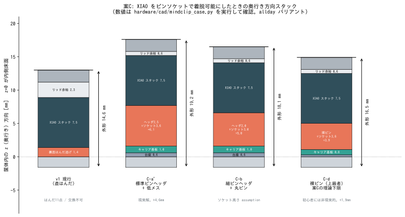

# 案C — キャリア基板 + ピンソケットで XIAO を着脱可能にする（評価と結論）

> **結論: 不採用（reject）。**
> 高さが現実解で **+4.6mm（外形 14.6 → 19.2mm、+32%）** 増え、
> しかも案Cの最大の売りである「XIAO を壊しても差し替えられる」は
> **BAT+/BAT− が 14ピンヘッダに出ていない**ために完成しない。
> 電池は結局 XIAO 裏面パッドへ手はんだで、**不可逆な極性ミスのリスクは残る**。
> 手はんだ点数も 11点 → 約54点に増える。
> VBUS検出は解決するが、それは案B（直付けキャリア）でも同じで、
> **ソケット固有の利益は「交換性」だけ**であり、その交換性が上記のとおり不完全。

| 項目 | 値 | 出典 |
|---|---|---|
| 追加高さ（XIAO単体比） | **+7.1 mm**（キャリア基板1.0 + 基板間6.1） | 実部品寸法（§2） |
| 筐体外形（allday） | **38.0 × 49.4 × 19.2 mm**（現行 14.6mm） | CAD実行（§3） |
| 筐体外形（slim） | **38.0 × 49.4 × 19.2 mm**（現行 12.9mm） | CAD実行。**slimの存在意義が消滅** |
| 案Cの理論下限（裸ピン） | 16.5 mm（**+1.9mm**）。ただし初心者には非現実的 | CAD実行（§3） |
| 手はんだ点数 | **約54点**（全て自分でやる場合）／JLCPCB実装を全部使って26点 | §5 |
| 1台あたり費用 | **約 ¥1,400**（基板5枚の最小ロットを1台に全額計上） | §6 |
| リードタイム | **約21日**（設計7日 + 製造2日 + 配送12日） | §6 |
| VBUS検出 | **解決できる**（5Vピンはヘッダに出ている） | §4.1 |
| 電池電圧監視 | **解決できる（ただし条件付き）** | §4.2 |
| 電池の極性ミス（不可逆） | **解決できない** | §4.3 ← 案C最大の誤算 |

再現方法:

```
python3 hardware/pcb/option_c_socket_height.py   # 高さ検証（筐体CADを実行して数値を出す）
python3 hardware/pcb/option_c_stackup.py         # 図 option_c_stackup.svg を生成
```



---

## 1. 案Cで何をしようとしていたか

XIAO ESP32S3 Sense（¥2,660）は本プロジェクトで最も高価な部品で、
v1では電池の極性ミス1回で不可逆に壊れる（README §0）。
そこで **キャリア基板にピンソケットを載せ、XIAO を「挿すだけ」にすれば**

1. XIAO を壊しても差し替えられる
2. スイッチ・LED・抵抗をキャリア基板上の配線に置き換えられる
3. ついでに VBUS検出（README §9.5）と電池電圧監視（同）の回路を載せられる

——という狙いだった。以下、狙いごとに成否を検証する。

## 2. 使える実部品（高さの一次情報）

秋月電子のサイトは本環境の egress 制限で直接閲覧できなかったため、
**検索結果に載る商品仕様の抜粋**を出典とする。発注前に商品ページで再確認のこと。

| 部品 | 型番 | 通販コード | 価格 | **高さ** | 備考 |
|---|---|---|---|---|---|
| シングルピンソケット（低メス）1×20 | 2212S-20SG-36 | **103138** | ¥80 | **ハウジング高さ 3.6 mm** | リード長3.3mm、金メッキ、推奨穴径1.02mm。同型で 1×14 (2212S-14SG-36) もある |
| ピンヘッダー 1×40 | — | **100167** | 約¥50 (assumption) | **ハウジング高さ 2.5 mm** | コンタクト長6.1mm／リード長3mm、推奨穴径1.02mm |
| 細ピンヘッダー 1×40（黒） | — | **106631** | 約¥150 (assumption) | **ハウジング高さ 2.0 mm** | コンタクト長5.3mm／リード長1.8mm、推奨穴径0.8mm（0.5mm丸ピン） |
| 丸ピンIC用ソケット シングル40P | 6604S-40 | **101591** | ¥150 | **3.0 mm（assumption）** | 商品ページに到達できず高さ未取得。丸ピンヘッダの相手 |
| PHコネクター ベース付ポスト サイド型 2P | S2B-PH-K-S | **112633** | ¥10 | 約4.5 mm (assumption) | 2.0mmピッチ・定格2A。電池入力用 |

**ここが案Cの急所**: ピンソケットの高さ（3.6mm）だけでは済まない。
XIAO 側に挿す**オスピンヘッダのハウジング 2.5mm が、XIAO 基板とソケット上面の間に必ず入る**。
したがって基板間ギャップは **2.5 + 3.6 = 6.1 mm**。ソケット単体の高さの倍近くになる。

樹脂ハウジングを使わず 0.64mm角ピンだけを XIAO のスルーホールに直はんだすれば
3.6 + フィレット0.3 = **3.9mm** まで下がるが、
14本のピンを垂直・等間隔に保ったまま手はんだする作業で、
**「初心者・特殊工具なし」という本プロジェクトの前提から外れる**（§7 C-c/C-d）。

また、標準ピンヘッダのコンタクト長は 6.1mm なのに低メスソケットの受け深さは 3.6mm しかないため、
**14本すべてをニッパで約3.4mmに切り詰める**工程が追加で要る。

## 3. 筐体に入るか — CADで実測

筐体CAD `hardware/cad/mindclip_case.py` は内寸奥行きを

```
ID = max(XIAO_LIFT + XIAO_STACK_T + 0.6,  BOSS_H + BAT_T + 1.8)
```

で決めている。キャリア基板を挟むことは
`XIAO_LIFT`（現行1.4 = 裏面はんだ逃げ）を `台座 + 基板厚 + 基板間ギャップ` に置き換えるのと等価。
XIAO 裏面のはんだ盛り・BATリードの逃げは基板間ギャップ（≥3.9mm）が肩代わりするので、
1.4mm の逃げは不要になる。この置換で `check_layout()` を回した結果:

| 構成 | 基板下の合計 | 内寸ID | **外形D（allday）** | Δ | 判定 |
|---|---|---|---|---|---|
| v1 現行（直はんだ） | 1.40 | 11.20 | **14.60** | — | OK |
| C-a 標準ヘッダ+低メス / PCB1.6 | 8.30 | 16.40 | **19.80** | **+5.20** | OK |
| C-a' 標準ヘッダ+低メス / PCB1.0 | 7.70 | 15.80 | **19.20** | **+4.60** | OK |
| C-b 細ピンヘッダ+丸ピン | 6.60 | 14.70 | **18.10** | +3.50 | OK |
| C-c 裸ピン+低メス | 5.50 | 13.60 | **17.00** | +2.40 | OK |
| C-d 裸ピン+低メス / PCB0.8 / 台座0.3 | 5.00 | 13.10 | **16.50** | +1.90 | OK |

（`check_layout()` はどの構成でも通る。つまり「幾何学的に成立はする」。
問題は成立するかどうかではなく、**成立させるために何mm厚くなるか**である。）

### 3.1 「入らない」ではなく「入れると別物になる」

- 現行の allday は 14.6mm。**C-a' で 19.2mm** は襟元クリップとしては別カテゴリの厚み。
  参考にしている本家は 16.8g・薄型で、v1 の 14.6mm ですら既に厚い（README §9.9）。
- **slim バリアントが消滅する**: キャリアを入れると内寸奥行きを支配するのが
  電池側（allday 11.2 / slim 8.2）ではなく XIAO 側（15.8）になるため、
  **allday も slim も外形 19.2mm で同一**になる（スクリプトが自動判定して出力する）。
  slim の存在理由は「薄さ」しかないので、案Cを採ると slim は捨てることになる。
- 副作用として良い点も1つある: 奥行きが増えると電池上面（z11.0〜11.3）がリッド lip 帯
  （z 15.2〜17.4）から z方向で完全に逃げるため、v1.4 で 34.0 → 34.8 に広げた内寸幅を
  **32.6 に戻せる（外形幅 38.0 → 35.8mm）**。CADで確認済み（`check_layout()` OK）。
  README §9.10 の「電池が右に1.25mm以上ずれるとフタが閉まらない」問題も同時に消える。
  ただし**厚み+4.6mm と幅−2.2mm の交換**であり、装着感としては割に合わない。

### 3.2 高さ以外に筐体CADの改修が必要な箇所

外形が変わるだけでは済まない。以下は `mindclip_case.py` の手作業改修が要る。

| 箇所 | 現状 | 案Cで必要な変更 |
|---|---|---|
| `xiao_seats`（コーナーシート h=XIAO_LIFT） | XIAO基板を4隅で支持 | **キャリア基板**を支持する台座に作り替え（高さ0.6mm、位置はキャリア外形に合わせる）。現行は `XIAO_LIFT` に連動して7.7mmの柱になってしまう |
| `xiao_stops`（左端ストップリブ、上端 z=8.1） | USB-C挿入反力を受ける | **XIAO基板が z9.3 に上がるのでリブが届かない**。z12〜13まで伸ばす + キャリア基板用の別リブを追加 |
| `xiao_nubs_top/bot`（上端 z=7.0） | 同上（y方向拘束） | 同じ理由で作り直し |
| リッド側 電池押さえリブ | z12.0〜12.8（0.8mm） | BODY_D が 17.4 に伸びるので **5.4mm 高のリブ**になる。肉厚と印刷性の見直しが要る |
| リッドからの XIAO 押さえ | 無し | **新規に必要**（§4.4 のソケット引き抜き対策） |
| USB-C開口・マイク開口の z | `XIAO_LIFT` 連動で自動追従 | 変更不要（パラメトリック） |

## 4. 目的は達成できるのか

### 4.1 VBUS（USB挿入）検出 → **解決できる**

XIAO の **5V ピンは USB VBUS そのもの**で、14ピンヘッダに出ている。
キャリア基板上で `5V → 220kΩ → D0(GPIO1) → 220kΩ → GND` の分圧を組めば
USB挿入で D0 が約2.5V（HIGH）になる。
- 消費電流は USB接続時のみ 5V/440kΩ ≈ **11µA**。電池からは流れないので電池寿命に影響しない。
- D0=GPIO1 は RTC GPIO なので、EXT1 ウェイクにも使える。
- これで README §9.5 の「充電検出をトリガに同期」が実装可能になる。
- **ただしこれはキャリア基板があれば得られる利益であって、ソケットの利益ではない**。
  直付けキャリア（案B）でも空中配線（案A）でも同じことができる。

### 4.2 電池電圧監視 → **解決できる（条件付き）**

`BAT+ → 220kΩ → A0(D0/GPIO2系の空きADCピン) → 220kΩ → GND` を
キャリア基板上に置けばよい（常時消費 4.2V/440kΩ ≈ **9.5µA**、
録音時28mA目標に対し 0.03% で無視できる）。

**条件**: BAT+ の電位がキャリア基板に来ていなければならない。
XIAO の 14ピンには BAT が出ていない（§4.3）ので、
**電池 → キャリア基板のJSTコネクタ → 基板配線 → 2本のピグテール線 → XIAO裏面 BAT+/BAT− パッド**
という経路にする必要がある。この経路にすればキャリア上で分圧を取れる。

### 4.3 電池の極性ミス（不可逆） → **解決できない**（案C最大の誤算）

**XIAO ESP32S3 の 14ピンヘッダは 11 GPIO + 5V + GND + 3V3 で、BAT+/BAT− は含まれない。**
BAT+/BAT− は基板裏面の独立したパッドである（Seeed公式wiki記載、ELECTRICAL.md §5.2 と同じ事実）。

したがってソケット経由で電池を給電することは**原理的にできない**。帰結:

- 電池は結局 **XIAO 裏面パッドへ手はんだ**。README §0 の
  「極性を間違えると XIAO は一瞬で壊れる・復旧できない」というリスクは**そのまま残る**。
- しかも案Cの売りは「壊れても差し替えられる」なのに、
  **差し替えるたびに同じ危険な2点はんだをやり直す**ことになる。ループが閉じていない。
- キャリア上のJSTコネクタで解決するのは「**電池側**の抜き差し」だけ。
  一度ピグテールを作ってしまえば電池の脱着は安全になる（これは実利ではある）が、
  **ピグテールを XIAO に付ける最初の1回**が不可逆ステップであることは変わらない。

回避案とその評価:

| 回避案 | 評価 |
|---|---|
| キャリアに**ポゴピン**を立てて XIAO 裏面 BAT パッドに押し当てる | 理論上は極性ミスを完全に排除できる**唯一の**方法。しかし **BATパッドの正確な位置は本プロジェクトで未検証**（MECHANICAL.md §8・README §9.1 に明記）。位置を外した基板は2週間かけて届いてから丸ごと無駄になる。さらにバネ反力（0.5〜1.5N/本）が §4.4 の引き抜き問題を悪化させる。**初回の基板で賭けるべきではない** |
| ピグテールを XIAO 側に残し、キャリア側だけコネクタ化 | 交換性は保てる（ピグテールが XIAO と一緒に外れる）が、新しい XIAO には結局はんだ2点。極性リスクは残る |
| 5Vピンから給電 | **不可**。5V は VBUS であり、充電IC（BQ25101）の入力側。ここに電池を繋ぐと充電経路が壊れる |
| 3V3ピンから給電 | **不可**。LDO出力。逆流させる設計であり、かつ充電できなくなる |

### 4.4 USB-C 挿入力でソケットから抜けないか → **要対策**

キャリアを挟むと XIAO 基板は床から 9.3mm の高さに上がり、
USB-C 開口の中心は z=12.5 になる。ソケット嵌合の中心（z≈6.1）からの**てこ腕は 6.4mm**。
ピン列スパン 15.24mm で受けるとすると、USB-C 挿入力に対して片列7ピンにかかる引き抜き力は:

| USB-C 挿入力 | 片列7ピンを引き抜く力 |
|---|---|
| 5 N（規格下限） | **2.1 N** |
| 20 N（規格上限） | **8.4 N** |

2.54mmソケットの保持力を1極 0.5〜2N（assumption）とすると7極で 3.5〜14N。
**弱い個体・使い込んだソケットでは 20N の挿入で XIAO が浮く／抜ける。**
v1 では左端ストップリブが基板側面を直接受けていたが、案Cではリブが届かない（§3.2）。
→ **リッド内面から XIAO を押さえる新規機構**（押さえリブ or ネジ止め）が必須になる。
これは「工具不要でパチンと開くリッド」というv1のコンセプトとも衝突する。

## 5. 手はんだ点数 — 11点 → 約54点

案Cの構成（キャリア 約31×17.8mm、2層。JSTは XIAO 直下に入らないので左へ張り出す）で数える。

| 箇所 | 点数 |
|---|---|
| 低メスソケット 1×7 × 2列（キャリア側） | 14 |
| ピンヘッダー 1×7 × 2列（XIAO側。事前に6.1→3.4mmへ切詰） | 14 |
| 0805 抵抗 5個（LED 220Ω + VBUS分圧2 + 電池分圧2） | 10 |
| JST-PH 2P（電池入力） | 2 |
| BATピグテール用 2Pコネクタ（キャリア側） | 2 |
| BATピグテール ↔ XIAO裏面 BAT+/BAT− パッド | **2**（← 極性リスクはここに残る） |
| ピグテール反対端の端子処理 | 2 |
| スイッチ配線（キャリア側2 + スイッチ側2） | 4 |
| LED配線（キャリア側2 + LED側2。抵抗が基板に乗るので空中配線は消える） | 4 |
| **合計** | **54** |

減らす手段:

- JLCPCB の SMT実装で 0805 抵抗5個を任せる → **−10点**（費用は §6）
- JLCPCB の手はんだ（THT）サービスでソケット・コネクタを任せる → **−18点**
- 両方使って **26点**。それでも v1 の 11点より多い。

**「初心者のはんだ付けを減らす」という本プロジェクトの中心的な価値とは逆方向に働く。**
（スイッチ・LED まわりの点数は v1 とほぼ同数で、増分はすべて 28点のコネクタ由来。）

## 6. 費用とリードタイム

### 費用（1台）

| 項目 | 金額 | 出典 |
|---|---|---|
| JLCPCB 2層 5枚（最小ロット） | $2 | JLCPCB公式（$2 for 5 PCBs） |
| 送料 Global Standard Direct Line | $1.5（割引時）〜$6.59 | JLCPCB。100×100mm以内・5枚以内で割引対象 |
| 低メスソケット 103138 | ¥80 | 秋月 |
| ピンヘッダー 100167 | 約¥50 | 秋月（価格 assumption） |
| JST S2B-PH-K-S ×2 | ¥20 | 秋月 112633 |
| PH圧着済みケーブル（圧着工具を持たない前提） | 約¥150 | assumption |
| 0805抵抗 5個（袋売り） | 約¥200 | assumption |
| **合計** | **約 ¥1,400** | $1=¥150 (assumption)。基板5枚の最小ロットを1台に全額計上 |

- 5台作るなら基板代を按分できて **1台あたり約¥680**。ただし本プロジェクトは1台前提。
- JLCPCB の SMT実装を使う場合は **+$20〜30 程度**（セットアップ費・拡張部品費・最小2枚）で
  **1台あたり ¥4,000〜5,000 に跳ね上がる**。手はんだ点数を10点減らすために費用が3倍になる。
- 手はんだ（THT）サービスは $3.5 + $0.0173/joint。ソケット・コネクタ 18点で約$3.8 → 計$7.3。

### リードタイム（約21日）

| 工程 | 日数 |
|---|---|
| 回路図・基板レイアウト（KiCad は本環境に未導入。導入と習得を含む） | 5〜7日 |
| JLCPCB 製造 | 1〜2日 |
| 配送（Global Standard Direct Line 実績） | 約12日 |
| **合計** | **約21日** |

**やり直しは1周でさらに約14日**。§4.3 のポゴピン案や、
未確定の XIAO ピン列間隔（§8）を外した場合、この14日を丸ごと失う。

## 7. 案Cの下位バリアント評価

| 案 | 外形D | 初心者適性 | 評価 |
|---|---|---|---|
| **C-a'** 標準ピンヘッダ + 低メス / PCB1.0 | 19.2mm | ○（唯一まともに組める） | **これが案Cの現実解**。しかし +4.6mm は許容外 |
| C-a 同上 PCB1.6 | 19.8mm | ○ | JLCPCBの既定厚。さらに0.6mm不利 |
| C-b 細ピンヘッダ + 丸ピンソケット | 18.1mm | △ | 丸ピンソケット高さ3.0mmが **assumption**。0.5mm丸ピンは強度が低く、抜き差しで曲がる |
| C-c 裸ピン + 低メス | 17.0mm | ✗ | 14本の裸ピンを垂直に保って手はんだ。治具（=ソケット）を使う技はあるが「初心者・特殊工具なし」の前提外 |
| C-d 裸ピン + PCB0.8 + 台座0.3 | 16.5mm | ✗ | 案Cの理論下限。台座0.3mmはソケット足の切り詰め精度が要る |

**仮に案Cを採るなら C-a' 一択**。C-c/C-d の +1.9〜2.4mm は魅力的に見えるが、
それを実現する作業は本プロジェクトの対象ユーザーには渡せない。

## 8. リスク・未検証事項

| # | 内容 | 重大度 |
|---|---|---|
| R1 | **BAT+/BAT− がヘッダに無く、極性ミスの不可逆リスクが残る**（§4.3）。案Cの目的の中核が達成できない | **致命的** |
| R2 | 外形が 14.6 → 19.2mm（+32%）。高さ予算が最もシビアな制約という前提と正面衝突（§3） | **致命的** |
| R3 | 手はんだが 11 → 54点。初心者向けという製品前提を壊す（§5） | 高 |
| R4 | USB-C挿入力（最大20N）で片列7ピンに 8.4N の引き抜き力。ソケット保持力の下限（3.5N）を超える。リッド側押さえ機構が新規に必要（§4.4） | 高 |
| R5 | **XIAO のピン2列間隔が未確認**。本環境から Seeed wiki / 秋月に到達できず数値を裏取りできなかった（15.24mm と推定＝**assumption**）。間違えると基板5枚が丸ごと無駄になり、やり直しに約14日 → **必ず Seeed 公式 KiCadライブラリ（Seeed-Studio/OPL_Kicad_Library）のフットプリントを使い、自分で寸法を打たないこと** | 高 |
| R6 | **Sense拡張ボードの装着面が未確認**。MECHANICAL.md は「部品面(USB-C側)に装着、BATパッド面が裏面」としているが、これも本プロジェクトの assumption。**もし拡張ボードが XIAO の裏面側に付くなら、XIAO 直下にソケットを置く案Cは幾何学的に成立しない**（拡張ボードとソケットが同じ場所を取り合う）。現物を見るまで案Cは成立可否すら確定しない | **高（前提破壊）** |
| R7 | XIAOスタック総厚 7.5mm 自体が assumption（README §9.1）。実測がこれより厚ければ外形はさらに増える | 中 |
| R8 | 丸ピンソケット（案C-b）の高さ 3.0mm は assumption。商品ページに到達できず未取得 | 中 |
| R9 | slim バリアントが消滅（allday と同じ 19.2mm になる）。薄型オプションを失う（§3.1） | 中 |
| R10 | 装着重量が増える（印刷部品 15.3g → 17.4g、キャリア基板+コネクタで約+2g、合計 +4g 前後）。磁石保持力の余裕は 4倍 → 約3.4倍に低下。加えて厚みが増して重心がクランプ点から離れるため「お辞儀」しやすくなる（未実測） | 中 |
| R11 | 電池分圧の常時消費 9.5µA。deep sleep 3mA に対して無視できるが、放置時の自己放電には効く | 低 |
| R12 | JLCPCB の $2/5枚・送料$1.5 は数量・サイズ・キャンペーン条件つき。為替 ¥150/USD も assumption | 低 |
| R13 | 低メスソケット（板バネ・0.64mm角ピン用）に細ピンヘッダの 0.5mm丸ピンを挿す組み合わせは接触不良になる。**必ずヘッダとソケットを同じ系列で揃えること** | 低（設計時に潰せる） |

## 9. 推奨

**案Cは採用しない。**

1. **VBUS検出と電池電圧監視が欲しいだけなら、ソケットは要らない。**
   どちらもキャリア基板さえあれば実現でき（§4.1/§4.2）、
   ソケットを外せば基板間ギャップ 6.1mm と +4.6mm の外形増がまるごと消える。
   → **案B（直付けキャリア）または案A（空中配線）で目的を果たすべき**。
2. **XIAO の交換性が本当に欲しいなら、ソケットは正しい手段ではない。**
   BAT+/BAT− がヘッダに出ていない以上、交換のたびに危険な2点はんだが発生する（§4.3）。
   同じコストを払うなら
   「**組立ガイドに、電池をはんだ付けする前のテスター確認手順をより強く書く**」
   「**XIAO を1枚予備で買う（¥2,660）**」ほうが、
   +4.6mm・+43点のはんだ・+21日より安く確実である（キャリア基板一式 ¥1,400 + 21日 に対して、
   予備XIAO は ¥2,660 で即日）。
3. どうしても案Cを検討し続ける場合の**前提条件**（これが揃うまで基板は発注しない）:
   - R6（Sense拡張ボードの装着面）を**現物で確認**する。裏面装着なら案Cは即時に不成立。
   - R5（ピン2列間隔）を Seeed 公式フットプリントで確定する。
   - XIAOスタック総厚（R7）と BATパッド位置を**ノギスで実測**する。
   - 外形 19.2mm を装着して許容できるか、**まず筐体だけ印刷して首から下げて確かめる**
     （`MC_XIAO_LIFT` 相当の改造版CADで body を1個刷るだけなので、フィラメント代 ¥500 で判定できる）。

---

## 付録: 検証に使ったファイル

| ファイル | 内容 |
|---|---|
| `hardware/pcb/option_c_socket_height.py` | 筐体CADをパラメータ差し替えで実行し、案C各構成の内寸・外形・干渉判定・USB挿入モーメントを出力 |
| `hardware/pcb/option_c_stackup.py` | 高さスタック比較図の生成スクリプト |
| `hardware/pcb/option_c_stackup.svg` | 生成された比較図 |

出典（Web検証済みのもの）:

- 秋月電子 [103138 シングルピンソケット(低メス) 1×20](https://akizukidenshi.com/catalog/g/g103138/)（ハウジング高さ3.6mm、2212S-20SG-36、¥80）
- 秋月電子 [100167 ピンヘッダー 1×40](https://akizukidenshi.com/catalog/g/g100167/)（ハウジング高さ2.5mm、コンタクト長6.1mm）
- 秋月電子 [106631 細ピンヘッダー 1×40](https://akizukidenshi.com/catalog/g/g106631/)（ハウジング高さ2.0mm、コンタクト長5.3mm）
- 秋月電子 [101591 丸ピンIC用ソケット シングル40P](https://akizukidenshi.com/catalog/g/g101591/)（6604S-40、¥150。高さ未取得）
- 秋月電子 [112633 PHコネクター ベース付ポスト サイド型 2P](https://akizukidenshi.com/catalog/g/g112633/)（S2B-PH-K-S、¥10）
- [JLCPCB](https://jlcpcb.com/)（2層5枚 $2〜） / [Shipping](https://jlcpcb.com/help/article/shipping-methods-and-delivery-time) / [PCBA価格](https://jlcpcb.com/help/article/pcb-assembly-price)
- [Seeed XIAO ESP32S3 Getting Started](https://wiki.seeedstudio.com/xiao_esp32s3_getting_started/)（14ピン=11GPIO+5V/GND/3V3、BAT±は裏面パッド）
- [Seeed-Studio/OPL_Kicad_Library](https://github.com/Seeed-Studio/OPL_Kicad_Library)（XIAO公式フットプリント）

**注記**: 秋月電子・Seeed wiki の各ページは本環境の egress 制限で直接閲覧できず、
数値は検索結果に含まれる仕様抜粋を採用している。発注前に商品ページで再確認すること。
